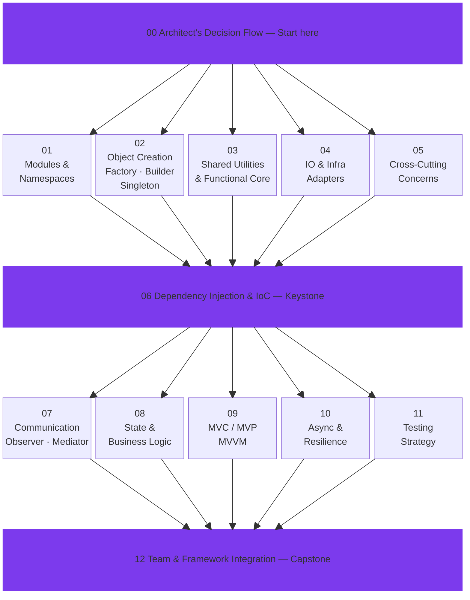

<p align="center">
  
</p>

<p align="center">
  <strong>Teach your AI Agent to write code that lasts — without slowing it down.</strong>
</p>

<p align="center">
  <a href="README_zh.md">繁體中文</a> · <a href="README_de.md">Deutsch</a> · <a href="README_ja.md">日本語</a> · <a href="README_ko.md">한국어</a>
</p>

---

## The Problem Nobody Talks About

AI-assisted coding is fast. Unbelievably fast. But speed without structure creates a hidden cost:

> *"The code works, but nobody can maintain it — not even the AI that wrote it."*

An AI Agent without design pattern guidance will produce code that **compiles and passes tests** but quietly accumulates technical debt: tightly coupled modules, scattered business logic, duplicated patterns, and inconsistent abstractions. Six months later, you're paying for that speed with interest — in debugging time, token costs, and rewrite cycles.

**"Just rewrite it"** is the most expensive sentence in software engineering. It was expensive with human developers. It's still expensive with AI — you're just paying in tokens instead of salaries.

## Why Design Patterns Matter More in the AI Era

### The Paradox of AI Speed

Traditional developers learn design patterns through years of painful experience — spaghetti code, failed refactors, production outages. That pain is a teacher. AI Agents skip the pain entirely, which means **they also skip the lessons**.

Without explicit guidance, an AI Agent will:
- Create a new database connection in every function instead of using a **Singleton** pool
- Hard-code API calls deep inside business logic instead of isolating them behind an **Adapter**
- Pass configuration through 8 layers of function parameters instead of using **Dependency Injection**
- Scatter event handling across 20 files instead of centralizing it with an **Observer** or **Mediator**

Each of these "works." Each of these is a future bug waiting to happen.

### The Token Economy Argument

Here's something vibe coders rarely consider: **design patterns directly reduce token consumption**.

| Scenario | Without Patterns | With Patterns |
|----------|-----------------|---------------|
| "Add Stripe payment" | Agent reads 30 files to find where payment logic should go | Agent reads the Adapter layer — 3 files |
| "Change from MySQL to PostgreSQL" | Agent rewrites 15 files where SQL is scattered | Agent changes 1 Adapter. Done. |
| "Add logging to all API calls" | Agent modifies every endpoint, one by one | Agent adds a Decorator/AOP middleware. 1 file. |
| "Debug why orders fail on weekends" | Agent traces spaghetti code for 50+ turns | Agent checks the State Pattern — finds invalid transition in 2 turns |

Structured code means the Agent **reads less, touches less, and gets it right in fewer iterations**. Fewer iterations = fewer tokens = lower cost. This isn't theory — it's arithmetic.

### Agent Discipline: The Missing Concept

We talk a lot about "AI alignment." But there's a more practical version of it for software engineering: **Agent Discipline**.

Agent Discipline means your AI coding assistant consistently follows architectural rules — not because it "understands" them the way a senior engineer does, but because you've **explicitly defined the patterns** it should use.

Think of it like this:

- **Without discipline:** You give the Agent a task. It writes something that works. Each time differently. Technical debt quietly grows.
- **With discipline:** You give the Agent a task *plus a design pattern guide*. It writes something that works **and fits into the existing architecture**. Every time. Consistently.

The 13 skill files in this repo are that guide.

## What's Inside

13 structured skill files organized as a **layered architecture** — from foundation to team integration:



Each skill file includes:
- **When and why** to use each pattern (not just "how")
- **Real-world mappings** from textbook examples to production scenarios
- **Anti-patterns** — what goes wrong without the pattern
- **Integration points** — how patterns compose across layers

## Quick Start: Make Your AI Agent Follow Design Patterns

### Option 1: Claude Code — Add to `CLAUDE.md`

Add this to your project's `CLAUDE.md`. Claude Code loads it every session automatically:

```markdown
## Design Pattern Guidelines

When writing or refactoring code, follow these design pattern principles:
https://github.com/MattAtAIEra/Learning_JavaScript_Design_Pattern

Key rules:
- Object creation via Factory / Builder — no bare `new` in business logic (ref: skills/02)
- External services behind Adapter abstraction (ref: skills/04)
- Cross-module communication via Observer / Mediator — no direct coupling (ref: skills/07)
- Business logic in Domain Layer with State Pattern for state machines (ref: skills/08)
- All dependencies injected, wired at Composition Root (ref: skills/06)
```

### Option 2: Claude Code — Custom Slash Command

Create `.claude/commands/design-pattern.md` in your project:

```markdown
Review the current code architecture against these design pattern guidelines and suggest improvements:

$ARGUMENTS

Reference:
- Layered architecture overview: skills/00-overview-architect-decision-flow.md
- Object creation: skills/02-object-creation-layer.md
- Communication: skills/07-inter-component-communication.md
- State management: skills/08-state-management-and-business-logic.md
```

Then run `/design-pattern check src/services/ dependency structure`.

### Option 3: Cursor / Windsurf — Rules File

In `.cursor/rules/design-patterns.mdc` or `.windsurfrules`:

```markdown
---
description: Design pattern architecture guidelines
globs: ["src/**/*.ts", "src/**/*.js"]
---

# Design Pattern Guidelines

1. **Module boundaries** (skills/01): Single responsibility, explicit interfaces
2. **Object creation** (skills/02): Complex objects → Builder; families → Abstract Factory
3. **Infrastructure isolation** (skills/04): DB, HTTP, filesystem behind Adapters
4. **Cross-cutting** (skills/05): Logging, auth, caching via Decorator or AOP
5. **Dependency injection** (skills/06): No service locators; wire at Composition Root
6. **Communication** (skills/07): Cross-module via Event Bus; complex coordination via Mediator
7. **State management** (skills/08): Finite states → State Pattern; history → Memento
8. **Async handling** (skills/10): Unified error handling; retry + circuit breaker
```

### Option 4: GitHub Copilot — Custom Instructions

In `.github/copilot-instructions.md`:

```markdown
## Architecture Rules

This project follows layered design patterns (see skills/ directory).
When generating or reviewing code:

- Never call external APIs directly from the Domain Layer (violates Adapter principle, skills/04)
- All state transitions must be explicitly defined via State Pattern (skills/08)
- New modules must be injectable — no hard-coded dependencies (skills/06)
```

### Option 5: Clone Into Any Project

```bash
# As a git submodule
git submodule add https://github.com/MattAtAIEra/Learning_JavaScript_Design_Pattern.git docs/design-patterns

# Or just copy the skills
cp -r Learning_JavaScript_Design_Pattern/skills/ your-project/docs/design-patterns/
```

Then point your AI tool's config to that directory.

## The Long Game

Some say design patterns don't matter when code lifecycles are short and AI can rewrite anything. We disagree.

**Code quality compounds.** Every well-structured module makes the next feature faster to build, cheaper to test, and easier for both humans and AI to understand. Every shortcut compounds too — in the wrong direction.

Design patterns are not about writing code slower. They're about writing code that **stays fast** — fast to read, fast to change, fast to extend. Not just today, but six months from now when nobody remembers why that function exists.

An AI Agent armed with design patterns doesn't just write better code. It writes code that **reduces its own future token cost**, because well-structured code requires less context to understand and less work to modify. That's the real return on investment.

**This isn't something most vibe coders discover on their own. But with 13 skill files, your AI Agent can internalize what takes human engineers years to learn — and apply it on every single commit.**

## Contributing

Issues and PRs welcome. If you've found a pattern that improves AI Agent code quality, we'd love to hear about it.

## License

The SKILL.MD teaching content in this repository is original work. Design pattern code examples reference *Mastering JavaScript Design Patterns, Second Edition* (Packt). The original book source code and PDFs are not included in this repo.

---

<p align="center">
  If this helps your AI write better code, consider giving it a ⭐
</p>
