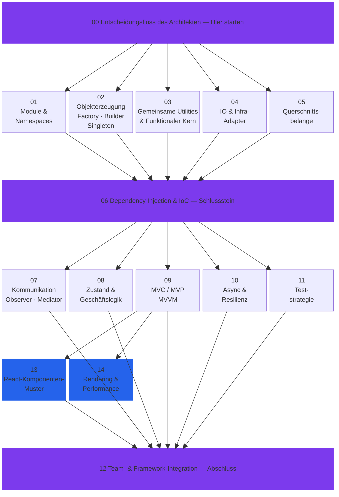

  

  <strong>Damit dein KI-Agent nicht nur schnell schreibt, sondern auch sauber — von Anfang an.</strong>

  <a href="README.md">English</a> · <a href="README_zh.md">繁體中文</a> · <a href="README_ja.md">日本語</a> · <a href="README_ko.md">한국어</a>

---

## Worüber keiner redet

KI-gestützte Entwicklung ist rasend schnell. Geradezu berauschend. Doch Tempo ohne Fundament hat einen Preis, der erst später sichtbar wird:

> *„Läuft alles. Wartbar ist es trotzdem nicht — selbst die KI, die es geschrieben hat, kommt nicht mehr klar."*

Ein KI-Agent ohne klare Architekturvorgaben liefert Code, der **kompiliert und grüne Tests zeigt** — während im Hintergrund die technischen Schulden wachsen: Module, die aneinander kleben, Geschäftslogik verstreut über dutzende Dateien, drei verschiedene Lösungen für dasselbe Problem. Sechs Monate später bezahlst du die Zeche — mit Debugging-Marathons, steigenden Token-Kosten und dem unvermeidlichen Rewrite.

**„Schreiben wir halt neu"** — der wohl teuerste Satz in der Softwareentwicklung. Früher kostete er Entwicklergehälter. Heute kostet er Token. Günstiger ist er dadurch nicht geworden.

## Warum Design Patterns im KI-Zeitalter wichtiger werden

### Das Tempo-Paradox

Erfahrene Entwickler haben Design Patterns auf die harte Tour gelernt: Spaghetti-Code, ein Refactoring, das alles schlimmer machte, ein Produktionsausfall um drei Uhr morgens. Schmerz ist ein guter Lehrer. KI-Agenten kennen keinen Schmerz — und **überspringen damit auch die Lektion**.

Ohne konkrete Vorgaben wird ein KI-Agent:
- Pro Funktionsaufruf eine neue DB-Verbindung öffnen, statt einen **Singleton**-Pool zu nutzen
- API-Calls mitten in die Geschäftslogik packen, statt sie hinter einem **Adapter** zu kapseln
- Konfigurationswerte durch acht Funktionsparameter schleusen, statt auf **Dependency Injection** zu setzen
- Event-Handling quer über 20 Dateien verteilen, statt es mit **Observer** oder **Mediator** zu bündeln

Alles davon „funktioniert". Und alles davon wird irgendwann zum Problem.

### Was das für deine Token-Rechnung bedeutet

Ein Aspekt, den die meisten Vibe-Coder übersehen: **Gute Architektur spart bares Geld bei den Token-Kosten.**

| Aufgabe | Ohne Patterns | Mit Patterns |
|---------|---------------|--------------|
| „Stripe-Zahlung einbauen" | Agent durchforstet 30 Dateien auf der Suche nach der richtigen Stelle | Agent öffnet die Adapter-Schicht — 3 Dateien, fertig |
| „MySQL durch PostgreSQL ersetzen" | Agent schreibt 15 Dateien um, in denen SQL verstreut liegt | Agent ändert einen Adapter. Erledigt. |
| „Logging für alle API-Calls" | Agent bearbeitet jeden Endpoint einzeln | Agent hängt eine Decorator-Middleware ein. 1 Datei. |
| „Warum scheitern Bestellungen am Wochenende?" | Agent verfolgt Spaghetti-Logik über 50+ Runden | Agent prüft das State Pattern — findet den Fehler in 2 Runden |

Sauberer Code heißt: Der Agent **liest weniger, ändert weniger und trifft schneller ins Schwarze**. Weniger Durchläufe = weniger Token = niedrigere Kosten. Keine Theorie — einfache Mathematik.

### Agent Discipline — das fehlende Puzzlestück

Über „KI-Alignment" wird viel diskutiert. In der Softwareentwicklung gibt es dafür einen handfesteren Begriff: **Agent Discipline**.

Gemeint ist: Dein KI-Assistent hält sich verlässlich an Architekturregeln — nicht weil er sie wie ein erfahrener Architekt „versteht", sondern weil du **ihm klar gesagt hast, welche Muster gelten**.

Zwei Szenarien:

- **Ohne Spielregeln:** Du gibst dem Agenten eine Aufgabe. Er liefert etwas, das läuft. Jedes Mal anders. Technische Schulden häufen sich still und leise.
- **Mit Spielregeln:** Du gibst dem Agenten eine Aufgabe — **samt Design-Pattern-Leitfaden**. Er liefert etwas, das läuft **und zur bestehenden Architektur passt**. Jedes Mal. Verlässlich.

Die 15 Skill-Dateien in diesem Repo sind genau dieser Leitfaden.

## Was steckt drin

15 Skill-Dateien, aufgebaut als **Schichtenarchitektur** — vom Fundament bis zur Team-Organisation:

## Schnellstart

Ausführliche Anleitungen zur Integration mit Claude Code, Cursor, Windsurf, GitHub Copilot und als git-Submodule findest du in der [englischen README](README.md).

## Langfristig denken

Manche meinen, bei kurzen Code-Lebenszyklen und KI, die jederzeit alles neu schreiben kann, seien Design Patterns überflüssig. Wir sehen das anders.

**Code-Qualität wirkt wie Zinseszins.** Jedes sauber aufgebaute Modul macht das nächste Feature schneller, die Tests günstiger und den Code verständlicher — für Menschen wie für KI. Und Abkürzungen wirken genauso — nur in die falsche Richtung.

Ein KI-Agent mit Design-Pattern-Wissen schreibt nicht einfach besseren Code. Er schreibt Code, **der seine eigenen künftigen Token-Kosten senkt** — weil strukturierter Code weniger Kontext braucht und sich mit weniger Aufwand ändern lässt. Das ist der eigentliche Return on Investment.

**Die wenigsten Vibe-Coder kommen von selbst auf diese Erkenntnis. Aber mit 15 Skill-Dateien kann dein KI-Agent in Minuten verinnerlichen, wofür menschliche Entwickler Jahre brauchen — und es ab dem nächsten Commit anwenden.**

## Lizenz

Die SKILL.MD-Inhalte sind eigenständige Originalarbeit. Code-Beispiele orientieren sich an *Mastering JavaScript Design Patterns, Second Edition* (Simon Timms, Packt) und *Learning JavaScript Design Patterns* (Addy Osmani, O'Reilly). Quellcode und PDFs der Bücher sind nicht in diesem Repository enthalten.

---

  Wenn es dir hilft, freuen wir uns über einen ⭐

