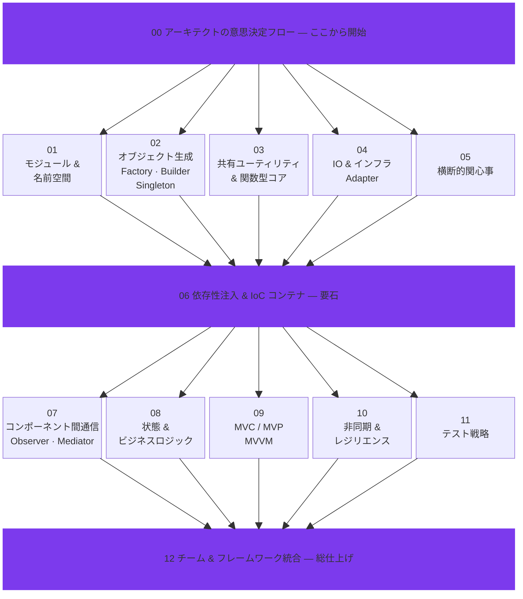

  

  <strong>AIエージェントに「速いだけ」のコードを卒業させよう。設計の型を教えれば、品質もスピードも手に入る。</strong>

  <a href="README.md">English</a> · <a href="README_zh.md">繁體中文</a> · <a href="README_de.md">Deutsch</a> · <a href="README_ko.md">한국어</a>

---

## 見て見ぬふりをしている問題

AIを使ったコーディングは驚くほど速い。一度体験すると手放せなくなるほどに。でも、構造のないスピードにはツケがある。

> *「動くコードはできた。でも半年後に手を入れられる人が誰もいない ── 書いたAI自身ですら。」*

デザインパターンを知らないAIエージェントは、**ビルドもテストも通る**コードを量産する。しかしその裏では、モジュール同士がべったり密結合し、ビジネスロジックがあちこちに散らばり、同じ処理が三箇所で三通りに書かれている。半年後にそのツケが回ってくる ── デバッグの泥沼、膨らむトークン請求、そして結局やり直し。

**「作り直せばいいじゃん」** ── ソフトウェア開発で一番高くつくセリフだ。人が書いていた時代も高くついた。AIが書く時代も変わらない。払い先が給与からトークンに変わっただけだ。

## AI時代こそ、デザインパターンが効いてくる

### スピードの落とし穴

ベテランのエンジニアは苦い経験からデザインパターンを身につけてきた ── スパゲッティコードで炎上、リファクタリングで二次災害、深夜の緊急対応。あの痛みがあったから覚えられた。AIエージェントには痛みがない。**だから、学びもない。**

指針を与えなければ、AIエージェントは平気でこうする：
- 関数ごとに毎回DBコネクションを張る（**Singleton**プールという発想がない）
- 外部APIコールをビジネスロジックにベタ書きする（**Adapter**で隔離するという判断がない）
- 設定値を8階層ぶんの引数リレーで渡す（**DI**を使えば一発なのに）
- イベント処理を20ファイルに散在させる（**Observer**や**Mediator**で集約するという選択肢を知らない）

どれもちゃんと動く。そしてどれも、将来のバグの種になる。

### トークンのお財布事情

ここがVibeコーダーの盲点だ ── **デザインパターンはトークン消費を目に見えて減らす**。

| タスク | パターンなし | パターンあり |
|--------|------------|------------|
| 「Stripe決済を組み込んで」 | 30ファイルを読み漁り、決済ロジックの置き場所を探す | Adapterレイヤーを開く。3ファイルで完了 |
| 「MySQLをPostgreSQLに差し替えて」 | SQLが散在する15ファイルを書き直す | Adapterを1つ変更。以上 |
| 「全APIにログを仕込んで」 | エンドポイントをひとつずつ修正 | Decoratorミドルウェアを1つ追加。1ファイル |
| 「週末だけ注文が通らない原因は？」 | スパゲッティコードを50ターン以上追いかける | State Patternを確認 → 2ターンで不正な状態遷移を特定 |

構造があるコードなら、エージェントは**読む量も、触る量も、試行回数も少なくて済む**。回数が減ればトークンが減る。トークンが減ればコストが下がる。理屈じゃなくて、算数の話だ。

### Agent Discipline ── 「お行儀のいいAI」の作り方

「AIアライメント」はよく話題になるが、ソフトウェア開発にはもっと地に足のついた概念がある。**Agent Discipline（エージェント規律）** だ。

要するに、AIコーディングアシスタントに**アーキテクチャのルールを一貫して守らせる**こと。シニアエンジニアのように「分かっている」から守るのではなく、**「こうしなさい」と明示されているから守る**。それでいい。

比べてみよう：

- **規律なし：** タスクを渡す。動くものが出てくる。でも毎回書き方がバラバラ。技術的負債が静かに積み上がる。
- **規律あり：** タスクと一緒に**デザインパターンガイド**を渡す。動くものが出てくる。**しかも既存の設計にきれいに馴染む。** 毎回。ブレなく。

このリポジトリにある13本のスキルファイルが、そのガイドだ。

## 中身

13本のスキルファイルを、**レイヤードアーキテクチャ**に沿って配置：

## クイックスタート

Claude Code・Cursor・Windsurf・GitHub Copilot・git submoduleとの具体的な連携方法は、[英語版README](README.md)にまとめてある。

## 長い目で見る

「コードの寿命は短くなったし、AIがいつでも書き直せる。デザインパターンなんて今さら必要？」── そういう声もある。私たちの考えは逆だ。

**コード品質は複利で効く。** きちんと設計されたモジュールは、次の機能開発を速くし、テストコストを下げ、人にもAIにも読みやすいコードベースを育てる。逆に、場当たり的なコードも複利で効く ── ただし、マイナス方向に。

デザインパターンは「丁寧にゆっくり書け」という話ではない。**ずっと速いまま走り続けられるコード**を書くための型だ。今日だけ速いのではなく、半年後に誰かが触ったときにも迷わず読めるコード。

デザインパターンを身につけたAIエージェントは、単に良いコードを書くだけじゃない。**次に自分が触るときのトークンコストまで下げるコード**を書く。構造が整っていれば、理解に必要なコンテキストが少なくて済み、修正の手数も減るからだ。それが本当の投資対効果というものだ。

**これは、Vibeコーディングを始めたばかりの人がひとりで気づけることではない。でも13本のスキルファイルがあれば、あなたのAIエージェントはベテランエンジニアが何年もかけて体得したことを即座に取り込み ── 次のコミットから実践できる。**

## ライセンス

SKILL.MDの教育コンテンツはオリジナルの著作物です。コード例は *Mastering JavaScript Design Patterns, Second Edition*（Packt）を参考にしています。書籍のソースコードおよびPDFは本リポジトリに含まれていません。

---

  役に立ったら ⭐ をもらえると励みになります

