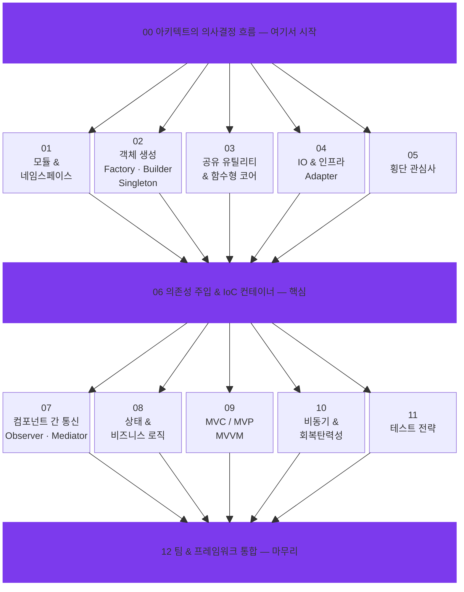

  

  <strong>AI 에이전트에게 오래가는 코드 작성법을 가르치세요 — 속도를 희생하지 않고.</strong>

  <a href="README.md">English</a> · <a href="README_zh.md">繁體中文</a> · <a href="README_de.md">Deutsch</a> · <a href="README_ja.md">日本語</a>

---

## 아무도 이야기하지 않는 문제

AI 지원 코딩은 빠르다. 믿을 수 없을 만큼 빠르다. 그러나 구조 없는 속도는 숨겨진 비용을 만든다:

> *"코드는 돌아간다. 하지만 아무도 유지보수할 수 없다 — 그것을 작성한 AI조차도."*

디자인 패턴 가이드가 없는 AI 에이전트는 **컴파일되고 테스트를 통과하는** 코드를 생성하지만, 밀결합 모듈, 흩어진 비즈니스 로직, 중복된 패턴, 일관성 없는 추상화라는 기술 부채를 조용히 쌓아간다. 6개월 후, 당신은 그 속도에 대한 이자를 지불하게 된다 — 디버깅 시간, 토큰 비용, 재작성 사이클의 형태로.

**"그냥 다시 쓰면 되지"** 는 소프트웨어 엔지니어링에서 가장 비싼 문장이다. 인간 개발자와 함께할 때도 비쌌다. AI와 함께할 때도 여전히 비싸다 — 급여 대신 토큰으로 지불할 뿐이다.

## AI 시대에 디자인 패턴이 더 중요한 이유

### AI 속도의 역설

전통적인 개발자는 수년간의 고통스러운 경험을 통해 디자인 패턴을 배운다 — 스파게티 코드, 실패한 리팩토링, 프로덕션 장애. 그 고통이 교사다. AI 에이전트는 고통을 완전히 건너뛴다. 이는 **교훈도 건너뛴다**는 의미다.

명시적 가이드가 없는 AI 에이전트는:
- **Singleton** 풀을 사용하는 대신 모든 함수에서 새 DB 연결을 생성한다
- **Adapter**로 격리하는 대신 API 호출을 비즈니스 로직 깊숙이 하드코딩한다
- **의존성 주입**을 사용하는 대신 설정을 8단계 함수 파라미터로 전달한다
- **Observer**나 **Mediator**로 중앙 관리하는 대신 이벤트 처리를 20개 파일에 흩뿌린다

모두 "돌아간다". 모두 미래의 버그가 될 씨앗이다.

### 토큰 경제학 논거

Vibe 코더들이 거의 고려하지 않는 것: **디자인 패턴은 토큰 소비를 직접 줄인다.**

| 시나리오 | 패턴 없음 | 패턴 있음 |
|---------|----------|----------|
| "Stripe 결제 추가" | 에이전트가 30개 파일을 읽어 결제 로직 위치 탐색 | 에이전트가 Adapter 레이어 읽음 — 3개 파일 |
| "MySQL에서 PostgreSQL로 변경" | 에이전트가 SQL이 흩어진 15개 파일 재작성 | 에이전트가 Adapter 1개 변경. 완료. |
| "모든 API 호출에 로깅 추가" | 에이전트가 각 엔드포인트를 하나씩 수정 | 에이전트가 Decorator/AOP 미들웨어 추가. 1개 파일. |
| "주말에 주문이 실패하는 이유 조사" | 에이전트가 스파게티 코드를 50턴 이상 추적 | 에이전트가 State Pattern 확인 — 2턴 만에 잘못된 전환 발견 |

구조화된 코드는 에이전트가 **덜 읽고, 덜 수정하고, 더 적은 반복으로 정답에 도달**한다는 것을 의미한다. 반복 감소 = 토큰 감소 = 비용 절감. 이론이 아니라 산수다.

### Agent Discipline: 빠진 개념

"AI 정렬"은 많이 이야기된다. 하지만 소프트웨어 엔지니어링에는 더 실용적인 버전이 있다: **Agent Discipline(에이전트 규율)**.

Agent Discipline은 AI 코딩 어시스턴트가 일관되게 아키텍처 규칙을 따르는 것을 의미한다 — 시니어 엔지니어처럼 "이해"해서가 아니라, 당신이 **사용해야 할 패턴을 명시적으로 정의했기** 때문이다.

- **규율 없음:** 에이전트에게 작업을 준다. 돌아가는 것을 쓴다. 매번 다르게. 기술 부채가 조용히 증가한다.
- **규율 있음:** 에이전트에게 작업과 **디자인 패턴 가이드**를 준다. 돌아가는 것을 쓴다. **게다가 기존 아키텍처에 맞는다.** 매번. 일관되게.

이 저장소의 13개 스킬 파일이 바로 그 가이드다.

## 콘텐츠

13개의 구조화된 스킬 파일. **레이어드 아키텍처**로 정리 — 기초부터 팀 통합까지:

## 빠른 시작

Claude Code, Cursor, Windsurf, GitHub Copilot, git submodule과의 상세한 통합 방법은 [영문 README](README.md)를 참조하세요.

## 장기적 관점

코드 수명 주기가 짧아지고 AI가 무엇이든 다시 쓸 수 있는 시대에 디자인 패턴은 중요하지 않다고 말하는 사람들이 있다. 우리는 동의하지 않는다.

**코드 품질은 복리로 작용한다.** 잘 구조화된 모든 모듈은 다음 기능을 더 빠르게 구축하고, 더 저렴하게 테스트하고, 인간과 AI 모두 더 쉽게 이해할 수 있게 만든다.

디자인 패턴으로 무장한 AI 에이전트는 단순히 더 나은 코드를 쓰는 것이 아니다. **자신의 미래 토큰 비용을 줄이는 코드**를 쓴다. 구조화된 코드는 이해하는 데 더 적은 컨텍스트가 필요하고, 수정하는 데 더 적은 작업이 필요하기 때문이다.

**이것은 대부분의 Vibe 코더가 스스로 깨닫지 못하는 것이다. 하지만 13개의 스킬 파일이 있으면, 당신의 AI 에이전트는 인간 엔지니어가 수년이 걸려 배우는 것을 내재화하고 — 모든 커밋에서 적용할 수 있다.**

## 라이선스

이 저장소의 SKILL.MD 교육 콘텐츠는 오리지널 저작물입니다. 디자인 패턴 코드 예제는 *Mastering JavaScript Design Patterns, Second Edition*(Packt)을 참조합니다. 원서의 소스 코드와 PDF는 이 저장소에 포함되어 있지 않습니다.

---

  이 프로젝트가 AI의 코드 품질 향상에 도움이 되었다면 ⭐를 눌러주세요

