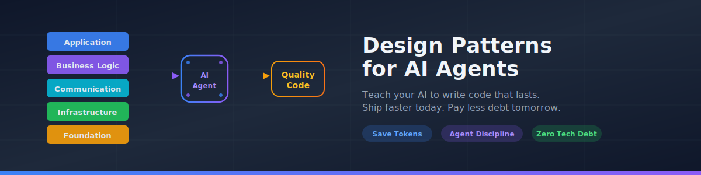
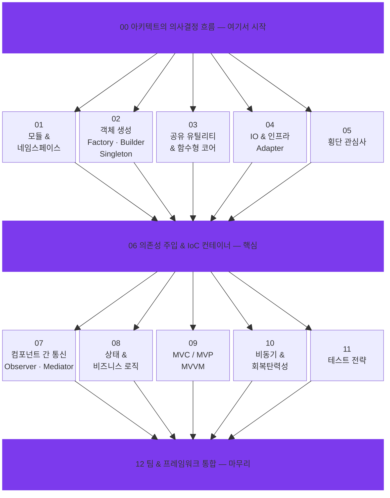

  

  <strong>빠르기만 한 코드는 이제 그만 — 디자인 패턴으로 AI 에이전트의 격을 올리세요.</strong>

  <a href="README.md">English</a> · <a href="README_zh.md">繁體中文</a> · <a href="README_de.md">Deutsch</a> · <a href="README_ja.md">日本語</a>

---

## 아무도 꺼내지 않는 이야기

AI로 코드 짜는 건 정말 빠릅니다. 한번 맛보면 돌아갈 수 없을 정도로요. 그런데 구조 없는 속도에는 반드시 대가가 따릅니다.

> *"코드는 잘 돌아갑니다. 그런데 반년 뒤에 손댈 수 있는 사람이 아무도 없어요 — 그걸 짠 AI조차도."*

디자인 패턴 가이드 없는 AI 에이전트는 **빌드도 되고 테스트도 통과하는** 코드를 척척 만들어 냅니다. 문제는 그 안에서 모듈끼리 엉겨 붙고, 비즈니스 로직이 여기저기 흩어지고, 같은 기능이 세 군데서 세 가지 방식으로 구현되어 있다는 거예요. 6개월 후, 그 속도의 이자를 고스란히 치르게 됩니다 — 디버깅 야근, 불어나는 토큰 비용, 결국 처음부터 다시 짜는 리라이트 사이클로.

**"그냥 다시 짜면 되지"** — 소프트웨어 세계에서 가장 비싼 한마디입니다. 사람이 짤 때도 비쌌고, AI가 짜는 지금도 여전히 비쌉니다. 월급 대신 토큰으로 내는 것뿐이에요.

## AI 시대에 디자인 패턴이 더 중요해지는 이유

### 속도의 역설

시니어 개발자들은 오랜 시행착오 끝에 디자인 패턴을 체득했습니다 — 스파게티 코드 때문에 밤새운 경험, 리팩토링했다가 더 꼬여버린 기억, 새벽 장애 콜. 그 아픔이 곧 배움이었죠. AI 에이전트에게는 그런 아픔이 없습니다. **아픔이 없으니, 깨달음도 없습니다.**

가이드 없이 풀어놓으면 AI 에이전트는 거침없이 이렇게 합니다:
- 함수마다 DB 커넥션을 새로 맺습니다 (**Singleton** 풀이라는 개념 자체가 없으니까요)
- API 호출을 비즈니스 로직 한복판에 직접 박아 넣습니다 (**Adapter**로 분리한다는 판단이 없으니까요)
- 설정값을 8단계 파라미터 릴레이로 넘깁니다 (**의존성 주입**이면 깔끔한데 말이죠)
- 이벤트 처리를 20개 파일에 뿌려놓습니다 (**Observer**나 **Mediator**로 모은다는 선택지를 모르니까요)

전부 "돌아가긴" 합니다. 그리고 전부, 미래의 버그 씨앗입니다.

### 토큰 지갑을 지키는 법

Vibe 코더분들이 놓치기 쉬운 부분인데요 — **디자인 패턴은 토큰 사용량을 눈에 띄게 줄여줍니다.**

| 요청 | 패턴 없을 때 | 패턴 있을 때 |
|------|------------|------------|
| "Stripe 결제 붙여줘" | 30개 파일을 뒤져야 결제 로직 자리를 찾음 | Adapter 레이어만 열면 됨 — 파일 3개 |
| "MySQL을 PostgreSQL로 바꿔줘" | SQL이 흩어진 15개 파일을 일일이 수정 | Adapter 1개 수정. 끝. |
| "모든 API에 로깅 추가해줘" | 엔드포인트를 하나씩 고침 | Decorator 미들웨어 1개 추가. 파일 1개 |
| "주말에만 주문이 안 되는 이유는?" | 스파게티 코드를 50턴 넘게 추적 | State Pattern 확인 → 2턴 만에 잘못된 상태 전이 발견 |

코드에 구조가 있으면 에이전트는 **읽는 양도, 고치는 양도, 시도 횟수도 줄어듭니다**. 시도가 줄면 토큰이 줄고, 토큰이 줄면 비용이 줍니다. 이론이 아니라 산수입니다.

### Agent Discipline — AI에게도 규율이 필요합니다

"AI 정렬(alignment)"이 화두인 요즘, 소프트웨어 개발 현장에는 좀 더 현실적인 개념이 있습니다. 바로 **Agent Discipline(에이전트 규율)** 입니다.

핵심은 간단합니다. AI 코딩 어시스턴트가 **아키텍처 규칙을 매번 지키도록 만드는 것**. 시니어 엔지니어처럼 "이해해서" 지키는 게 아니라, **"이렇게 해라"고 명확히 알려줬기 때문에** 지키는 겁니다. 그걸로 충분합니다.

두 가지를 비교해 보세요:

- **규율 없음:** 작업을 던져줍니다. 돌아가는 코드가 나옵니다. 그런데 매번 스타일이 다릅니다. 기술 부채가 조용히 쌓입니다.
- **규율 있음:** 작업과 함께 **디자인 패턴 가이드**를 줍니다. 돌아가는 코드가 나옵니다. **그런데 기존 아키텍처와 딱 맞습니다.** 매번. 일관되게.

이 저장소에 있는 13개 스킬 파일이 바로 그 가이드입니다.

## 무엇이 들어 있나요

13개 스킬 파일을 **레이어드 아키텍처** 순서로 정리했습니다:

## 빠른 시작

Claude Code · Cursor · Windsurf · GitHub Copilot · git submodule과의 구체적인 연동 방법은 [영문 README](README.md)에 정리되어 있습니다.

## 길게 보는 시선

"코드 수명도 짧아졌고 AI가 언제든 다시 짜줄 수 있는데, 디자인 패턴이 아직도 필요해?" — 이런 이야기도 있습니다. 저희 생각은 다릅니다.

**코드 품질은 복리입니다.** 잘 설계된 모듈 하나가 다음 기능 개발을 빠르게 하고, 테스트 비용을 낮추고, 사람이든 AI든 읽기 편한 코드베이스를 만들어 줍니다. 반대로 대충 짠 코드도 복리로 돌아옵니다 — 다만 마이너스 방향으로.

디자인 패턴은 "느긋하게 정성 들여 짜라"는 뜻이 아닙니다. **계속해서 빠르게 달릴 수 있는 코드**를 만드는 틀입니다. 오늘만 빠른 게 아니라, 반년 후에 누군가 처음 보더라도 금방 파악할 수 있는 코드.

디자인 패턴을 갖춘 AI 에이전트는 단순히 좋은 코드를 짜는 데 그치지 않습니다. **다음번 수정 때 자기 자신의 토큰 비용까지 줄여주는 코드**를 짭니다. 구조가 잡혀 있으면 이해에 필요한 컨텍스트가 적고, 고쳐야 할 곳도 적으니까요. 그게 진짜 투자 대비 수익입니다.

**이건 Vibe 코딩에 갓 입문한 분이 혼자 깨닫기는 어려운 통찰입니다. 하지만 13개 스킬 파일이 있으면, 여러분의 AI 에이전트는 시니어 엔지니어가 수년에 걸쳐 체득한 것을 즉시 흡수하고 — 바로 다음 커밋부터 실천할 수 있습니다.**

## 라이선스

SKILL.MD 교육 콘텐츠는 오리지널 저작물입니다. 코드 예제는 *Mastering JavaScript Design Patterns, Second Edition*(Packt)을 참고했습니다. 원서 소스 코드와 PDF는 이 저장소에 포함되어 있지 않습니다.

---

  도움이 되셨다면 ⭐ 한 번 눌러주세요

