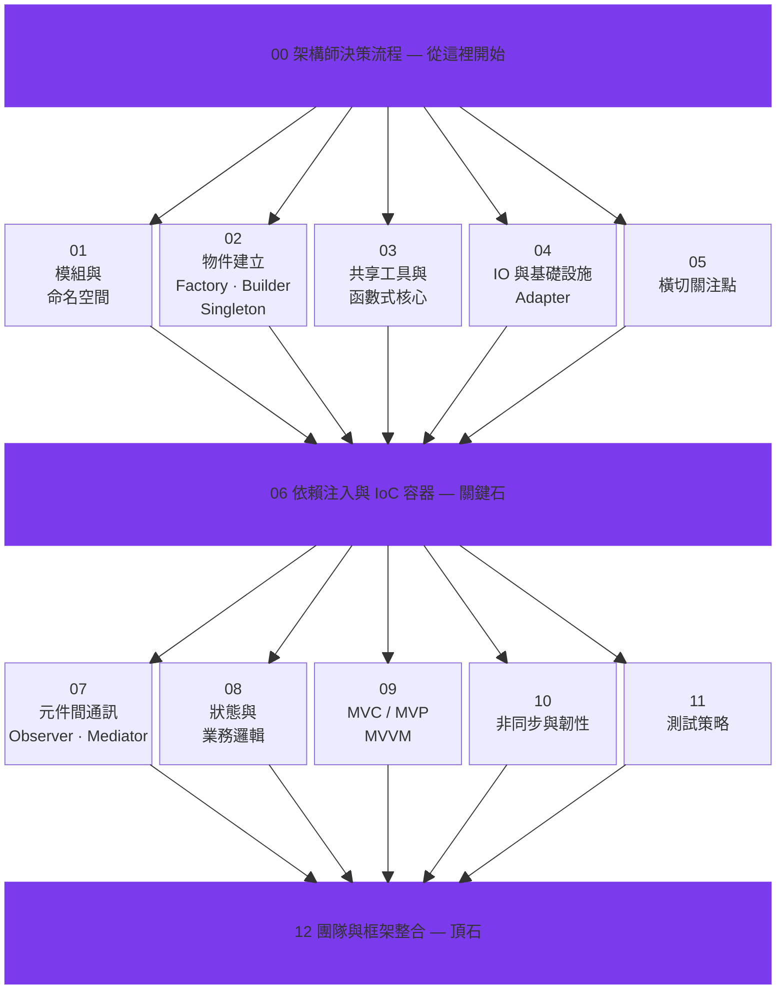

<p align="center">
  
</p>

<p align="center">
  <strong>讓 AI 不只寫得快，更寫得好 — 用設計模式帶出真正的工程品質。</strong>
</p>

<p align="center">
  <a href="README.md">English</a> · <a href="README_de.md">Deutsch</a> · <a href="README_ja.md">日本語</a> · <a href="README_ko.md">한국어</a>
</p>

---

## 大家不願面對的真相

用 AI 寫程式確實飛快，快到讓人上癮。但光有速度、沒有骨架，遲早要還的：

> *「程式能動，但半年後誰來改？連寫它的 AI 都接不住。」*

少了設計模式的 AI Agent，交出來的程式碼**編譯得過、測試也綠**，卻暗藏地雷 — 模組黏成一團、商業邏輯四處亂竄、同樣的事做三遍寫法三種。半年後你才發現，當初省下的時間全變成加班除錯的利息，Token 帳單也跟著腫起來。

**「大不了重寫就好」** — 這句話在軟體業最燒錢。從前燒的是工程師薪水，現在燒的是 token，本質沒變。

## AI 時代，設計模式反而更關鍵

### 速度的弔詭

老一輩工程師靠踩坑學會設計模式 — 寫出義大利麵條碼、上線後炸掉、半夜被 call 起來修 bug。痛過才記得住。AI Agent 不會痛，所以**它也不會自己學到教訓**。

放任一個沒有指引的 AI Agent，它會：
- 每個 function 各開一條 DB 連線，而不是共用一個 **Singleton** 連線池
- 在 service 裡面直接 call 第三方 API，而不是包一層 **Adapter**
- 設定值像接力賽一樣穿過八層參數，而不是用**依賴注入**乾淨處理
- 事件處理邏輯散落二十個檔案，而不是用 **Observer** 或 **Mediator** 收攏

每一個都「能跑」。每一個都在替未來埋雷。

### Token 帳單的祕密

這件事很多 vibe coder 沒想過：**好的架構直接幫你省 token**。

| 需求 | 沒有模式的 Agent | 有模式的 Agent |
|------|-----------------|---------------|
| 「串接 Stripe 金流」 | 翻遍 30 個檔案才搞懂金流邏輯放哪 | 直接看 Adapter 層，3 個檔案搞定 |
| 「把 MySQL 換成 PostgreSQL」 | SQL 散落 15 個檔案，逐一改寫 | 改 1 個 Adapter，收工 |
| 「所有 API 加上 logging」 | 一支一支 endpoint 慢慢加 | 掛一個 Decorator 中介層，1 個檔案 |
| 「為什麼週末的訂單會失敗？」 | 在麵條碼裡追蹤 50 個 turn 以上 | 看 State Pattern，2 個 turn 就抓到錯誤的狀態轉換 |

程式碼有結構，Agent 就能**少讀、少改、少跑幾輪就做對**。少跑一輪就少燒一輪 token。這不是什麼高深理論 — 就是簡單的算術。

### Agent Discipline：你的 AI 也需要紀律

「AI 對齊」大家聊得很多，但在寫程式這件事上，有個更落地的版本叫 **Agent Discipline**。

意思是：你的 AI 助手**每次都乖乖遵守架構規範** — 不是因為它像十年經驗的老鳥一樣「懂」，而是因為你**白紙黑字告訴它該怎麼做**。

想像兩種情境：

- **沒給規範：** 丟一個需求過去。AI 生出能跑的東西。但每次風格不同，技術債默默成長。
- **有給規範：** 丟一個需求，**附上設計模式指引**。AI 生出能跑的東西，**而且跟現有架構無縫接軌**。每一次都一樣穩。

這個 repo 裡的 13 份 skill 檔案，就是那份規範。

## 裡面有什麼

13 份 skill 檔案，沿著**分層架構**由下往上編排：



每份 skill 都會告訴你：
- **什麼時候該用、為什麼要用**（不只是語法教學）
- **實戰對照** — 教科書範例如何對應到真實專案
- **反面教材** — 不用會怎樣
- **組合技** — 不同模式之間怎麼搭配

## 五分鐘上手：讓 AI Agent 自動遵守設計模式

### 方式一：Claude Code — 寫進 `CLAUDE.md`

把以下內容加到你專案根目錄的 `CLAUDE.md`。Claude Code 每次開對話都會自動讀取：

```markdown
## Design Pattern 指導原則

在撰寫或重構程式碼時，請參考以下設計模式知識庫作為架構決策依據：
https://github.com/MattAtAIEra/Learning_JavaScript_Design_Pattern

關鍵原則：
- 物件建立使用 Factory / Builder，避免裸 new（參考 skills/02）
- 外部服務一律透過 Adapter 隔離（參考 skills/04）
- 跨層溝通使用 Observer / Mediator，禁止直接耦合（參考 skills/07）
- 商業邏輯集中於 Domain Layer，使用 State Pattern 管理狀態（參考 skills/08）
- 依賴注入優先，由 Composition Root 統一組裝（參考 skills/06）
```

### 方式二：Claude Code — 自訂 Slash Command

在專案中建立 `.claude/commands/design-pattern.md`：

```markdown
請根據以下設計模式指引，審查目前的程式架構並提出改善建議：

$ARGUMENTS

參考知識庫：
- 分層架構總覽：skills/00-overview-architect-decision-flow.md
- 物件建立層：skills/02-object-creation-layer.md
- 通訊層：skills/07-inter-component-communication.md
- 狀態管理：skills/08-state-management-and-business-logic.md
```

用法：`/design-pattern 幫我檢查 src/services/ 的依賴結構合不合理`。

### 方式三：Cursor / Windsurf — Rules 檔案

放到 `.cursor/rules/design-patterns.mdc` 或 `.windsurfrules`：

```markdown
---
description: 設計模式架構決策指引
globs: ["src/**/*.ts", "src/**/*.js"]
---

# Design Pattern 指導原則

1. **模組邊界**（skills/01）：一個模組一件事，介面明確
2. **物件建立**（skills/02）：複雜物件走 Builder，家族物件走 Abstract Factory
3. **基礎設施隔離**（skills/04）：DB、HTTP、檔案系統，一律躲在 Adapter 後面
4. **橫切關注點**（skills/05）：logging、認證、快取，用 Decorator 或 AOP 處理
5. **依賴注入**（skills/06）：別用 service locator，在 Composition Root 統一接線
6. **元件通訊**（skills/07）：跨模組用 Event Bus，複雜協調用 Mediator
7. **狀態管理**（skills/08）：有限狀態走 State Pattern，歷程追蹤走 Memento
8. **非同步處理**（skills/10）：錯誤處理統一收口，搭配 retry + circuit breaker
```

### 方式四：GitHub Copilot — 自訂指令

在 `.github/copilot-instructions.md` 裡加上：

```markdown
## 架構原則

本專案遵循分層架構，詳見 skills/ 目錄。
程式碼審查與生成請遵守：

- Domain Layer 不准直接 call 外部 API（參考 skills/04 Adapter 原則）
- 狀態轉換必須透過 State Pattern 明確定義（skills/08）
- 新模組一律可注入，不可寫死依賴（skills/06）
```

### 方式五：直接 Clone 進你的專案

```bash
# 當 git submodule
git submodule add https://github.com/MattAtAIEra/Learning_JavaScript_Design_Pattern.git docs/design-patterns

# 或純粹複製 skills/
cp -r Learning_JavaScript_Design_Pattern/skills/ your-project/docs/design-patterns/
```

然後在你的 AI 工具設定裡指過去就好。

## 長線思維

有人覺得，AI 隨時能重寫、程式碼壽命又短，何必講究設計模式？我們的看法剛好相反。

**程式碼品質是複利。** 每一個結構清晰的模組，都讓下一個功能做得更快、測試花得更少、人和 AI 都更容易讀懂。反過來，每一條捷徑也會複利 — 只是利滾利的方向不同。

設計模式從來不是叫你慢慢寫。它是讓你的程式碼**一直快得下去** — 讀得快、改得快、擴展得快。不只是今天快，是半年後那個沒人記得為什麼存在的函數，也能三秒看懂。

懂設計模式的 AI Agent，不只寫出更好的程式碼 — 它寫出來的東西，**會讓自己下一次改動花更少的 token**。結構清楚的程式碼不需要塞一大堆 context 才能理解，改起來也不用大動干戈。這才是真正的投報率。

**這不是剛踏進 vibe coding 的新手自己能頓悟的。但有了這 13 份 skill 檔案，你的 AI Agent 可以一口氣學到資深工程師花好幾年才悟出來的東西 — 而且每一次 commit 都派上用場。**

## 貢獻

歡迎開 Issue、發 PR。如果你有能讓 AI Agent 寫出更好程式碼的心得，非常樂意交流。

## 授權

SKILL.MD 教學內容為原創整理。設計模式程式碼範例參考 *Mastering JavaScript Design Patterns, Second Edition*（Packt），書籍原始碼與 PDF 不包含在此 repo 中。

---

<p align="center">
  覺得有幫助的話，歡迎順手點個 ⭐
</p>
