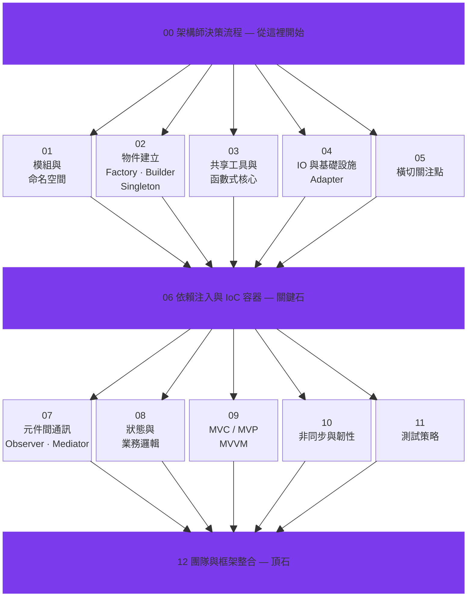

<p align="center">
  
</p>

<p align="center">
  <strong>教會你的 AI Agent 寫出經得起時間考驗的程式碼 — 而且不會慢下來。</strong>
</p>

<p align="center">
  <a href="README.md">English</a> · <a href="README_de.md">Deutsch</a> · <a href="README_ja.md">日本語</a> · <a href="README_ko.md">한국어</a>
</p>

---

## 沒有人在談論的問題

AI 輔助寫程式很快。快到不可思議。但沒有結構的速度，會產生隱藏成本：

> *「程式能跑，但沒有人能維護它 — 連當初寫它的 AI 也不行。」*

一個沒有設計模式指引的 AI Agent 會產出**能編譯、能通過測試**的程式碼，但悄悄累積技術債：緊耦合的模組、散落各處的業務邏輯、重複的模式、不一致的抽象。六個月後，你會為當初的速度付出利息 — 以除錯時間、token 費用和重寫週期的形式。

**「反正重寫就好了」** 是軟體工程中最昂貴的一句話。用人力開發時很貴，用 AI 開發時依然很貴 — 只是你從付薪水改成付 token 費而已。

## 為什麼設計模式在 AI 時代更重要

### AI 速度的弔詭

傳統開發者是透過多年的痛苦經驗學會設計模式的 — 義大利麵程式碼、失敗的重構、線上系統炸掉。那些痛苦是老師。AI Agent 完全跳過了痛苦，這意味著**它們也跳過了教訓**。

沒有明確指引的 AI Agent 會：
- 在每個函數裡建立新的資料庫連線，而不是使用 **Singleton** 連線池
- 把 API 呼叫硬編碼在業務邏輯深處，而不是用 **Adapter** 隔離
- 把設定值穿過 8 層函數參數傳遞，而不是使用**依賴注入**
- 把事件處理散佈在 20 個檔案裡，而不是用 **Observer** 或 **Mediator** 集中管理

每一個都「能跑」。每一個都是未來等著爆發的 bug。

### Token 經濟效益

這是 vibe coder 很少考慮的事：**設計模式直接減少 token 消耗**。

| 場景 | 沒有模式 | 有模式 |
|------|---------|--------|
| 「加入 Stripe 付款」 | Agent 讀 30 個檔案尋找付款邏輯該放哪 | Agent 讀 Adapter 層 — 3 個檔案 |
| 「從 MySQL 換成 PostgreSQL」 | Agent 改寫散落 SQL 的 15 個檔案 | Agent 改 1 個 Adapter。完成。 |
| 「在所有 API 呼叫加上 logging」 | Agent 逐一修改每個端點 | Agent 加一個 Decorator/AOP 中介層。1 個檔案。 |
| 「找出為什麼週末訂單會失敗」 | Agent 在義大利麵程式碼中追蹤 50+ 輪 | Agent 檢查 State Pattern — 2 輪就找到無效的狀態轉換 |

結構化的程式碼意味著 Agent **讀得更少、改得更少、用更少的迭代做對**。更少的迭代 = 更少的 token = 更低的成本。這不是理論 — 是算術。

### Agent Discipline：被遺漏的概念

我們常談「AI 對齊」。但在軟體工程中有一個更實際的版本：**Agent Discipline（代理紀律）**。

Agent Discipline 指的是你的 AI 程式碼助手**持續遵循架構規則** — 不是因為它像資深工程師一樣「理解」這些規則，而是因為你**明確定義了它該使用的模式**。

可以這樣想：

- **沒有紀律：** 你給 Agent 一個任務。它寫出能跑的東西。每次都不一樣。技術債悄悄增長。
- **有紀律：** 你給 Agent 一個任務，**加上設計模式指引**。它寫出能跑的東西，**而且符合現有架構**。每一次都是。一致地。

這個 repo 中的 13 個 skill 檔案就是那份指引。

## 內容概覽

13 份結構化的 skill 檔案，以**分層架構**組織 — 從基礎到團隊整合：



每個 skill 檔案包含：
- **何時、為何**使用每個模式（不只是「怎麼用」）
- **真實世界對照** — 從教科書範例對應到生產場景
- **反模式** — 不用模式會出什麼問題
- **整合點** — 模式如何跨層組合

## 快速開始：讓你的 AI Agent 遵循設計模式

### 方式一：Claude Code — 寫入 `CLAUDE.md`

在你的專案根目錄的 `CLAUDE.md` 中加入引用指示。Claude Code 每次對話都會自動載入：

```markdown
## Design Pattern 指導原則

在撰寫或重構程式碼時，請參考以下設計模式知識庫作為架構決策依據：
https://github.com/MattAtAIEra/Learning_JavaScript_Design_Pattern

關鍵原則：
- 物件建立使用 Factory / Builder，避免裸 new（參考 skills/02）
- 外部服務一律透過 Adapter 隔離（參考 skills/04）
- 跨層溝通使用 Observer / Mediator，禁止直接耦合（參考 skills/07）
- 商業邏輯集中於 Domain Layer，使用 State Pattern 管理狀態（參考 skills/08）
- 依賴注入優先，由 Composition Root 統一組裝（參考 skills/06）
```

### 方式二：Claude Code — 自訂 Slash Command

在專案中建立 `.claude/commands/design-pattern.md`：

```markdown
請根據以下設計模式指引，審查目前的程式架構並提出改善建議：

$ARGUMENTS

參考知識庫：
- 分層架構總覽：skills/00-overview-architect-decision-flow.md
- 物件建立層：skills/02-object-creation-layer.md
- 通訊層：skills/07-inter-component-communication.md
- 狀態管理：skills/08-state-management-and-business-logic.md
```

使用時輸入 `/design-pattern 請檢查 src/services/ 的依賴關係是否合理`。

### 方式三：Cursor / Windsurf — Rules 檔案

在 `.cursor/rules/design-patterns.mdc` 或 `.windsurfrules` 中：

```markdown
---
description: 設計模式架構決策指引
globs: ["src/**/*.ts", "src/**/*.js"]
---

# Design Pattern 指導原則

1. **模組邊界**（skills/01）：每個模組職責單一，透過明確介面暴露功能
2. **物件建立**（skills/02）：複雜物件使用 Builder，家族物件使用 Abstract Factory
3. **基礎設施隔離**（skills/04）：DB、HTTP、檔案系統一律透過 Adapter 抽象
4. **橫切關注點**（skills/05）：logging、認證、快取使用 Decorator 或 AOP
5. **依賴注入**（skills/06）：避免 service locator，在 Composition Root 統一組裝
6. **元件通訊**（skills/07）：跨模組使用 Event Bus，複雜協調使用 Mediator
7. **狀態管理**（skills/08）：有限狀態用 State Pattern，歷程追蹤用 Memento
8. **非同步處理**（skills/10）：統一錯誤處理，實作 retry + circuit breaker
```

### 方式四：GitHub Copilot — 自訂指令

在 `.github/copilot-instructions.md` 中引用：

```markdown
## 架構原則

本專案遵循分層架構設計模式，詳見 skills/ 目錄。
程式碼審查與生成時請遵守以下規範：

- 不允許在 Domain Layer 直接呼叫外部 API（違反 skills/04 Adapter 原則）
- 所有狀態轉換必須透過 State Pattern 明確定義（skills/08）
- 新增模組必須可透過 DI 注入，不可硬編碼依賴（skills/06）
```

### 方式五：直接 Clone 到專案中

```bash
# 作為 git submodule
git submodule add https://github.com/MattAtAIEra/Learning_JavaScript_Design_Pattern.git docs/design-patterns

# 或直接複製 skills/
cp -r Learning_JavaScript_Design_Pattern/skills/ your-project/docs/design-patterns/
```

然後在 AI Agent 的設定檔中指向該目錄。

## 長期思維

有人說，在程式碼生命週期變短、AI 可以隨時重寫的時代，設計模式已經不重要了。我們不同意。

**程式碼品質會複利。** 每一個結構良好的模組，都讓下一個功能更快開發、更便宜測試、更容易被人類和 AI 理解。每一個捷徑也會複利 — 只是方向相反。

設計模式不是要你把程式寫慢。它是讓程式碼**持續保持快** — 讀取快、修改快、擴展快。不只是今天，而是六個月後沒有人記得那個函數為什麼存在的時候。

裝備了設計模式的 AI Agent 不只是寫出更好的程式碼。它寫出的程式碼**會降低自己未來的 token 成本**，因為結構良好的程式碼需要更少的上下文才能理解、更少的工作量才能修改。這才是真正的投資回報率。

**這不是大多數剛加入 vibe coding 的初級開發者能自己體悟的事。但透過 13 個 skill 檔案，你的 AI Agent 可以內化人類工程師需要多年才能學會的東西 — 並在每一次 commit 中應用。**

## 貢獻

歡迎 Issue 和 PR。如果你發現了能提升 AI Agent 程式碼品質的模式，我們很樂意聽取。

## 授權

本專案中的 SKILL.MD 教學內容為原創整理。設計模式的程式範例參考自 *Mastering JavaScript Design Patterns, Second Edition*（Packt），書籍原始碼與 PDF 不包含在本 repo 中。

---

<p align="center">
  如果這個專案幫助你的 AI 寫出更好的程式碼，請給它一顆 ⭐
</p>
