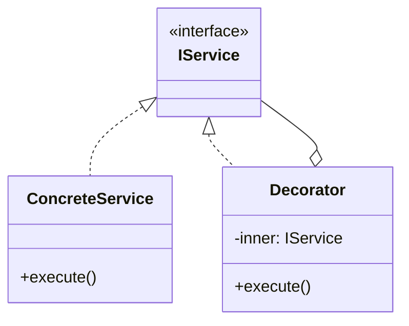

# Skill 00: The Architect's Decision Flow

## Why Layers Exist Before Patterns

Design patterns taught in isolation fail in production. Knowing what a Singleton or Observer is does not tell you **where** it belongs in your system. The real challenge is: after understanding requirements, how do you slice a program into layers so that a team of 2+ engineers can develop in parallel without stepping on each other?

This document is the **map** for the entire skill series. It shows the full layered architecture and points you to the right skill for each architectural decision.

## The Layered Architecture

```
┌─────────────────────────────────────────────────┐
│  13: React Component   │  14: Rendering &       │
│  Patterns (HOC, Hooks, │  Performance (SSR,     │
│  Provider, Compound)    │  SSG, Code Splitting)  │
├─────────────────────────┴───────────────────────┤
│           09: Application Layer                 │
│           (MVC / MVP / MVVM)                    │
├─────────────────────────────────────────────────┤
│           08: Business Logic Layer              │
│           (State, Memento, Visitor, Template)   │
├─────────────────────────────────────────────────┤
│           07: Communication Layer               │
│           (Observer, Mediator, PubSub, Command) │
├─────────────────────────────────────────────────┤
│           06: IoC / DI Container                │
│           (Composition Root — wires everything) │
├─────────────────────────────────────────────────┤
│  04: IO / Infrastructure  │  03: Shared Utils   │
│  (Adapter, Facade, Proxy) │  (Functional Core)  │
├───────────────────────────┴─────────────────────┤
│           05: Cross-Cutting Concerns            │
│           (Decorator, AOP, Middleware)           │
├─────────────────────────────────────────────────┤
│           02: Object Creation Layer             │
│           (Factory, Builder, Singleton)         │
├─────────────────────────────────────────────────┤
│           01: Foundation                        │
│           (Modules, Namespaces, Project Layout) │
└─────────────────────────────────────────────────┘

  10: Async / Concurrency ─── cuts across all layers
  11: Testing Strategy    ─── verifies each layer
  12: Team Integration    ─── conventions + onboarding
```

## The Decision Sequence

An architect designs a system **bottom-up**, not feature-down:

| Step | Question | Skill |
|------|----------|-------|
| 1 | How do I organize code so the team doesn't collide? | [01 - Modules & Namespaces](01-foundation-modules-and-namespaces.md) |
| 2 | How are objects created without hidden coupling? | [02 - Object Creation](02-object-creation-layer.md) |
| 3 | What shared logic can any layer safely call? | [03 - Shared Utilities](03-shared-utilities-and-functional-core.md) |
| 4 | How do I isolate DB, HTTP, filesystem? | [04 - IO & Infrastructure](04-io-and-infrastructure-adapters.md) |
| 5 | How do I handle logging, security, caching? | [05 - Cross-Cutting Concerns](05-cross-cutting-concerns-aop-and-decorators.md) |
| 6 | How do I wire layers without coupling? | [06 - DI & IoC](06-dependency-injection-and-ioc-container.md) |
| 7 | How do components communicate at runtime? | [07 - Communication](07-inter-component-communication.md) |
| 8 | Where do business rules live? | [08 - Business Logic](08-state-management-and-business-logic.md) |
| 9 | How does the user interact with the system? | [09 - Application Layer](09-application-layer-mvc-mvp-mvvm.md) |
| 10 | How do I handle async and failure? | [10 - Async & Resilience](10-async-concurrency-and-resilience.md) |
| 11 | How do I verify each layer works? | [11 - Testing Strategy](11-testing-strategy-across-layers.md) |
| 12 | How does the team work as one? | [12 - Team Framework](12-team-framework-integration.md) |
| 13 | How do I structure React components? | [13 - React Patterns](13-react-component-patterns.md) |
| 14 | How do I optimize rendering and loading? | [14 - Rendering & Performance](14-rendering-and-performance-patterns.md) |

## Reading Order

```
00 (this file)
 │
 ├── 01 ─┐
 ├── 02  │
 ├── 03  ├── can be read in parallel
 ├── 04  │
 ├── 05 ─┘
 │
 └── 06 (keystone — requires 01-05)
      │
      ├── 07 ─┐
      ├── 08  │
      ├── 09  ├── can be read in parallel
      ├── 10  │
      ├── 11 ─┘
      │
      ├── 13 ─┐  can be read in parallel
      ├── 14 ─┘  (after 09)
      │
      └── 12 (capstone — requires all)
```

## Book Example Quality Assessment

The code comes from two sources:
1. **Simon Timms** — `Data_Source/Simon Timms/` (Westeros namespace, GoF full set + functional/messaging/async/testing patterns)
2. **Addy Osmani** — `Data_Source/Addy Osmani/` (ES Modules, React Component Patterns, Rendering/Performance Patterns, Promise variants)

Quality ranges from excellent to skeletal. Each skill file notes what works as-is and what needs production enhancement:

| Book Directory | Quality | Best Used As |
|---------------|---------|-------------|
| B05337_03 (Creational) | AbstractFactory: excellent. Singleton: has bypass bug. Builder: skeletal. | Core teaching examples |
| B05337_04 (Structural) | Adapter, Composite: solid. Facade: empty bodies. | Adapter is primary reference |
| B05337_05 (Behavioral) | State: excellent (includes anti-pattern). Others: adequate. | State machine is the star |
| B05337_06 (Functional) | Filter: good. Immutable: nearly empty. | Starting points only |
| B05337_07 (MVC/MVP/MVVM) | Has bugs (L85, L91 in MVC.ts). Concepts are correct. | Learn the structure, fix the bugs |
| B05337_10 (Messaging) | PubSub: good multi-subscriber example. | Communication pattern reference |
| B05337_12 (Testing) | AAA, Mock: adequate. Stub: empty file. | Testing concept demos |
| B05337_13 (AOP/DI) | DI: 3 lines only. AspectWeaver: string-based. | Concept starters, not production |

## The Westeros Domain

All book examples use a Game of Thrones "Westeros" namespace. Throughout these skills, we carry the metaphor forward but bridge it to production concerns:

- `Westeros.Ruling.IRulingFamilyAbstractFactory` → `IDatabaseDriverFactory`
- `Westeros.Transportation.ShipAdapter` → `HttpClientAdapter`
- `Westeros.Communication.CrowMailBus` → `ApplicationEventBus`
- `Westeros.Banking.BankAccountManager` → Domain entity with state machine


---

## AI Agent Documentation Protocol

When an AI Agent completes a development task using patterns from this skill, it **MUST** perform the following documentation steps:

### 1. Pattern Annotation Comments

Add a block comment at the top of each file where a pattern is applied:

```typescript
/**
 * @pattern Observer
 * @skill 07-inter-component-communication
 * @description TypedEventBus for cross-layer event notification
 * @see skills/07-inter-component-communication.md
 */
```

### 2. Mermaid Architecture Diagram

Generate a Mermaid class or sequence diagram showing how the implemented patterns interact:



### 3. Pattern Registry Update

If a `pattern-registry.md` exists in the project, append an entry:

```markdown
| Date | File(s) | Pattern | Skill | Rationale |
|------|---------|---------|-------|-----------|
| YYYY-MM-DD | src/services/user-service.ts | Decorator | 05 | Added logging without modifying business logic |
```

> These steps ensure every AI-generated code change is traceable to a design decision, making future modifications faster and cheaper for both humans and AI agents.
