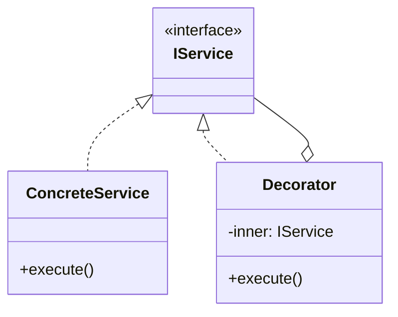

# Skill 01: Foundation — Modules, Namespaces, and Project Structure

## WHY

Before any pattern can be applied, the team needs a **shared module system**. Without it, two engineers create conflicting globals, duplicate utilities, and import paths become a tangled mess.

The module system is the skeleton that all subsequent layers plug into.

## WHICH Patterns

| Pattern | Use When | Book Example |
|---------|----------|-------------|
| IIFE Module | Legacy browser code, no bundler | `B05337_03/AbstractFactory.js` |
| TypeScript `module` / `namespace` | Legacy TS (pre-ES modules) | `B05337_03/AbstractFactory.ts` |
| ES Modules (`import`/`export`) | Modern projects (recommended) | Not in book — enhancement needed |
| Barrel Pattern (`index.ts`) | Public API per directory | Not in book — enhancement needed |

## HOW

### The Book's Approach: TypeScript `module` Keyword

Every file in the book uses this pattern:

```typescript
// From B05337_03/AbstractFactory.ts
module Westeros.Ruling {
  export interface IKing {
    makeDecision();
    marry();
  }
  // ...
}
```

The compiled JavaScript uses an IIFE:

```javascript
// From B05337_03/AbstractFactory.js
var Westeros;
(function (Westeros) {
    var Ruling;
    (function (Ruling) {
        // ...
    })(Ruling = Westeros.Ruling || (Westeros.Ruling = {}));
})(Westeros || (Westeros = {}));
```

**Why this works:** Prevents global pollution. Creates a hierarchical namespace.

**Why this is outdated:** TypeScript `module` keyword for namespacing is deprecated in favor of ES modules. Modern bundlers (webpack, esbuild, vite) work with `import`/`export`.

### Modern Equivalent: ES Modules

The same AbstractFactory in ES module style:

```typescript
// ruling/interfaces.ts
export interface IKing {
  makeDecision(): void;
  marry(): void;
}

export interface IHandOfTheKing {
  makeDecision(): void;
}

export interface IRulingFamilyAbstractFactory {
  getKing(): IKing;
  getHandOfTheKing(): IHandOfTheKing;
}
```

```typescript
// ruling/lannister.ts
import { IKing, IHandOfTheKing, IRulingFamilyAbstractFactory } from './interfaces';

export class KingJoffery implements IKing { /* ... */ }
export class LordTywin implements IHandOfTheKing { /* ... */ }
export class LannisterFactory implements IRulingFamilyAbstractFactory { /* ... */ }
```

```typescript
// ruling/index.ts  (barrel export)
export * from './interfaces';
export { LannisterFactory } from './lannister';
export { TargaryenFactory } from './targaryen';
```

### Project Skeleton for Layered Architecture

```
src/
  core/              ← Skill 03: pure utilities, zero dependencies
  domain/            ← Skill 08: business logic, state machines
  infrastructure/    ← Skill 04: adapters for DB, HTTP, filesystem
  application/       ← Skill 09: controllers, view-models
  crosscutting/      ← Skill 05: decorators, middleware
  communication/     ← Skill 07: event bus, message types
  config/            ← Skill 06: DI container, composition root
  index.ts           ← Application entry point
```

Each directory has an `index.ts` barrel that exports its public API. Internal files are not imported directly from other layers.

### Dynamic Import — Loading Modules on Demand

ES2020 introduced `import()` as an expression, enabling code splitting at the module level:

```typescript
// Static import — always loaded at startup
import { HeavyChart } from './analytics';

// Dynamic import — loaded only when needed
async function showAnalytics() {
  const { HeavyChart } = await import('./analytics');
  renderChart(HeavyChart);
}

// Conditional loading based on environment
const adapter = await import(
  process.env.DB_TYPE === 'postgres'
    ? './adapters/postgres-adapter'
    : './adapters/mysql-adapter'
);
```

**Ref:** `Data_Source/Addy Osmani/learning-jsdp-main/ch05/` — ES Module and dynamic import examples

Dynamic import is the foundation of code splitting in [Skill 14](14-rendering-and-performance-patterns.md).

### Revealing Module Pattern

The Revealing Module Pattern exposes only selected members, keeping internals truly private:

```javascript
// Revealing Module — only public API is returned
const UserModule = (() => {
  // Private
  let users = [];
  function validate(user) { return user.name && user.email; }

  // Public API
  function addUser(user) {
    if (!validate(user)) throw new Error('Invalid user');
    users.push(user);
  }
  function getCount() { return users.length; }

  return { addUser, getCount };  // reveal only what's needed
})();
```

**Modern equivalent with WeakMap privacy:**

```typescript
// WeakMap provides true private state for classes
const _state = new WeakMap<object, { count: number }>();

class Counter {
  constructor() {
    _state.set(this, { count: 0 });
  }

  increment() {
    const state = _state.get(this)!;
    state.count++;
  }

  get value() {
    return _state.get(this)!.count;
  }
}

// _state is inaccessible from outside — true encapsulation
const c = new Counter();
c.increment();
console.log(c.value); // 1
// c._state → undefined (not accessible)
```

**Ref:** `Data_Source/Addy Osmani/learning-jsdp-main/ch07/` — Revealing Module and privacy patterns

### Module Loading Systems — AMD, CommonJS, UMD

Understanding legacy module systems helps when working with older codebases:

```javascript
// CommonJS (Node.js) — synchronous, server-side
const express = require('express');
module.exports = { createApp };

// AMD (RequireJS) — asynchronous, browser-side
define(['jquery', 'underscore'], function($, _) {
  return { init: function() { /* ... */ } };
});

// UMD — Universal, works everywhere
(function(root, factory) {
  if (typeof define === 'function' && define.amd) {
    define(['dependency'], factory);          // AMD
  } else if (typeof module === 'object') {
    module.exports = factory(require('dependency')); // CommonJS
  } else {
    root.MyModule = factory(root.Dependency); // Browser global
  }
}(typeof self !== 'undefined' ? self : this, function(dep) {
  return { /* module API */ };
}));
```

**Ref:** `Data_Source/Addy Osmani/learning-jsdp-main/ch10/` — CommonJS, AMD, UMD examples with Node.js

**Modern guidance:** Use ES Modules (`import`/`export`) for all new code. CommonJS remains relevant in Node.js config files and legacy packages.

### Namespacing Patterns

Before ES Modules, namespacing prevented global collisions. These patterns still appear in legacy code:

```javascript
// 1. Object literal namespacing
var MyApp = MyApp || {};
MyApp.utils = { formatDate: function(d) { /* ... */ } };
MyApp.models = { User: function(name) { this.name = name; } };

// 2. Nested namespacing
MyApp.modules = MyApp.modules || {};
MyApp.modules.auth = { login: function() { /* ... */ } };

// 3. IIFE with namespace injection (the book's approach)
var Westeros;
(function(Westeros) {
  var Ruling = {};
  Ruling.King = function() { /* ... */ };
  Westeros.Ruling = Ruling;
})(Westeros || (Westeros = {}));
```

**Ref:** `Data_Source/Addy Osmani/learning-jsdp-main/ch11/` — Namespacing pattern examples

## TEAM Convention

1. **One module per bounded context.** Don't dump everything in a `utils/` folder.
2. **Barrel exports per layer.** Other layers import from `infrastructure/index.ts`, never from `infrastructure/adapters/mysql-adapter.ts`.
3. **Dependency direction flows inward.** `application/` → `domain/` → `core/`. Never the reverse.
4. **No circular imports.** If two modules need each other, extract the shared interface into `core/`.
5. **Use dynamic `import()` for code splitting.** Heavy modules should be loaded on demand, not at startup.
6. **ES Modules for all new code.** CommonJS only for Node.js config files or legacy compatibility.

## References

- `Mastering-JavaScript-Design-Patterns-Second-Edition-master/B05337_03/AbstractFactory.ts` — TypeScript `module` keyword usage (lines 1-18)
- `Mastering-JavaScript-Design-Patterns-Second-Edition-master/B05337_03/AbstractFactory.js` — IIFE compilation output
- `Data_Source/Addy Osmani/learning-jsdp-main/ch05/` — ES Modules, classes, dynamic import
- `Data_Source/Addy Osmani/learning-jsdp-main/ch07/` — Revealing Module, WeakMap privacy
- `Data_Source/Addy Osmani/learning-jsdp-main/ch10/` — AMD, CommonJS, UMD module loading
- `Data_Source/Addy Osmani/learning-jsdp-main/ch11/` — Namespacing patterns

## Next

With the module foundation set, [Skill 02](02-object-creation-layer.md) addresses how objects are created across these modules.


---

## AI Agent Documentation Protocol

When an AI Agent completes a development task using patterns from this skill, it **MUST** perform the following documentation steps:

### 1. Pattern Annotation Comments

Add a block comment at the top of each file where a pattern is applied:

```typescript
/**
 * @pattern Observer
 * @skill 07-inter-component-communication
 * @description TypedEventBus for cross-layer event notification
 * @see skills/07-inter-component-communication.md
 */
```

### 2. Mermaid Architecture Diagram

Generate a Mermaid class or sequence diagram showing how the implemented patterns interact:



### 3. Pattern Registry Update

If a `pattern-registry.md` exists in the project, append an entry:

```markdown
| Date | File(s) | Pattern | Skill | Rationale |
|------|---------|---------|-------|-----------|
| YYYY-MM-DD | src/services/user-service.ts | Decorator | 05 | Added logging without modifying business logic |
```

> These steps ensure every AI-generated code change is traceable to a design decision, making future modifications faster and cheaper for both humans and AI agents.
