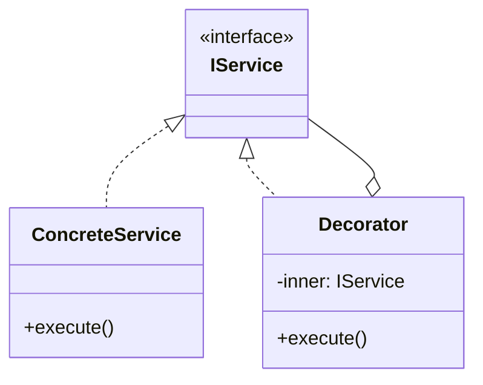

# Skill 02: Object Creation Layer — Controlling How Components Are Born

## WHY

Uncontrolled `new` calls scattered across a codebase create **hidden dependencies**. When Engineer A writes `new MySQLConnection()` inside a service, Engineer B cannot swap it for a test double or a different database. Creational patterns create **seams** — points where implementations can be swapped without changing consumers.

This is the creation half of Inversion of Control (the wiring half comes in [Skill 06](06-dependency-injection-and-ioc-container.md)).

## WHICH Patterns

| Pattern | Solves | Example |
|---------|--------|---------|
| **Abstract Factory** | Swapping families of related objects at runtime | DB driver + pool + query builder |
| **Factory Method** | Single creation point needs polymorphism | Logger that creates ConsoleLogger or FileLogger |
| **Builder** | Constructing complex configuration objects step by step | HTTP client config, DB connection options |
| **Singleton** | Exactly one shared instance (use sparingly) | Configuration registry, connection pool |
| **Prototype** | Creating objects by cloning an existing template | Default settings objects |

## HOW

### Abstract Factory — The Star Example

`B05337_03/AbstractFactory.ts` is the best example in the repository:

```typescript
// Interface defines the contract — consumers depend only on this
export interface IRulingFamilyAbstractFactory {
  getKing(): IKing;
  getHandOfTheKing(): IHandOfTheKing;
}

// Concrete factory 1: Lannister family
export class LannisterFactory implements IRulingFamilyAbstractFactory {
  getKing(): IKing { return new KingJoffery(); }
  getHandOfTheKing(): IHandOfTheKing { return new LordTywin(); }
}

// Concrete factory 2: Targaryen family
export class TargaryenFactory implements IRulingFamilyAbstractFactory {
  getKing(): IKing { return new KingAerys(); }
  getHandOfTheKing(): IHandOfTheKing { return new LordConnington(); }
}

// Consumer depends on the INTERFACE, not concrete classes
export class CourtSession {
  constructor(public abstractFactory: IRulingFamilyAbstractFactory) {}
  complaintPresented(complaint) {
    if (complaint.severity < this.COMPLAINT_THRESHOLD) {
      this.abstractFactory.getHandOfTheKing().makeDecision();
    } else {
      this.abstractFactory.getKing().makeDecision();
    }
  }
}
```

**Production mapping:** Replace `IRulingFamilyAbstractFactory` with `IDatabaseDriverFactory`. Replace `LannisterFactory`/`TargaryenFactory` with `MySQLDriverFactory`/`PostgresDriverFactory`. The `CourtSession` becomes any service that needs database access — it never knows which database it's talking to.

### Singleton — Cautionary Tale

`B05337_03/Singleton.ts` demonstrates the pattern but has a **critical bypass bug**:

```typescript
// The book's Singleton allows direct construction:
var wall = new Westeros.Wall();        // bypasses getInstance()!
var wall2 = Westeros.Wall.getInstance(); // correct usage
// wall !== wall2 — two instances exist!
```

**Production fix:** Use a private constructor (TypeScript enforces this):

```typescript
export class Configuration {
  private static instance: Configuration;
  private constructor(private settings: Map<string, string>) {}

  static getInstance(): Configuration {
    if (!Configuration.instance) {
      Configuration.instance = new Configuration(new Map());
    }
    return Configuration.instance;
  }
}
// new Configuration() → compile error
```

**When to use:** Configuration, connection pools, service registries. **When NOT to use:** Anything that should be testable with different instances — prefer DI ([Skill 06](06-dependency-injection-and-ioc-container.md)) over Singleton.

### Builder — Enhancement Needed

`B05337_03/Builder.ts` is skeletal. A production Builder uses a **fluent interface**:

```typescript
export class HttpClientConfigBuilder {
  private config: Partial<HttpClientConfig> = {};

  baseUrl(url: string): this { this.config.baseUrl = url; return this; }
  timeout(ms: number): this { this.config.timeout = ms; return this; }
  retries(count: number): this { this.config.retries = count; return this; }
  auth(token: string): this { this.config.authToken = token; return this; }

  build(): HttpClientConfig {
    if (!this.config.baseUrl) throw new Error('baseUrl is required');
    return { timeout: 5000, retries: 3, ...this.config } as HttpClientConfig;
  }
}

// Usage:
const config = new HttpClientConfigBuilder()
  .baseUrl('https://api.example.com')
  .timeout(3000)
  .retries(5)
  .build();
```

### Constructor Pattern — Object.create() and Prototype Variants

JavaScript offers multiple ways to create objects. Understanding the spectrum helps choose the right approach:

```javascript
// 1. Constructor function (classical)
function User(name, role) {
  this.name = name;
  this.role = role;
}
User.prototype.greet = function() { return `I am ${this.name}`; };

// 2. Object.create() — prototype-based creation without constructors
const userProto = {
  greet() { return `I am ${this.name}`; },
  hasPermission(perm) { return this.permissions.includes(perm); }
};

const admin = Object.create(userProto);
admin.name = 'Admin';
admin.permissions = ['read', 'write', 'delete'];

// 3. ES6 Class (syntactic sugar over prototypes)
class User {
  constructor(public name: string, public role: string) {}
  greet() { return `I am ${this.name}`; }
}

// 4. Factory function (no new keyword needed)
function createUser(name: string, role: string) {
  return {
    name,
    role,
    greet: () => `I am ${name}`,
  };
}
```

**Ref:** `Data_Source/Addy Osmani/learning-jsdp-main/ch07/` — Constructor pattern, Object.create(), Prototype variants

**Guidance:** Prefer ES6 classes for domain entities ([Skill 08](08-state-management-and-business-logic.md)). Use factory functions when you need to hide implementation details or avoid `new`.

## TEAM Convention

1. **No raw `new` for cross-layer dependencies.** If a class in `application/` needs something from `infrastructure/`, it receives it through constructor injection, not `new`.
2. **Factory interfaces defined at layer boundaries.** The `domain/` layer defines `IDatabaseDriverFactory`; the `infrastructure/` layer implements it.
3. **Singleton only for true global state.** Prefer DI container-managed singletons ([Skill 06](06-dependency-injection-and-ioc-container.md)) over static `getInstance()`.
4. **Use factory functions for simple object creation** without class ceremony. Reserve classes for entities with behavior.

## References

- `B05337_03/AbstractFactory.ts` — Complete abstract factory with interface + 2 concrete factories + consumer
- `B05337_03/Singleton.ts` — Singleton with constructor bypass vulnerability
- `B05337_03/Builder.ts` — Skeletal builder (needs fluent enhancement)
- `B05337_03/FactoryMethod.ts` — Factory method pattern
- `B05337_03/Prototype.ts` — Prototype pattern
- `B05337_06/LazyInstantiation.ts` — Deferred creation
- `Data_Source/Addy Osmani/learning-jsdp-main/ch07/` — Constructor, Object.create(), Prototype variants

## Next

With object creation controlled, [Skill 03](03-shared-utilities-and-functional-core.md) builds the shared utility layer that any part of the system can safely call.


---

## AI Agent Documentation Protocol

When an AI Agent completes a development task using patterns from this skill, it **MUST** perform the following documentation steps:

### 1. Pattern Annotation Comments

Add a block comment at the top of each file where a pattern is applied:

```typescript
/**
 * @pattern Observer
 * @skill 07-inter-component-communication
 * @description TypedEventBus for cross-layer event notification
 * @see skills/07-inter-component-communication.md
 */
```

### 2. Mermaid Architecture Diagram

Generate a Mermaid class or sequence diagram showing how the implemented patterns interact:



### 3. Pattern Registry Update

If a `pattern-registry.md` exists in the project, append an entry:

```markdown
| Date | File(s) | Pattern | Skill | Rationale |
|------|---------|---------|-------|-----------|
| YYYY-MM-DD | src/services/user-service.ts | Decorator | 05 | Added logging without modifying business logic |
```

> These steps ensure every AI-generated code change is traceable to a design decision, making future modifications faster and cheaper for both humans and AI agents.
