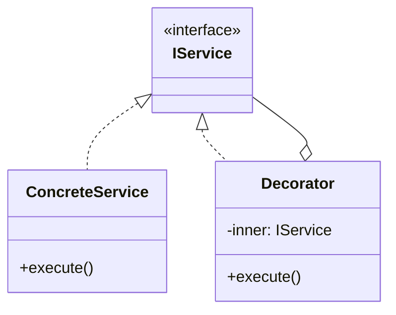

# Skill 03: Shared Utilities — Functional Patterns for the Pure Core

## WHY

Every layered application needs a shared utility layer — **pure functions with no side effects** that any layer can safely call. When utilities mutate state or depend on IO, they become landmines in a team codebase: one engineer's "helpful" utility breaks another's code path.

The principle: the **innermost layer** of your architecture should be functional. It has zero dependencies on IO, frameworks, or mutable state. It is the easiest code to test, reuse, and reason about.

## WHICH Patterns

| Pattern | Solves | Book Reference |
|---------|--------|---------------|
| **Filter / Pipeline** | Data transformation chains | `B05337_06/Filter.ts` |
| **Accumulator / Reduce** | Aggregating collections into a single value | `B05337_06/Accumulator.ts` |
| **Immutable Data** | Preventing shared state mutation | `B05337_06/Immutable.ts` (nearly empty — needs enhancement) |
| **Iterator** | Uniform traversal of any collection | `B05337_05/Iterator.ts` |
| **Strategy** | Pluggable algorithms consumed by multiple layers | `B05337_05/Strategy.ts` |

## HOW

### Filter / Pipeline

`B05337_06/Filter.ts` extends `Array.prototype` with `.where()` and `.select()`:

```typescript
// Book approach: prototype extension
Array.prototype.where = function(inclusionTest) {
  var results = [];
  for (var i = 0; i < this.length; i++) {
    if (inclusionTest(this[i])) results.push(this[i]);
  }
  return results;
};
```

**Production approach:** Don't extend `Array.prototype` (it affects all arrays globally — a team hazard). Use standalone functions or a pipeline utility:

```typescript
// Pure pipeline functions
const where = <T>(predicate: (item: T) => boolean) =>
  (items: T[]): T[] => items.filter(predicate);

const select = <T, R>(transform: (item: T) => R) =>
  (items: T[]): R[] => items.map(transform);

// Compose into a pipeline
const pipe = <T>(...fns: Array<(arg: T) => T>) =>
  (input: T): T => fns.reduce((acc, fn) => fn(acc), input);

// Usage:
const activeAdults = pipe(
  where<User>(u => u.age >= 18),
  where<User>(u => u.isActive)
);
const result = activeAdults(users);
```

### Strategy as Shared Business Rules

`B05337_05/Strategy.ts` defines `ITravelMethod` with `Travel()`. Reframed as a utility pattern:

```typescript
// Define a pluggable validation strategy
interface IValidationStrategy {
  validate(value: string): boolean;
  errorMessage: string;
}

class RequiredField implements IValidationStrategy {
  errorMessage = 'Field is required';
  validate(value: string): boolean { return value.length > 0; }
}

class MaxLength implements IValidationStrategy {
  errorMessage: string;
  constructor(private max: number) {
    this.errorMessage = `Must be ${max} characters or fewer`;
  }
  validate(value: string): boolean { return value.length <= this.max; }
}

// Any layer can use these validators — they are pure, stateless, reusable
function validateField(value: string, strategies: IValidationStrategy[]): string[] {
  return strategies
    .filter(s => !s.validate(value))
    .map(s => s.errorMessage);
}
```

### Immutable Data — Enhancement

`B05337_06/Immutable.ts` is nearly empty (just a class declaration). Production immutability:

```typescript
// 1. Object.freeze for shallow immutability
const config = Object.freeze({ host: 'localhost', port: 3306 });
// config.port = 5432; → TypeError in strict mode

// 2. Spread-based updates (create new, don't mutate)
function updateUser(user: User, changes: Partial<User>): User {
  return { ...user, ...changes };  // returns NEW object
}

// 3. ReadonlyArray for collection safety
function processItems(items: ReadonlyArray<Item>): Summary {
  // items.push(x); → compile error
  return items.reduce((acc, item) => /* ... */, initialSummary);
}
```

### Iterator in Modern JavaScript

`B05337_05/Iterator.ts` implements a manual iterator. Modern JS provides `Symbol.iterator`:

```typescript
class NumberRange {
  constructor(private start: number, private end: number) {}

  [Symbol.iterator]() {
    let current = this.start;
    const end = this.end;
    return {
      next(): IteratorResult<number> {
        return current <= end
          ? { value: current++, done: false }
          : { value: undefined, done: true };
      }
    };
  }
}

// Works with for...of, spread, destructuring
for (const n of new NumberRange(1, 5)) { console.log(n); }
const nums = [...new NumberRange(1, 10)];
```

### Mixin Pattern — Composable Shared Behavior

Mixins add behavior to classes without inheritance. Three variants exist:

```typescript
// 1. Constructor Augmenting Mixin — adds methods to existing class
function Serializable<T extends new (...args: any[]) => any>(Base: T) {
  return class extends Base {
    toJSON() { return JSON.stringify(this); }
    static fromJSON(json: string) { return Object.assign(new Base(), JSON.parse(json)); }
  };
}

// 2. Subclassing Mixin — adds shared behavior to a class hierarchy
function Timestamped<T extends new (...args: any[]) => any>(Base: T) {
  return class extends Base {
    createdAt = new Date();
    updatedAt = new Date();
    touch() { this.updatedAt = new Date(); }
  };
}

// 3. Compose multiple mixins
class User {
  constructor(public name: string) {}
}

const EnhancedUser = Serializable(Timestamped(User));
const user = new EnhancedUser('Alice');
user.touch();
console.log(user.toJSON());
```

**Object.assign Mixin (simpler variant):**

```typescript
// Merge behavior from multiple sources
const Validatable = {
  validate() { return Object.keys(this).every(k => this[k] != null); }
};

const Loggable = {
  log() { console.log(JSON.stringify(this)); }
};

// Apply to any object
const user = Object.assign({ name: 'Alice', email: 'a@b.com' }, Validatable, Loggable);
user.validate(); // true
user.log();      // {"name":"Alice","email":"a@b.com"}
```

**Ref:** `Data_Source/Addy Osmani/learning-jsdp-main/ch07/` — Mixin pattern (3 variants: augmenting, subclassing, superclassing)

**When to use:** Cross-cutting behavior (serialization, timestamps, validation) that doesn't warrant a full Decorator ([Skill 05](05-cross-cutting-concerns-aop-and-decorators.md)) chain.

## TEAM Convention

1. **Utility functions are pure.** No `this`, no mutation, no IO. Given the same input, always the same output.
2. **Shared utilities live in `core/` or `shared/`.** They have zero imports from other layers.
3. **Don't extend native prototypes.** Use standalone functions instead of `Array.prototype.where`.
4. **Strategy interfaces go in `core/`.** Implementations can live in any layer, but the interface is shared.
5. **Prefer `ReadonlyArray`, `Readonly<T>`, and `as const` for shared data structures.**
6. **Use Mixins for cross-cutting behavior** that multiple unrelated classes need. Prefer TypeScript mixin functions over `Object.assign` for type safety.

## References

- `B05337_06/Filter.ts` — Array prototype extension with `.where()` / `.select()`
- `B05337_06/Accumulator.ts` — Reduce/accumulate pattern
- `B05337_06/Immutable.ts` — Nearly empty (needs production enhancement)
- `B05337_05/Iterator.ts` — Manual iterator implementation
- `B05337_05/Strategy.ts` — `ITravelMethod` strategy interface
- `Data_Source/Addy Osmani/learning-jsdp-main/ch07/` — Mixin pattern (3 variants)

## Next

With shared utilities defined, [Skill 04](04-io-and-infrastructure-adapters.md) shows how to isolate external systems behind adapter interfaces.


---

## AI Agent Documentation Protocol

When an AI Agent completes a development task using patterns from this skill, it **MUST** perform the following documentation steps:

### 1. Pattern Annotation Comments

Add a block comment at the top of each file where a pattern is applied:

```typescript
/**
 * @pattern Observer
 * @skill 07-inter-component-communication
 * @description TypedEventBus for cross-layer event notification
 * @see skills/07-inter-component-communication.md
 */
```

### 2. Mermaid Architecture Diagram

Generate a Mermaid class or sequence diagram showing how the implemented patterns interact:



### 3. Pattern Registry Update

If a `pattern-registry.md` exists in the project, append an entry:

```markdown
| Date | File(s) | Pattern | Skill | Rationale |
|------|---------|---------|-------|-----------|
| YYYY-MM-DD | src/services/user-service.ts | Decorator | 05 | Added logging without modifying business logic |
```

> These steps ensure every AI-generated code change is traceable to a design decision, making future modifications faster and cheaper for both humans and AI agents.
