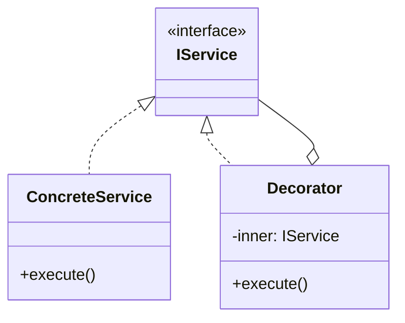

# Skill 04: IO and Infrastructure Layer — Adapter, Facade, Bridge, and Proxy

## WHY

Without an infrastructure abstraction layer, business logic gets polluted with `fs.readFile`, `http.get`, and raw SQL strings. Engineer A writes MySQL queries directly in a service; Engineer B cannot swap it for PostgreSQL or a test mock. The infrastructure layer defines **interfaces that the rest of the application programs against**, while concrete implementations handle the messy real-world details.

This is the boundary between "our code" and "the outside world" — file system, databases, HTTP APIs, TCP/IP, third-party services.

## WHICH Patterns

| Pattern | Solves | When to Use |
|---------|--------|------------|
| **Adapter** | Wrapping a third-party API behind your own interface | Database drivers, HTTP clients, payment gateways |
| **Facade** | Simplifying a complex subsystem into one clean API | Coordinating connection + pool + query + transaction |
| **Bridge** | Separating abstraction from implementation when both vary | Logger (abstraction) × Console/File/Remote (targets) |
| **Proxy** | Adding caching, logging, or access control transparently | Caching proxy for API calls, lazy-loading proxy for DB |

## HOW

### Adapter — The Primary Example

`B05337_04/Adapter.ts` demonstrates wrapping a complex `IShip` interface behind a simple `SimpleShip`:

```typescript
// Complex third-party interface (the thing you can't change)
export interface IShip {
  SetRudderAngleTo(angle: number);
  SetSailConfiguration(configuration: SailConfiguration);
  SetSailAngle(sailId: number, sailAngle: number);
  GetCurrentBearing(): number;
  GetCurrentSpeedEstimate(): number;
  ShiftCrewWeightTo(weightToShift: number, locationId: number);
}

// Your application's simple interface (the thing your code uses)
export interface SimpleShip {
  TurnLeft();
  TurnRight();
  GoForward();
}

// Adapter bridges the gap
export class ShipAdapter implements SimpleShip {
  _ship: Ship;
  constructor() { this._ship = new Ship(); }
  TurnLeft()   { this._ship.SetRudderAngleTo(-30); this._ship.SetSailAngle(3, 12); }
  TurnRight()  { this._ship.SetRudderAngleTo(30); this._ship.SetSailAngle(5, -9); }
  GoForward()  { /* coordinate multiple ship methods */ }
}
```

**Production mapping — Database Adapter:**

```typescript
// Your interface (defined in domain/ layer)
export interface IUserRepository {
  findById(id: string): Promise<User | null>;
  save(user: User): Promise<void>;
  delete(id: string): Promise<void>;
}

// MySQL adapter (lives in infrastructure/)
export class MySQLUserRepository implements IUserRepository {
  constructor(private pool: mysql.Pool) {}
  async findById(id: string): Promise<User | null> {
    const [rows] = await this.pool.query('SELECT * FROM users WHERE id = ?', [id]);
    return rows[0] ? this.mapToUser(rows[0]) : null;
  }
  // ...
}

// In-memory adapter (for testing)
export class InMemoryUserRepository implements IUserRepository {
  private users = new Map<string, User>();
  async findById(id: string) { return this.users.get(id) ?? null; }
  // ...
}
```

### Facade — Enhancement Needed

`B05337_04/Facade.ts` is skeletal (empty method bodies). A production Facade coordinates multiple subsystems:

```typescript
// Multiple complex subsystems
class ConnectionPool { acquire(): Connection { /* ... */ } release(conn: Connection) { /* ... */ } }
class QueryBuilder    { select(table: string): Query { /* ... */ } }
class TransactionManager { begin(conn: Connection): Tx { /* ... */ } }

// Facade provides one simple API
export class DatabaseService {
  constructor(
    private pool: ConnectionPool,
    private queryBuilder: QueryBuilder,
    private txManager: TransactionManager
  ) {}

  async query<T>(table: string, where: object): Promise<T[]> {
    const conn = this.pool.acquire();
    try {
      const query = this.queryBuilder.select(table).where(where);
      return await conn.execute(query);
    } finally {
      this.pool.release(conn);
    }
  }

  async inTransaction<T>(work: (tx: Tx) => Promise<T>): Promise<T> {
    const conn = this.pool.acquire();
    const tx = this.txManager.begin(conn);
    try {
      const result = await work(tx);
      await tx.commit();
      return result;
    } catch (e) {
      await tx.rollback();
      throw e;
    } finally {
      this.pool.release(conn);
    }
  }
}
```

### Bridge — Logging Example

`B05337_04/Bridege.ts` (note: filename typo in the book) shows the Bridge concept. Reframed for infrastructure:

```typescript
// Abstraction: what the application uses
export abstract class Logger {
  constructor(protected output: ILogOutput) {}
  abstract info(msg: string): void;
  abstract error(msg: string, err?: Error): void;
}

// Implementation: how the output happens (varies independently)
export interface ILogOutput {
  write(level: string, message: string): void;
}

export class ConsoleOutput implements ILogOutput {
  write(level: string, message: string) { console[level](message); }
}

export class FileOutput implements ILogOutput {
  constructor(private filePath: string) {}
  write(level: string, message: string) { fs.appendFileSync(this.filePath, `[${level}] ${message}\n`); }
}

// Both dimensions can vary independently:
// new AppLogger(new ConsoleOutput())
// new AppLogger(new FileOutput('/var/log/app.log'))
// new SecurityLogger(new RemoteOutput('https://siem.example.com'))
```

### Proxy — ES6 Proxy Traps

JavaScript's native `Proxy` object provides a powerful way to intercept and customize operations on objects:

```typescript
// ES6 Proxy — intercept property access, assignment, and more
const handler: ProxyHandler<any> = {
  get(target, property, receiver) {
    console.log(`Accessing ${String(property)}`);
    return Reflect.get(target, property, receiver);
  },
  set(target, property, value, receiver) {
    console.log(`Setting ${String(property)} = ${value}`);
    // Validation trap — reject invalid values
    if (property === 'age' && (typeof value !== 'number' || value < 0)) {
      throw new TypeError('Age must be a non-negative number');
    }
    return Reflect.set(target, property, value, receiver);
  },
  has(target, property) {
    // Hide private properties from `in` operator
    if (String(property).startsWith('_')) return false;
    return property in target;
  },
  deleteProperty(target, property) {
    if (String(property).startsWith('_')) {
      throw new Error('Cannot delete private property');
    }
    return delete target[property];
  }
};

const user = new Proxy({ name: 'Alice', age: 30, _secret: 'hidden' }, handler);
user.name;        // logs: "Accessing name"
user.age = 31;    // logs: "Setting age = 31"
user.age = -1;    // throws TypeError
'_secret' in user; // false (hidden by has trap)
```

**Production use cases for ES6 Proxy:**

```typescript
// 1. Lazy-loading proxy — defer expensive initialization
function createLazyProxy<T>(factory: () => T): T {
  let instance: T | undefined;
  return new Proxy({} as T, {
    get(_, property) {
      if (!instance) instance = factory();
      return (instance as any)[property];
    }
  });
}

// 2. Reactive data binding (how Vue.js reactivity works)
function reactive<T extends object>(target: T, onChange: () => void): T {
  return new Proxy(target, {
    set(obj, prop, value) {
      const result = Reflect.set(obj, prop, value);
      onChange();  // trigger re-render
      return result;
    }
  });
}

// 3. API call logging proxy
function withLogging<T extends object>(service: T, logger: ILogger): T {
  return new Proxy(service, {
    get(target, property) {
      const original = (target as any)[property];
      if (typeof original === 'function') {
        return function(...args: any[]) {
          logger.info(`${String(property)} called with`, args);
          return original.apply(target, args);
        };
      }
      return original;
    }
  });
}
```

**Ref:** `Data_Source/Addy Osmani/learning-jsdp-main/ch07/proxy/` — ES6 Proxy pattern examples with traps

### Flyweight — Shared Intrinsic State

The Flyweight pattern separates **intrinsic** (shared) state from **extrinsic** (instance-specific) state to minimize memory usage:

```typescript
// Problem: 10,000 books, each storing duplicate author/genre/publisher data

// Flyweight factory — manages shared intrinsic state
class BookFlyweightFactory {
  private static flyweights = new Map<string, BookFlyweight>();

  static get(title: string, author: string, genre: string, isbn: string): BookFlyweight {
    const key = `${isbn}`;
    if (!this.flyweights.has(key)) {
      this.flyweights.set(key, new BookFlyweight(title, author, genre, isbn));
    }
    return this.flyweights.get(key)!;
  }

  static getCount(): number { return this.flyweights.size; }
}

// Flyweight — intrinsic (shared) state only
class BookFlyweight {
  constructor(
    readonly title: string,
    readonly author: string,
    readonly genre: string,
    readonly isbn: string
  ) {}
}

// Context — extrinsic (per-instance) state
interface BookRecord {
  flyweight: BookFlyweight;    // shared
  checkoutDate: Date;           // instance-specific
  checkoutMember: string;       // instance-specific
  dueDate: Date;                // instance-specific
  availability: boolean;        // instance-specific
}

// Manager coordinates flyweight + extrinsic state
class BookRecordManager {
  private records: BookRecord[] = [];

  addRecord(title: string, author: string, genre: string, isbn: string,
            member: string, checkoutDate: Date, dueDate: Date) {
    const flyweight = BookFlyweightFactory.get(title, author, genre, isbn);
    this.records.push({
      flyweight,
      checkoutDate,
      checkoutMember: member,
      dueDate,
      availability: false,
    });
  }
}

// Result: 10,000 book records but only ~500 unique flyweight objects
```

**Production mapping:** Connection pooling is a Flyweight. The pool (factory) manages shared connection objects; each checkout adds extrinsic context (query, timeout, caller).

**Ref:** `Data_Source/Addy Osmani/learning-jsdp-main/ch07/` — BookFactory Flyweight with intrinsic/extrinsic separation

### Caching Proxy — Interface-Compatible Wrapper

```typescript
// Caching Proxy wraps any repository
export class CachingUserRepository implements IUserRepository {
  private cache = new Map<string, User>();

  constructor(private inner: IUserRepository) {}

  async findById(id: string): Promise<User | null> {
    if (this.cache.has(id)) return this.cache.get(id)!;
    const user = await this.inner.findById(id);
    if (user) this.cache.set(id, user);
    return user;
  }

  async save(user: User): Promise<void> {
    await this.inner.save(user);
    this.cache.set(user.id, user);  // invalidate/update cache
  }

  async delete(id: string): Promise<void> {
    await this.inner.delete(id);
    this.cache.delete(id);
  }
}
```

## TEAM Convention

1. **All external system access goes through adapter interfaces.** Business logic never imports `mysql`, `axios`, `fs`, or any third-party package directly.
2. **Interfaces defined in `domain/` or `core/`.** Implementations live in `infrastructure/`.
3. **One adapter per external system.** Don't create a god-adapter that wraps everything.
4. **Facade for complex subsystems.** If using a service requires coordinating 3+ classes (pool + builder + transaction), wrap it in a Facade.
5. **Adapter interfaces become DI injection points** — see [Skill 06](06-dependency-injection-and-ioc-container.md).

## References

- `B05337_04/Adapter.ts` — Ship/ShipAdapter/SimpleShip (complete, well-structured)
- `B05337_04/Facade.ts` — Fleet facade (skeletal — empty method bodies)
- `B05337_04/Bridege.ts` — Bridge with religion adapters (filename typo; concept is solid)
- `B05337_04/Proxy.ts` — Proxy pattern
- `B05337_04/Flyweight.ts` — Flyweight (relevant to connection pooling)
- `Data_Source/Addy Osmani/learning-jsdp-main/ch07/proxy/` — ES6 Proxy with handler traps
- `Data_Source/Addy Osmani/learning-jsdp-main/ch07/` — Flyweight BookFactory (intrinsic/extrinsic)

## Next

With infrastructure isolated, [Skill 05](05-cross-cutting-concerns-aop-and-decorators.md) handles the concerns that cut across all layers: logging, security, and caching.


---

## AI Agent Documentation Protocol

When an AI Agent completes a development task using patterns from this skill, it **MUST** perform the following documentation steps:

### 1. Pattern Annotation Comments

Add a block comment at the top of each file where a pattern is applied:

```typescript
/**
 * @pattern Observer
 * @skill 07-inter-component-communication
 * @description TypedEventBus for cross-layer event notification
 * @see skills/07-inter-component-communication.md
 */
```

### 2. Mermaid Architecture Diagram

Generate a Mermaid class or sequence diagram showing how the implemented patterns interact:



### 3. Pattern Registry Update

If a `pattern-registry.md` exists in the project, append an entry:

```markdown
| Date | File(s) | Pattern | Skill | Rationale |
|------|---------|---------|-------|-----------|
| YYYY-MM-DD | src/services/user-service.ts | Decorator | 05 | Added logging without modifying business logic |
```

> These steps ensure every AI-generated code change is traceable to a design decision, making future modifications faster and cheaper for both humans and AI agents.
