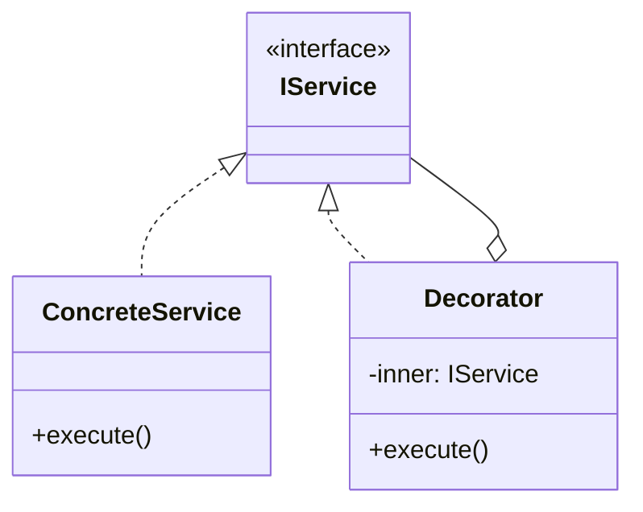

# Skill 05: Cross-Cutting Concerns — AOP, Decorators, and Middleware

## WHY

Logging, security checks, caching, and transaction management appear in **every layer**. If each engineer inlines these concerns into business logic, you get:

- Duplicated boilerplate everywhere
- Inconsistent implementations (one service logs errors, another doesn't)
- Business logic buried under infrastructure noise

Cross-cutting concerns must be **separated** from the code they enhance. Three approaches exist, from explicit to implicit:

## WHICH Approaches

| Approach | Mechanism | Type Safety | Debuggability | Book Reference |
|----------|-----------|-------------|---------------|---------------|
| **Decorator Pattern** (GoF) | Wraps an object with the same interface | Full | Excellent — explicit chain | `B05337_04/Decorator.ts` |
| **Chain of Responsibility** | Pipeline of handlers, each decides to handle or pass | Full | Good — linear pipeline | `B05337_05/ChainOfResponsibility.ts` |
| **TypeScript Decorators** | Annotation-based metadata | Partial | Good | `B05337_14/decorator.ts` |
| **AOP / Aspect Weaving** | Runtime method wrapping | None | Poor — implicit modification | `B05337_13/AspectWeaver.ts` |

## HOW

### Decorator Pattern — Composable Wrappers

`B05337_04/Decorator.ts` shows `ChainMail` wrapping `BasicArmor`:

```typescript
export interface IArmor {
  CalculateDamageFromHit(hit: Hit): number;
  GetArmorIntegrity(): number;
}

export class BasicArmor implements IArmor {
  CalculateDamageFromHit(hit: Hit): number { return hit.Strength * .2; }
  GetArmorIntegrity(): number { return 1; }
}

export class ChainMail implements IArmor {
  constructor(private decoratedArmor: IArmor) {}
  CalculateDamageFromHit(hit: Hit): number {
    hit.Strength = hit.Strength * .8;  // reduce incoming damage
    return this.decoratedArmor.CalculateDamageFromHit(hit);
  }
  GetArmorIntegrity(): number {
    return .9 * this.decoratedArmor.GetArmorIntegrity();
  }
}

// Composable: stack multiple decorators
let armor = new ChainMail(new BasicArmor());
```

**Production mapping — Logging Decorator:**

```typescript
export interface IUserService {
  findById(id: string): Promise<User | null>;
  save(user: User): Promise<void>;
}

export class LoggingUserService implements IUserService {
  constructor(
    private inner: IUserService,
    private logger: ILogger
  ) {}

  async findById(id: string): Promise<User | null> {
    this.logger.info(`Finding user: ${id}`);
    const result = await this.inner.findById(id);
    this.logger.info(`Found user: ${result ? 'yes' : 'no'}`);
    return result;
  }

  async save(user: User): Promise<void> {
    this.logger.info(`Saving user: ${user.id}`);
    await this.inner.save(user);
  }
}

// Compose at the DI composition root:
// const userService = new LoggingUserService(new CachingUserService(new RealUserService(db)), logger);
```

### Chain of Responsibility as Middleware

`B05337_05/ChainOfResponsibility.ts` shows a complaint resolution chain (ClerkOfTheCourt → King). Reframed as HTTP middleware:

```typescript
interface IMiddleware {
  handle(request: Request, next: () => Promise<Response>): Promise<Response>;
}

class AuthMiddleware implements IMiddleware {
  async handle(request: Request, next: () => Promise<Response>): Promise<Response> {
    if (!request.headers.authorization) {
      return { status: 401, body: 'Unauthorized' };
    }
    return next();  // pass to next middleware
  }
}

class LoggingMiddleware implements IMiddleware {
  async handle(request: Request, next: () => Promise<Response>): Promise<Response> {
    console.log(`${request.method} ${request.path}`);
    const start = Date.now();
    const response = await next();
    console.log(`Completed in ${Date.now() - start}ms`);
    return response;
  }
}

// Build the pipeline:
function buildPipeline(middlewares: IMiddleware[], handler: RequestHandler) {
  return middlewares.reduceRight(
    (next, mw) => (req) => mw.handle(req, () => next(req)),
    handler
  );
}
```

### AOP / Aspect Weaving — Cautionary Example

`B05337_13/AspectWeaver.ts` uses **string-based aspect detection**:

```typescript
// Book approach: parse function source for @aspect comments
function weave(toWeave, toWeaveIn, toWeaveInName) {
  for (var property in toWeave.prototype) {
    var stringRepresentation = toWeave.prototype[property].toString();
    if (stringRepresentation.indexOf("@aspect(" + toWeaveInName + ")") >= 0) {
      // wrap the original method at runtime
      toWeave.prototype[property + "_wrapped"] = toWeave.prototype[property];
      toWeave.prototype[property] = function() {
        toWeaveIn.BeforeCall();
        toWeave.prototype[property + "_wrapped"]();
        toWeaveIn.AfterCall();
      }
    }
  }
}
```

**Problems with this approach:**
1. Relies on `Function.toString()` — minification breaks it
2. No type safety — wrapped methods lose their signatures
3. Implicit — hard to debug when aspects don't fire or fire in wrong order

**Production alternative: TypeScript decorator metadata:**

```typescript
function logged(target: any, propertyKey: string, descriptor: PropertyDescriptor) {
  const original = descriptor.value;
  descriptor.value = function (...args: any[]) {
    console.log(`Calling ${propertyKey} with`, args);
    const result = original.apply(this, args);
    console.log(`${propertyKey} returned`, result);
    return result;
  };
  return descriptor;
}

class PaymentService {
  @logged
  sendPayment(amount: number, destination: string) {
    // business logic only — no logging boilerplate
  }
}
```

### Comparing the AOP Examples

`B05337_13/AOP.ts` shows the **problem** — security logic hardcoded in `GoldTransfer`:

```typescript
class GoldTransfer {
  SendPaymentOfGold(amountOfGold, destination) {
    // security check inline — tight coupling
    if (Security.isAuthorized(currentUser)) {
      // send payment
    }
  }
}
```

`B05337_13/AspectWeaver.ts` shows the **string-based solution**. The Decorator pattern ([above](#decorator-pattern--composable-wrappers)) shows the **production solution**.

## TEAM Convention

1. **Cross-cutting concerns are never inline in business logic.** Use Decorator, Middleware, or TypeScript decorators.
2. **Prefer explicit Decorator Pattern over implicit AOP weaving** — the stack trace is readable and the IDE can navigate it.
3. **Chain of Responsibility for request pipelines** (HTTP, validation, event processing).
4. **One decorator per concern.** `LoggingService`, `CachingService`, `AuthorizingService` — don't combine multiple concerns in one decorator.
5. **Compose decorators at the DI composition root** ([Skill 06](06-dependency-injection-and-ioc-container.md)), not scattered through the code.

## References

- `B05337_04/Decorator.ts` — ChainMail/BasicArmor decorator chain (complete, well-structured)
- `B05337_13/AOP.ts` — GoldTransfer with hardcoded security (the problem statement)
- `B05337_13/AspectWeaver.ts` — String-based aspect weaving (educational, not production-ready)
- `B05337_14/decorator.ts` — TypeScript `@spy` decorator
- `B05337_05/ChainOfResponsibility.ts` — ComplaintResolver chain

## Next

With cross-cutting concerns separated, [Skill 06](06-dependency-injection-and-ioc-container.md) wires everything together through Dependency Injection — the keystone of the architecture.


---

## AI Agent Documentation Protocol

When an AI Agent completes a development task using patterns from this skill, it **MUST** perform the following documentation steps:

### 1. Pattern Annotation Comments

Add a block comment at the top of each file where a pattern is applied:

```typescript
/**
 * @pattern Observer
 * @skill 07-inter-component-communication
 * @description TypedEventBus for cross-layer event notification
 * @see skills/07-inter-component-communication.md
 */
```

### 2. Mermaid Architecture Diagram

Generate a Mermaid class or sequence diagram showing how the implemented patterns interact:



### 3. Pattern Registry Update

If a `pattern-registry.md` exists in the project, append an entry:

```markdown
| Date | File(s) | Pattern | Skill | Rationale |
|------|---------|---------|-------|-----------|
| YYYY-MM-DD | src/services/user-service.ts | Decorator | 05 | Added logging without modifying business logic |
```

> These steps ensure every AI-generated code change is traceable to a design decision, making future modifications faster and cheaper for both humans and AI agents.
