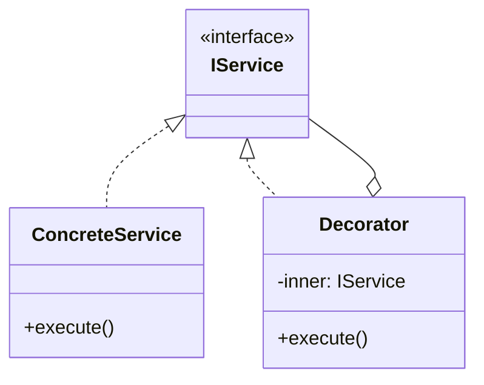

# Skill 06: Dependency Injection and IoC Container — Wiring the Layers

## WHY

This is the **keystone** of the layered architecture. Skills 01-05 defined layers with clean interfaces. Now the question is: **who creates the concrete implementations and passes them to consumers?**

Without DI:
```typescript
class OrderService {
  private repo = new MySQLOrderRepository();     // hardcoded dependency
  private emailer = new SMTPEmailService();       // hardcoded dependency
  private logger = new ConsoleLogger();           // hardcoded dependency
}
```
- Cannot swap MySQL for PostgreSQL without changing `OrderService`
- Cannot test without hitting a real database
- Engineer A and Engineer B must coordinate on concrete types

With DI:
```typescript
class OrderService {
  constructor(
    private repo: IOrderRepository,        // interface only
    private emailer: IEmailService,         // interface only
    private logger: ILogger                 // interface only
  ) {}
}
```
- Any implementation can be injected: real, mock, or alternate
- Each layer develops against interfaces independently

## WHICH Patterns

| Approach | Complexity | When to Use |
|----------|-----------|------------|
| **Constructor Injection** (manual) | Low | Small projects, < 20 classes |
| **Factory-based DI** | Medium | When object creation has logic (conditional, lazy) |
| **DI Container** | Higher | Medium-large projects, automated wiring |

## HOW

### Starting Point: The Book's DI

`B05337_13/DependencyInjection.ts` is just 3 lines:

```typescript
class UserManager {
  constructor(public database, public userEmailer) {}
}
```

This is **correct in principle** — constructor injection. But it's incomplete: there's no container, no lifecycle management, and no composition root.

### Level 1: Manual Constructor Injection

Wire dependencies by hand at the application entry point:

```typescript
// config/composition-root.ts  (the ONLY file that knows concrete types)
import { MySQLUserRepository } from '../infrastructure/mysql-user-repository';
import { SMTPEmailService } from '../infrastructure/smtp-email-service';
import { ConsoleLogger } from '../infrastructure/console-logger';
import { UserService } from '../domain/user-service';
import { UserController } from '../application/user-controller';

// Create infrastructure
const logger = new ConsoleLogger();
const userRepo = new MySQLUserRepository(connectionPool);
const emailService = new SMTPEmailService(smtpConfig);

// Create domain services (depend on interfaces, receive concrete implementations)
const userService = new UserService(userRepo, emailService);

// Create application layer
const userController = new UserController(userService, logger);
```

**Key insight:** Only `composition-root.ts` knows about concrete classes. Every other file imports only interfaces.

### Level 2: Factory-Based DI

Revisiting Abstract Factory from [Skill 02](02-object-creation-layer.md):

```typescript
// The book's IRulingFamilyAbstractFactory becomes an infrastructure factory
interface IInfrastructureFactory {
  createUserRepository(): IUserRepository;
  createEmailService(): IEmailService;
  createLogger(): ILogger;
}

class ProductionInfrastructure implements IInfrastructureFactory {
  createUserRepository() { return new MySQLUserRepository(this.pool); }
  createEmailService() { return new SMTPEmailService(this.smtpConfig); }
  createLogger() { return new FileLogger('/var/log/app.log'); }
}

class TestInfrastructure implements IInfrastructureFactory {
  createUserRepository() { return new InMemoryUserRepository(); }
  createEmailService() { return new MockEmailService(); }
  createLogger() { return new NullLogger(); }
}
```

### Level 3: Simple DI Container

Build a minimal container that registers and resolves dependencies:

```typescript
type Constructor<T> = new (...args: any[]) => T;

class Container {
  private registrations = new Map<string, { factory: () => any; singleton: boolean; instance?: any }>();

  // Register a factory for a token
  register<T>(token: string, factory: () => T, options?: { singleton?: boolean }): void {
    this.registrations.set(token, {
      factory,
      singleton: options?.singleton ?? false
    });
  }

  // Resolve an instance by token
  resolve<T>(token: string): T {
    const reg = this.registrations.get(token);
    if (!reg) throw new Error(`No registration for: ${token}`);

    if (reg.singleton) {
      if (!reg.instance) reg.instance = reg.factory();
      return reg.instance;
    }
    return reg.factory();
  }
}

// Usage in composition root:
const container = new Container();
container.register('ILogger', () => new ConsoleLogger(), { singleton: true });
container.register('IUserRepository', () => new MySQLUserRepository(pool), { singleton: true });
container.register('IEmailService', () => new SMTPEmailService(config));
container.register('UserService', () => new UserService(
  container.resolve('IUserRepository'),
  container.resolve('IEmailService')
));
container.register('UserController', () => new UserController(
  container.resolve('UserService'),
  container.resolve('ILogger')
));

// Application entry point:
const app = container.resolve<UserController>('UserController');
```

### Composite for Service Aggregation

`B05337_04/Composite.ts` (CompoundIngredient aggregating SimpleIngredients) reframed as a composite service:

```typescript
interface INotificationService {
  notify(user: User, message: string): Promise<void>;
}

class EmailNotification implements INotificationService { /* ... */ }
class SMSNotification implements INotificationService { /* ... */ }
class PushNotification implements INotificationService { /* ... */ }

// Composite: sends to ALL channels
class CompositeNotification implements INotificationService {
  constructor(private services: INotificationService[]) {}

  async notify(user: User, message: string): Promise<void> {
    await Promise.all(this.services.map(s => s.notify(user, message)));
  }
}

// Registered in container:
container.register('INotificationService', () => new CompositeNotification([
  new EmailNotification(emailConfig),
  new PushNotification(pushConfig),
]));
```

### The Composition Root Principle

The **composition root** is the single place where:
1. The DI container is configured
2. All concrete types are registered
3. The application object graph is assembled

**It is the ONLY file that imports concrete implementation classes.** Business logic, domain services, and application controllers import only interfaces.

### Service Locator Anti-Pattern

```typescript
// BAD: Service Locator scattered through code
class OrderService {
  process(order: Order) {
    const repo = Container.resolve<IOrderRepository>('IOrderRepository');  // hidden dependency!
    const emailer = Container.resolve<IEmailService>('IEmailService');     // hidden dependency!
  }
}
```

This is worse than `new` because the dependencies are completely invisible from the constructor signature. Use constructor injection instead.

## TEAM Convention

1. **Dependencies flow inward.** `application/` → `domain/` → `core/`. Infrastructure implements domain interfaces.
2. **Constructor injection by default.** Every class declares its dependencies as constructor parameters.
3. **Composition root is the only file that imports from `infrastructure/`.** All other files import interfaces from `domain/` or `core/`.
4. **No Service Locator.** Don't call `container.resolve()` outside the composition root.
5. **Singleton vs. Transient is a container decision**, not a class decision. Don't use the Singleton pattern ([Skill 02](02-object-creation-layer.md)) — let the container manage lifecycle.

## References

- `B05337_13/DependencyInjection.ts` — Constructor injection skeleton (3 lines)
- `B05337_03/AbstractFactory.ts` — Factory-based DI precursor (IRulingFamilyAbstractFactory)
- `B05337_04/Composite.ts` — Composite pattern for service aggregation

## Next

With layers wired, [Skill 07](07-inter-component-communication.md) addresses how components communicate at runtime through events and messages.


---

## AI Agent Documentation Protocol

When an AI Agent completes a development task using patterns from this skill, it **MUST** perform the following documentation steps:

### 1. Pattern Annotation Comments

Add a block comment at the top of each file where a pattern is applied:

```typescript
/**
 * @pattern Observer
 * @skill 07-inter-component-communication
 * @description TypedEventBus for cross-layer event notification
 * @see skills/07-inter-component-communication.md
 */
```

### 2. Mermaid Architecture Diagram

Generate a Mermaid class or sequence diagram showing how the implemented patterns interact:



### 3. Pattern Registry Update

If a `pattern-registry.md` exists in the project, append an entry:

```markdown
| Date | File(s) | Pattern | Skill | Rationale |
|------|---------|---------|-------|-----------|
| YYYY-MM-DD | src/services/user-service.ts | Decorator | 05 | Added logging without modifying business logic |
```

> These steps ensure every AI-generated code change is traceable to a design decision, making future modifications faster and cheaper for both humans and AI agents.
