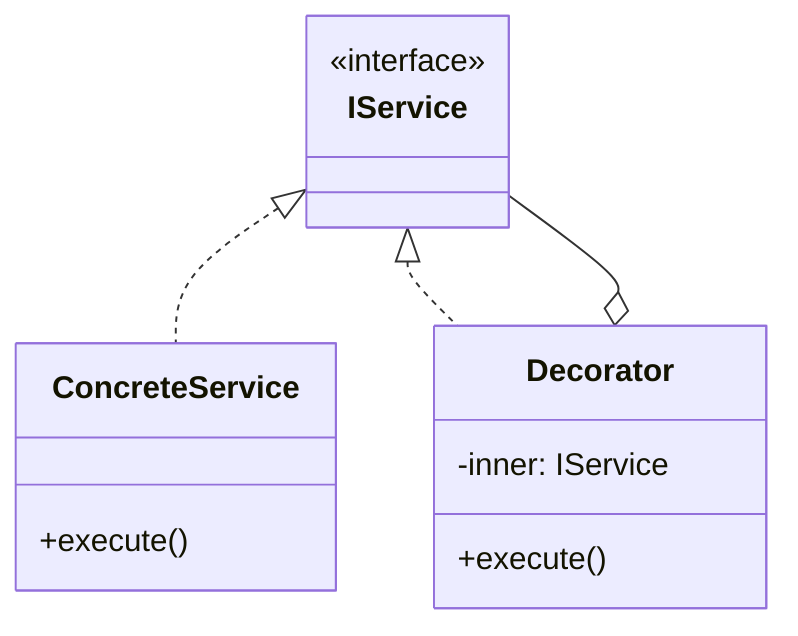

# Skill 07: Inter-Component Communication — Observer, Mediator, PubSub, and Events

## WHY

Once layers exist and are wired by DI ([Skill 06](06-dependency-injection-and-ioc-container.md)), components need to communicate **at runtime** without creating tight coupling. Direct method calls work within a layer, but cross-layer communication through direct calls creates dependency chains that are hard to modify.

Events decouple sender from receiver. Engineer A's component publishes an event; Engineer B's component subscribes to it. Neither knows about the other.

## WHICH Patterns

Listed from tightest to loosest coupling:

| Pattern | Coupling | Scope | Book Reference |
|---------|---------|-------|---------------|
| **Observer** | 1:N notification, sender knows subscribers exist | Within a layer or module | `B05337_05/Observer.ts` |
| **Mediator** | Hub-and-spoke, components know the mediator only | Within a bounded context | `B05337_05/Mediator.ts` |
| **Command** | Reified method call — can be queued, logged, undone | Cross-layer action dispatch | `B05337_05/Command.ts` |
| **PubSub** | Fully decoupled via message bus | Cross-layer, cross-module | `B05337_10/PubSub.ts` |
| **Request/Response** | Async RPC over message bus | Cross-service | `B05337_10/RequestResponse.ts` |

## HOW

### Observer — Subscribe / Notify Within a Module

The Observer pattern is the simplest event mechanism. One subject, many listeners:

```typescript
// From B05337_05/Observer.ts concept, production-enhanced:
interface IObserver<T> {
  update(data: T): void;
}

class EventEmitter<T> {
  private observers: IObserver<T>[] = [];

  subscribe(observer: IObserver<T>): () => void {
    this.observers.push(observer);
    return () => {  // returns unsubscribe function
      this.observers = this.observers.filter(o => o !== observer);
    };
  }

  notify(data: T): void {
    for (const observer of this.observers) {
      observer.update(data);
    }
  }
}
```

**Use for:** UI component state changes, model property change notification, simple within-module events.

### Mediator — Coordinating Multiple Components

`B05337_05/Mediator.ts` shows `HouseStark` routing messages between `Karstark`, `Bolton`, `Frey`, and `Umber`. The mediator prevents N-to-N direct communication:

```typescript
// Without mediator: every component talks to every other (N*(N-1) connections)
// With mediator: every component talks to ONE hub (N connections)

interface IColleague {
  receiveMessage(message: string): void;
}

class ChatRoom {  // Mediator
  private members = new Map<string, IColleague>();

  register(name: string, member: IColleague) { this.members.set(name, member); }

  send(from: string, to: string, message: string) {
    const recipient = this.members.get(to);
    if (recipient) recipient.receiveMessage(`[${from}]: ${message}`);
  }

  broadcast(from: string, message: string) {
    this.members.forEach((member, name) => {
      if (name !== from) member.receiveMessage(`[${from}]: ${message}`);
    });
  }
}
```

**Use for:** Form field coordination, UI panel interactions, workflow step orchestration.

### Command — Reified Actions

`B05337_05/Command.ts` encapsulates an action as an object. This enables queueing, logging, and undo:

```typescript
interface ICommand {
  execute(): void;
  undo(): void;
}

class MoveUnitCommand implements ICommand {
  private previousLocation: Location;
  constructor(private unit: Unit, private destination: Location) {}

  execute() {
    this.previousLocation = this.unit.location;
    this.unit.moveTo(this.destination);
  }

  undo() {
    this.unit.moveTo(this.previousLocation);
  }
}

// Command queue enables undo/redo
class CommandHistory {
  private history: ICommand[] = [];
  private position = -1;

  execute(command: ICommand) {
    command.execute();
    this.history = this.history.slice(0, this.position + 1);
    this.history.push(command);
    this.position++;
  }

  undo() {
    if (this.position >= 0) {
      this.history[this.position].undo();
      this.position--;
    }
  }

  redo() {
    if (this.position < this.history.length - 1) {
      this.position++;
      this.history[this.position].execute();
    }
  }
}
```

### PubSub — The Primary Cross-Layer Pattern

`B05337_10/PubSub.ts` has the best communication example in the repo:

```typescript
// Book's CrowMailBus — Subscribe/Publish/Send with process.nextTick for async
export class CrowMailBus {
  responders: Array<any>;
  constructor() { this.responders = []; }

  public Subscribe(messageName: string, subscriber: IMessageResponder) {
    this.responders.push({ messageName, subscriber });
  }

  public Publish(message: Message) {
    for (var i = 0; i < this.responders.length; i++) {
      if (this.responders[i].messageName == message.__messageName) {
        process.nextTick(() => this.responders[i].subscriber.processMessage(message));
      }
    }
  }
}
```

**Production-enhanced typed event bus:**

```typescript
type EventHandler<T> = (data: T) => void;

class TypedEventBus {
  private handlers = new Map<string, Set<EventHandler<any>>>();

  on<T>(event: string, handler: EventHandler<T>): () => void {
    if (!this.handlers.has(event)) this.handlers.set(event, new Set());
    this.handlers.get(event)!.add(handler);
    return () => this.handlers.get(event)?.delete(handler);
  }

  emit<T>(event: string, data: T): void {
    this.handlers.get(event)?.forEach(handler => {
      try { handler(data); }
      catch (e) { console.error(`Error in handler for ${event}:`, e); }
    });
  }
}

// Define typed events as constants
const Events = {
  USER_CREATED: 'user:created' as const,
  ORDER_PLACED: 'order:placed' as const,
  PAYMENT_RECEIVED: 'payment:received' as const,
};

// Usage across layers:
bus.on<User>(Events.USER_CREATED, (user) => emailService.sendWelcome(user));
bus.on<Order>(Events.ORDER_PLACED, (order) => inventoryService.reserve(order));

bus.emit(Events.USER_CREATED, newUser);
```

### Observer Variants — RxJS, Event Aggregator, and Beyond

The basic Observer pattern has several powerful variants for different scales:

**Event Aggregator — Centralized Event Hub:**

```typescript
// Event Aggregator = Observer + Mediator hybrid
// One central hub for all events across the application
class EventAggregator {
  private handlers = new Map<string, Set<Function>>();

  on(event: string, handler: Function): { off: () => void } {
    if (!this.handlers.has(event)) this.handlers.set(event, new Set());
    this.handlers.get(event)!.add(handler);
    return { off: () => this.handlers.get(event)?.delete(handler) };
  }

  trigger(event: string, ...args: any[]) {
    this.handlers.get(event)?.forEach(handler => handler(...args));
  }
}

// Gmail-style example: multiple views react to one event
const aggregator = new EventAggregator();
aggregator.on('email:received', (email) => inboxView.addEmail(email));
aggregator.on('email:received', (email) => unreadCounter.increment());
aggregator.on('email:received', (email) => notificationPopup.show(email));
aggregator.trigger('email:received', newEmail);
```

**RxJS-style Observable — Stream-Based Observer:**

```typescript
// Observable transforms Observer into a push-based stream with operators
import { Subject, filter, map, debounceTime } from 'rxjs';

// Stock ticker — real-time price updates
const priceUpdates$ = new Subject<{ symbol: string; price: number }>();

// Multiple subscribers with transformation operators
priceUpdates$.pipe(
  filter(update => update.symbol === 'AAPL'),
  map(update => update.price),
  debounceTime(500)  // don't update UI more than every 500ms
).subscribe(price => {
  stockWidget.updatePrice('AAPL', price);
});

// Publisher doesn't know about subscribers
priceUpdates$.next({ symbol: 'AAPL', price: 185.50 });
priceUpdates$.next({ symbol: 'GOOGL', price: 142.30 });
```

**PubSub vs Observer vs Event Aggregator:**

| Feature | Observer | Event Aggregator | PubSub |
|---------|----------|-----------------|--------|
| Coupling | Subject knows observers exist | Hub decouples both sides | Fully decoupled via topics |
| Scope | Within a module | Within an application | Cross-application / cross-service |
| Type safety | Strong (interface) | Medium (event names) | Weak (string topics) |
| Debugging | Easy (direct reference) | Medium (central hub) | Hard (no direct link) |

**Ref:** `Data_Source/Addy Osmani/learning-jsdp-main/ch07/` — Observer variants (RxJS, Gmail, StockApp examples), Event Aggregator pattern

### When to Use Which

| Scenario | Pattern | Why |
|----------|---------|-----|
| Model property changed → update UI | Observer | Simple 1:N, same layer |
| Form field A changed → validate field B | Mediator | N components coordinated |
| User action → needs undo/redo | Command | Reified, reversible |
| Order placed → notify multiple systems | PubSub | Decoupled, cross-layer |
| Service A needs data from Service B async | Request/Response | RPC-style over bus |
| Multiple views react to one event | Event Aggregator | Centralized hub, app-wide |
| Real-time stream with transformations | RxJS Observable | Stream operators, backpressure |

## TEAM Convention

1. **Cross-layer communication uses PubSub with typed event constants.** No magic strings scattered through code.
2. **Intra-layer communication uses Observer or Mediator** — simpler and more debuggable.
3. **Commands for user actions that need undo.** If the action is fire-and-forget, use PubSub instead.
4. **Event handlers must not throw.** Wrap handlers in try/catch. One failing handler should not break others.
5. **Define event types in a shared `communication/events.ts` file** so both publishers and subscribers reference the same contract.

## References

- `B05337_05/Observer.ts` — Subscribe/Unsubscribe/Notify pattern
- `B05337_05/Mediator.ts` — HouseStark routing messages between houses
- `B05337_05/Command.ts` — BringTroopsCommand with receiver + parameters
- `B05337_10/PubSub.ts` — CrowMailBus with Subscribe/Publish/Send (best in repo)
- `B05337_10/RequestResponse.ts` — CrowMailRequestor/CrowMailResponder
- `B05337_10/FanOutIn.ts` — Parallel dispatch with aggregated response
- `Data_Source/Addy Osmani/learning-jsdp-main/ch07/` — Observer variants (RxJS, Event Aggregator, Gmail, StockApp)

## Next

With communication patterns established, [Skill 08](08-state-management-and-business-logic.md) defines where business rules and domain state machines live.


---

## AI Agent Documentation Protocol

When an AI Agent completes a development task using patterns from this skill, it **MUST** perform the following documentation steps:

### 1. Pattern Annotation Comments

Add a block comment at the top of each file where a pattern is applied:

```typescript
/**
 * @pattern Observer
 * @skill 07-inter-component-communication
 * @description TypedEventBus for cross-layer event notification
 * @see skills/07-inter-component-communication.md
 */
```

### 2. Mermaid Architecture Diagram

Generate a Mermaid class or sequence diagram showing how the implemented patterns interact:



### 3. Pattern Registry Update

If a `pattern-registry.md` exists in the project, append an entry:

```markdown
| Date | File(s) | Pattern | Skill | Rationale |
|------|---------|---------|-------|-----------|
| YYYY-MM-DD | src/services/user-service.ts | Decorator | 05 | Added logging without modifying business logic |
```

> These steps ensure every AI-generated code change is traceable to a design decision, making future modifications faster and cheaper for both humans and AI agents.
