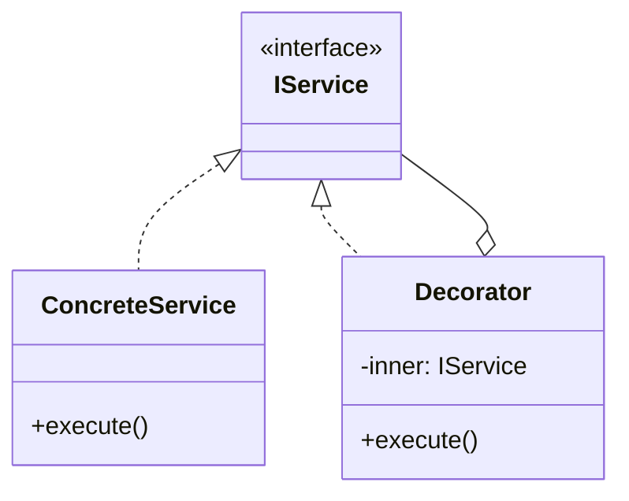

# Skill 08: Business Logic Layer — State, Memento, Visitor, and Domain Modeling

## WHY

The business logic layer is the **reason the system exists**. It contains the domain rules that differentiate your application from any other. This layer must be:

- **Isolated** from infrastructure (no database imports, no HTTP)
- **Testable** independently (pure logic, injectable dependencies)
- **Expressible** in domain terms (not in framework terms)

The patterns in this skill manage the complexity of domain state, state transitions, and operations on domain object graphs.

## WHICH Patterns

| Pattern | Solves | Book Reference |
|---------|--------|---------------|
| **State** | Entity lifecycle (order states, account states) | `B05337_05/State.ts` (excellent) |
| **Memento** | Undo/redo, audit trail, state snapshots | `B05337_05/Memento.ts` |
| **Visitor** | Operations across heterogeneous domain objects | `B05337_05/Visitor.ts` |
| **Template Method** | Standardized process with customizable steps | `B05337_05/TemplateMethod.ts` |
| **Interpreter** | Domain-specific rule evaluation | `B05337_05/Interpreter.ts` |

## HOW

### State — The Star Example

`B05337_05/State.ts` is the best behavioral example in the repository. It demonstrates **two approaches** side-by-side:

**The Anti-Pattern (NaiveBanking):**
```typescript
class NaiveBanking {
  state = "";
  balance = 0;
  public NextState(action: string, amount: number) {
    if (this.state == "overdrawn" && action == "withdraw") {
      this.state = "on hold";
    }
    if (this.state == "on hold" && action != "deposit") {
      this.state = "on hold";
    }
    // ... more nested if/else chains
  }
}
```

**The Problem:** State logic is buried in conditionals. Adding a new state requires modifying every `if` block. Two engineers adding different states will conflict.

**The State Pattern (BankAccountManager):**
```typescript
export interface IState {
  Deposit(amount: number);
  Withdraw(amount: number);
}

export class BankAccountManager {
  private currentState: IState;
  constructor() {
    this.currentState = new GoodStandingState(this);
  }
  public Deposit(amount: number)  { this.currentState.Deposit(amount); }
  public Withdraw(amount: number) { this.currentState.Withdraw(amount); }
  public moveToState(newState: IState) { this.currentState = newState; }
}

export class GoodStandingState implements IState {
  constructor(private manager: BankAccountManager) {}
  Deposit(amount: number) { this.manager.addToBalance(amount); }
  Withdraw(amount: number) {
    if (this.manager.getBalance() < amount) {
      this.manager.moveToState(new OverdrawnState(this.manager));
    }
    this.manager.addToBalance(-1 * amount);
  }
}

export class OverdrawnState implements IState {
  constructor(private manager: BankAccountManager) {}
  Deposit(amount: number) {
    this.manager.addToBalance(amount);
    if (this.manager.getBalance() > 0) {
      this.manager.moveToState(new GoodStandingState(this.manager));
    }
  }
  Withdraw(amount: number) {
    this.manager.moveToState(new OnHold(this.manager));
    throw "Cannot withdraw from overdrawn account";
  }
}

export class OnHold implements IState {
  // Both Deposit and Withdraw throw — account is frozen
}
```

**Why this is excellent:**
- Each state is a separate class — Engineer A adds a new state without touching others
- Transitions are explicit (`moveToState()`)
- Invalid operations are caught per-state (OnHold rejects Withdraw)
- Easy to test each state independently

**Production mapping — Order lifecycle:**
```
Created → Paid → Shipped → Delivered
  ↓         ↓
Cancelled  Refunded
```

Each state class defines which transitions are valid, making impossible states unrepresentable.

### Memento — State Snapshots

`B05337_05/Memento.ts` captures and restores object state. Essential for undo/redo and audit trails:

```typescript
// Memento holds a frozen snapshot
class OrderMemento {
  constructor(
    readonly status: string,
    readonly items: ReadonlyArray<OrderItem>,
    readonly total: number,
    readonly timestamp: Date
  ) {}
}

// Originator can save and restore from mementos
class Order {
  private status: string;
  private items: OrderItem[];

  save(): OrderMemento {
    return new OrderMemento(this.status, [...this.items], this.total, new Date());
  }

  restore(memento: OrderMemento): void {
    this.status = memento.status;
    this.items = [...memento.items];
  }
}

// Caretaker maintains history
class OrderHistory {
  private snapshots: OrderMemento[] = [];

  push(memento: OrderMemento) { this.snapshots.push(memento); }
  pop(): OrderMemento | undefined { return this.snapshots.pop(); }
}
```

**Combines with Command ([Skill 07](07-inter-component-communication.md)):** Command captures the action; Memento captures the state before the action. Together they enable full undo.

### Visitor — Operations on Domain Object Graphs

`B05337_05/Visitor.ts` defines operations that traverse heterogeneous domain objects without modifying them:

```typescript
// Domain objects accept visitors
interface IVisitable {
  accept(visitor: IVisitor): void;
}

interface IVisitor {
  visitOrder(order: Order): void;
  visitLineItem(item: LineItem): void;
  visitDiscount(discount: Discount): void;
}

// Reporting visitor — generates a summary without modifying domain objects
class ReportVisitor implements IVisitor {
  private lines: string[] = [];

  visitOrder(order: Order) { this.lines.push(`Order #${order.id}`); }
  visitLineItem(item: LineItem) { this.lines.push(`  ${item.name}: $${item.price}`); }
  visitDiscount(discount: Discount) { this.lines.push(`  Discount: -$${discount.amount}`); }

  getReport(): string { return this.lines.join('\n'); }
}

// Tax calculation visitor — same traversal, different operation
class TaxVisitor implements IVisitor {
  totalTax = 0;
  visitOrder(order: Order) { /* nothing at order level */ }
  visitLineItem(item: LineItem) { this.totalTax += item.price * item.taxRate; }
  visitDiscount(discount: Discount) { this.totalTax -= discount.amount * discount.taxRate; }
}
```

**Use for:** Reporting, serialization, validation, tax calculation — any operation that must traverse a complex domain object graph.

### Template Method — Standardized Processes

```typescript
abstract class OrderProcessor {
  // Template: the algorithm skeleton is fixed
  async process(order: Order): Promise<void> {
    await this.validate(order);         // step 1: customizable
    await this.calculatePricing(order); // step 2: customizable
    await this.applyPayment(order);     // step 3: fixed
    await this.fulfill(order);          // step 4: customizable
  }

  protected abstract validate(order: Order): Promise<void>;
  protected abstract calculatePricing(order: Order): Promise<void>;
  protected abstract fulfill(order: Order): Promise<void>;

  private async applyPayment(order: Order): Promise<void> {
    // fixed step — same for all order types
  }
}

class DigitalOrderProcessor extends OrderProcessor {
  protected async validate(order: Order) { /* digital-specific validation */ }
  protected async calculatePricing(order: Order) { /* no shipping costs */ }
  protected async fulfill(order: Order) { /* send download link */ }
}

class PhysicalOrderProcessor extends OrderProcessor {
  protected async validate(order: Order) { /* check shipping address */ }
  protected async calculatePricing(order: Order) { /* add shipping costs */ }
  protected async fulfill(order: Order) { /* create shipping label */ }
}
```

## Domain Layer Architecture Summary

```
core/                    ← Skill 03: Pure validation rules, formatters (functional)
domain/
  entities/              ← Domain objects with State pattern
  value-objects/         ← Immutable data (OrderId, Money, Address)
  services/              ← Domain services (OrderProcessor template method)
  events/                ← Domain events (OrderPlaced, PaymentReceived)
  repositories/          ← Repository INTERFACES (implemented in infrastructure/)
```

The functional core ([Skill 03](03-shared-utilities-and-functional-core.md)) handles pure computation. The domain layer wraps it in stateful entities managed by State, persisted via Memento, traversed via Visitor.

## TEAM Convention

1. **Domain objects never import infrastructure.** No `import mysql`, no `import fs`, no `import axios`.
2. **State machines are explicit** — use the State pattern, not hidden if/else chains.
3. **Each state is a separate class.** Engineers can add new states without touching existing ones (Open-Closed Principle).
4. **Visitor for cross-cutting domain operations** (reporting, validation, serialization). Don't add `toReport()`, `toJSON()`, `validate()` to every domain object.
5. **Template Method for standardized processes** where the steps are fixed but the details vary.

## References

- `B05337_05/State.ts` — NaiveBanking (anti-pattern) + BankAccountManager (State pattern) — the best example in the repo
- `B05337_05/Memento.ts` — State capture and restore
- `B05337_05/Visitor.ts` — Operations on object graphs
- `B05337_05/TemplateMethod.ts` — Algorithm skeleton with customizable steps
- `B05337_05/Interpreter.ts` — Domain-specific rule evaluation
- `B05337_06/Memento.ts` — Functional variant of Memento

## Next

With business logic modeled, [Skill 09](09-application-layer-mvc-mvp-mvvm.md) connects it to users through MVC, MVP, and MVVM.


---

## AI Agent Documentation Protocol

When an AI Agent completes a development task using patterns from this skill, it **MUST** perform the following documentation steps:

### 1. Pattern Annotation Comments

Add a block comment at the top of each file where a pattern is applied:

```typescript
/**
 * @pattern Observer
 * @skill 07-inter-component-communication
 * @description TypedEventBus for cross-layer event notification
 * @see skills/07-inter-component-communication.md
 */
```

### 2. Mermaid Architecture Diagram

Generate a Mermaid class or sequence diagram showing how the implemented patterns interact:



### 3. Pattern Registry Update

If a `pattern-registry.md` exists in the project, append an entry:

```markdown
| Date | File(s) | Pattern | Skill | Rationale |
|------|---------|---------|-------|-----------|
| YYYY-MM-DD | src/services/user-service.ts | Decorator | 05 | Added logging without modifying business logic |
```

> These steps ensure every AI-generated code change is traceable to a design decision, making future modifications faster and cheaper for both humans and AI agents.
