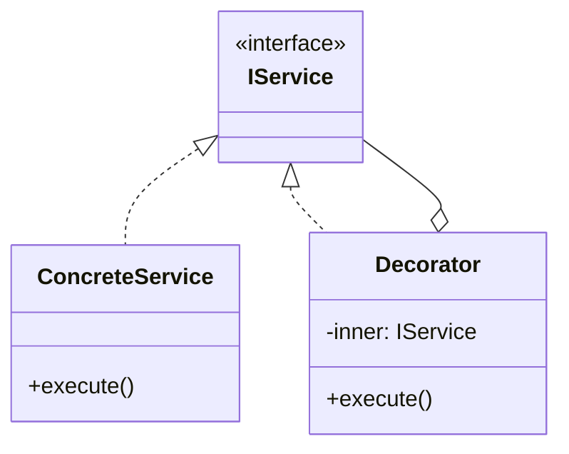

# Skill 09: Application Layer — MVC, MVP, MVVM and Presentation Architecture

## WHY

The application layer orchestrates user interaction with the domain layer. Without it, UI code and business logic become entangled: form validation lives next to database calls, event handlers contain domain rules, and two engineers working on "the same page" constantly conflict.

The application layer separates **what the user sees** from **what the system does**.

## WHICH Patterns

| Pattern | View Role | Logic Location | Best For |
|---------|-----------|---------------|----------|
| **MVC** | Active — observes model directly | Controller coordinates | Server-rendered, request/response |
| **MVP** | Passive — only getters/setters | Presenter owns all logic | Complex views needing heavy testing |
| **MVVM** | Data-bound to ViewModel | ViewModel holds state | SPAs, data-binding frameworks |

## HOW

### MVC — Model-View-Controller

`B05337_07/MVC.ts` demonstrates CastleDesign with Model, View, and Controller:

```
User Action → Controller → updates Model → View reads Model → renders
```

**Key structure from the book:**
```typescript
export class Controller {
  constructor(public document: Document) {}

  public saveCastle(data: Model) {
    var validationResult = this.validate(data);
    if (validationResult.IsValid) {
      this.saveCastleSuccess(data);
    } else {
      this.setView(new CreateCastleView(this.document, this, data, validationResult));
    }
  }
}
```

**Known bugs in the book example** (useful as learning material for [Skill 11](11-testing-strategy-across-layers.md)):
- Line 85: `var validationResult = new validationResult()` — lowercase `v` references the variable being declared, not the `ValidationResult` class. Should be `new ValidationResult()`.
- Line 91: bare `return` with no value — the `validate()` method never returns the `ValidationResult` it constructs.

These bugs illustrate why the application layer needs unit tests.

### MVP — Passive View

`B05337_07/MVP.ts` makes the View completely passive:

```typescript
// View has ONLY getters and setters — no logic
interface ICastleView {
  getName(): string;
  setName(name: string): void;
  getDescription(): string;
  setDescription(desc: string): void;
  showErrors(errors: string[]): void;
}

// Presenter owns ALL logic
class CastlePresenter {
  constructor(private view: ICastleView, private model: CastleModel) {}

  onSave() {
    const name = this.view.getName();
    const errors = this.validate(name);
    if (errors.length > 0) {
      this.view.showErrors(errors);
    } else {
      this.model.save({ name, description: this.view.getDescription() });
    }
  }

  private validate(name: string): string[] {
    const errors: string[] = [];
    if (!name) errors.push('Name is required');
    return errors;
  }
}
```

**Advantage:** The Presenter can be fully tested without any UI framework. The View interface is trivially mockable.

### MVVM — Two-Way Binding

`B05337_07/MVVM.ts` shows ViewModel with bidirectional communication:

```
View ←→ ViewModel ←→ Model
```

```typescript
// ViewModel holds the presentation state
class CastleViewModel {
  private name: string = '';
  private nameChangedListeners: Array<(name: string) => void> = [];

  getName(): string { return this.name; }

  setName(name: string) {
    this.name = name;
    this.nameChangedListeners.forEach(l => l(name));
  }

  onNameChanged(listener: (name: string) => void) {
    this.nameChangedListeners.push(listener);
  }
}
```

**Modern equivalent:** Frameworks like React, Vue, and Angular automate the binding that the book implements manually. The ViewModel concept maps to:
- React: Component state + hooks
- Vue: Reactive data in `setup()` / `data()`
- Angular: Component class with `@Input`/`@Output`

### Connecting to Other Layers

The Controller/Presenter/ViewModel consumes services injected via DI ([Skill 06](06-dependency-injection-and-ioc-container.md)):

```typescript
class OrderController {
  constructor(
    private orderService: IOrderService,       // domain service (Skill 08)
    private eventBus: IEventBus,               // communication (Skill 07)
    private logger: ILogger                    // cross-cutting (Skill 05)
  ) {}

  async createOrder(formData: OrderFormData): Promise<void> {
    const order = this.orderService.createFromForm(formData);
    await this.orderService.save(order);
    this.eventBus.emit('order:created', order);
    this.logger.info(`Order ${order.id} created`);
  }
}
```

### Modern Framework Implementations

Modern frameworks implement MVC/MVP/MVVM with their own conventions. Understanding the classical patterns helps you see **what the framework is doing for you**:

**React — Component as View + ViewModel (MVVM-like):**

```typescript
// React hooks act as the ViewModel
function OrderPage() {
  // ViewModel state
  const [orders, setOrders] = useState<Order[]>([]);
  const [filter, setFilter] = useState<'all' | 'pending' | 'shipped'>('all');

  // ViewModel logic (would be in Presenter/ViewModel in classical patterns)
  useEffect(() => {
    orderService.getOrders(filter).then(setOrders);
  }, [filter]);

  const handleStatusChange = async (orderId: string, newStatus: string) => {
    await orderService.updateStatus(orderId, newStatus);
    setOrders(prev => prev.map(o =>
      o.id === orderId ? { ...o, status: newStatus } : o
    ));
  };

  // View (JSX) is data-bound to ViewModel state
  return (
    <div>
      <FilterBar current={filter} onChange={setFilter} />
      <OrderList orders={orders} onStatusChange={handleStatusChange} />
    </div>
  );
}
```

**Vue.js — Reactive MVVM:**

```typescript
// Vue's Composition API maps directly to MVVM
import { ref, computed, watch } from 'vue';

export default {
  setup() {
    // ViewModel (reactive state)
    const searchQuery = ref('');
    const items = ref<Item[]>([]);

    // Computed properties = derived ViewModel state
    const filteredItems = computed(() =>
      items.value.filter(item =>
        item.name.toLowerCase().includes(searchQuery.value.toLowerCase())
      )
    );

    // Watcher = Observer pattern on ViewModel changes
    watch(searchQuery, async (newQuery) => {
      if (newQuery.length > 2) {
        items.value = await searchService.search(newQuery);
      }
    });

    // Expose to View template (two-way binding)
    return { searchQuery, filteredItems };
  }
};
```

**Lodash/Backbone-style MVC (historical):**

```javascript
// Classical MVC with Backbone-style models (for understanding legacy code)
const UserModel = Backbone.Model.extend({
  defaults: { name: '', email: '' },
  validate(attrs) {
    if (!attrs.name) return 'Name is required';
  }
});

const UserView = Backbone.View.extend({
  events: { 'click .save': 'onSave' },
  initialize() { this.listenTo(this.model, 'change', this.render); },  // Observer
  render() { this.$el.html(template(this.model.toJSON())); },
  onSave() { this.model.save(); }
});
```

**Ref:** `Data_Source/Addy Osmani/learning-jsdp-main/ch08/` — MVC/MVP/MVVM advanced variants with React/Vue/Lodash examples

### When to Use Which

| Scenario | Pattern | Reason |
|----------|---------|--------|
| Server-side rendering (Express, Koa) | MVC | Request → Controller → Response is natural |
| Complex desktop-style UI | MVP | Passive view enables full presenter testing |
| SPA with data-binding framework | MVVM | Framework handles binding automatically |
| API-only backend | None of these — use Service Layer pattern | No view to orchestrate |
| React app | MVVM-like (hooks as ViewModel) | Hooks manage state + logic, JSX is the View |
| Vue app | MVVM (Composition API) | Reactive refs + computed = ViewModel, template = View |

## TEAM Convention

1. **Controllers/Presenters/ViewModels contain NO business logic.** They translate between user actions and domain operations.
2. **One Controller per feature area**, not one per page. Group related actions.
3. **Validation lives in the domain layer** ([Skill 08](08-state-management-and-business-logic.md)), not in the Controller. The Controller calls `domain.validate()` and passes errors to the View.
4. **Application layer depends on domain interfaces**, never on infrastructure directly. Use DI ([Skill 06](06-dependency-injection-and-ioc-container.md)).
5. **Fix the book's bugs before using as reference.** The MVC.ts bugs (lines 85, 91) are good test-writing practice ([Skill 11](11-testing-strategy-across-layers.md)).

## References

- `B05337_07/MVC.ts` — CastleDesign MVC (bugs on lines 85, 91)
- `B05337_07/MVP.ts` — Passive view with Presenter
- `B05337_07/MVVM.ts` — Two-way binding ViewModel
- `B05337_07/SimpleMVC.ts` — Simplified MVC variant
- `B05337_07/Observe.ts` — Observer helper for binding
- `B05337_08/` — Advanced variants of the same patterns
- `Data_Source/Addy Osmani/learning-jsdp-main/ch08/` — Modern MVC/MVP/MVVM with React/Vue/Lodash

## Next

With the application layer in place, [Skill 10](10-async-concurrency-and-resilience.md) handles async operations and resilience across all layers.


---

## AI Agent Documentation Protocol

When an AI Agent completes a development task using patterns from this skill, it **MUST** perform the following documentation steps:

### 1. Pattern Annotation Comments

Add a block comment at the top of each file where a pattern is applied:

```typescript
/**
 * @pattern Observer
 * @skill 07-inter-component-communication
 * @description TypedEventBus for cross-layer event notification
 * @see skills/07-inter-component-communication.md
 */
```

### 2. Mermaid Architecture Diagram

Generate a Mermaid class or sequence diagram showing how the implemented patterns interact:



### 3. Pattern Registry Update

If a `pattern-registry.md` exists in the project, append an entry:

```markdown
| Date | File(s) | Pattern | Skill | Rationale |
|------|---------|---------|-------|-----------|
| YYYY-MM-DD | src/services/user-service.ts | Decorator | 05 | Added logging without modifying business logic |
```

> These steps ensure every AI-generated code change is traceable to a design decision, making future modifications faster and cheaper for both humans and AI agents.
