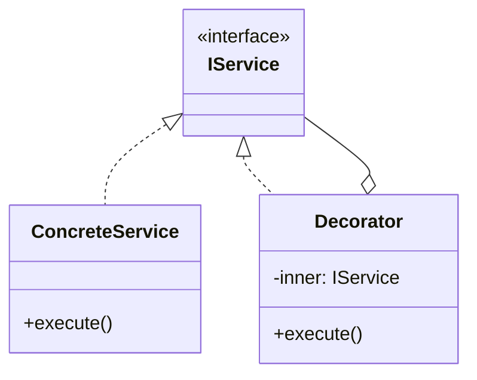

# Skill 10: Async, Concurrency, and Resilience

## WHY

Every IO adapter call ([Skill 04](04-io-and-infrastructure-adapters.md)), every cross-service message ([Skill 07](07-inter-component-communication.md)), every database query is async. Without proper async patterns, the application hangs, leaks resources, or silently drops errors. Resilience patterns are not in the book but are essential for production systems.

## WHICH Patterns

| Pattern | Solves | Book Reference |
|---------|--------|---------------|
| **Promises / Async-Await** | Sequential async operations | `B05337_14/async.ts`, `B05337_09/` |
| **Web Workers** | CPU-intensive work off the main thread | `B05337_09/main.ts`, `B05337_09/worker.ts` |
| **Fan-Out / Fan-In** | Parallel operations with aggregated results | `B05337_10/FanOutIn.ts` |
| **Retry** | Transient failure recovery | Not in book — needed |
| **Circuit Breaker** | Preventing cascade failures | Not in book — needed |
| **Timeout** | Bounding wait time for external calls | Not in book — needed |

## HOW

### Promises and Async/Await

The book uses `process.nextTick()` for async simulation (`B05337_10/PubSub.ts`). Modern code uses Promises:

```typescript
// Infrastructure adapter returns Promises (from Skill 04)
interface IUserRepository {
  findById(id: string): Promise<User | null>;  // always async
  save(user: User): Promise<void>;
}

// Application layer awaits them
class UserController {
  constructor(private repo: IUserRepository) {}

  async getUser(id: string): Promise<User> {
    const user = await this.repo.findById(id);
    if (!user) throw new NotFoundError(`User ${id} not found`);
    return user;
  }
}
```

**Key rules:**
- Every function that calls an async function must itself be `async`
- Always `await` — don't create floating promises
- Use `try/catch` for error handling (not `.catch()` chains)

### Fan-Out / Fan-In — Parallel Execution

`B05337_10/FanOutIn.ts` shows dispatching to multiple responders and collecting results:

```typescript
// Production pattern: parallel with aggregation
async function fetchDashboardData(userId: string): Promise<Dashboard> {
  // Fan-out: launch all in parallel
  const [profile, orders, notifications] = await Promise.all([
    userService.getProfile(userId),
    orderService.getRecent(userId),
    notificationService.getUnread(userId),
  ]);

  // Fan-in: aggregate results
  return { profile, orders, notifications };
}

// With error tolerance (some failures are OK)
async function fetchWithFallbacks(userId: string): Promise<Dashboard> {
  const results = await Promise.allSettled([
    userService.getProfile(userId),
    orderService.getRecent(userId),
    notificationService.getUnread(userId),
  ]);

  return {
    profile: results[0].status === 'fulfilled' ? results[0].value : defaultProfile,
    orders: results[1].status === 'fulfilled' ? results[1].value : [],
    notifications: results[2].status === 'fulfilled' ? results[2].value : [],
  };
}
```

### Web Workers — Off-Main-Thread Computation

`B05337_09/main.ts` and `B05337_09/worker.ts` demonstrate message passing to a worker:

```typescript
// main.ts — spawns worker and receives results
const worker = new Worker('worker.js');
worker.postMessage({ type: 'compute', data: largeDataset });
worker.onmessage = (event) => {
  console.log('Result:', event.data);
};

// worker.ts — runs in separate thread
self.onmessage = (event) => {
  const result = heavyComputation(event.data.data);
  self.postMessage(result);
};
```

### Retry — Transient Failure Recovery

Not in the book. Essential for infrastructure adapter calls:

```typescript
async function withRetry<T>(
  fn: () => Promise<T>,
  options: { maxRetries: number; baseDelay: number; }
): Promise<T> {
  let lastError: Error;
  for (let attempt = 0; attempt <= options.maxRetries; attempt++) {
    try {
      return await fn();
    } catch (error) {
      lastError = error as Error;
      if (attempt < options.maxRetries) {
        const delay = options.baseDelay * Math.pow(2, attempt);  // exponential backoff
        await new Promise(resolve => setTimeout(resolve, delay));
      }
    }
  }
  throw lastError!;
}

// Usage:
const user = await withRetry(
  () => userRepository.findById(id),
  { maxRetries: 3, baseDelay: 100 }
);
```

### Circuit Breaker — Preventing Cascade Failures

When an external service is down, don't keep hammering it:

```typescript
enum CircuitState { CLOSED, OPEN, HALF_OPEN }

class CircuitBreaker {
  private state = CircuitState.CLOSED;
  private failures = 0;
  private lastFailure = 0;

  constructor(
    private threshold: number = 5,       // failures before opening
    private resetTimeout: number = 30000  // ms before trying again
  ) {}

  async call<T>(fn: () => Promise<T>): Promise<T> {
    if (this.state === CircuitState.OPEN) {
      if (Date.now() - this.lastFailure > this.resetTimeout) {
        this.state = CircuitState.HALF_OPEN;
      } else {
        throw new Error('Circuit is OPEN — service unavailable');
      }
    }

    try {
      const result = await fn();
      this.onSuccess();
      return result;
    } catch (error) {
      this.onFailure();
      throw error;
    }
  }

  private onSuccess() {
    this.failures = 0;
    this.state = CircuitState.CLOSED;
  }

  private onFailure() {
    this.failures++;
    this.lastFailure = Date.now();
    if (this.failures >= this.threshold) {
      this.state = CircuitState.OPEN;
    }
  }
}

// Wrap infrastructure adapters:
const dbCircuit = new CircuitBreaker(5, 30000);
const user = await dbCircuit.call(() => userRepository.findById(id));
```

### Timeout Wrapper

```typescript
function withTimeout<T>(promise: Promise<T>, ms: number): Promise<T> {
  const timeout = new Promise<never>((_, reject) =>
    setTimeout(() => reject(new Error(`Timeout after ${ms}ms`)), ms)
  );
  return Promise.race([promise, timeout]);
}

// Usage: all external calls must have a timeout
const user = await withTimeout(userRepository.findById(id), 5000);
```

### Complete Async Pipeline

Combining all patterns for a production infrastructure call:

```typescript
const userCircuit = new CircuitBreaker(5, 30000);

async function getUser(id: string): Promise<User> {
  return withTimeout(
    withRetry(
      () => userCircuit.call(() => userRepository.findById(id)),
      { maxRetries: 2, baseDelay: 200 }
    ),
    5000  // total timeout including retries
  );
}
```

### Promise Pipeline Patterns — Memoization, Racing, and Decorator

Advanced Promise composition patterns from Addy Osmani's async patterns:

**Promise Memoization — Cache Expensive Async Results:**

```typescript
// Memoize any async function — return cached promise for same arguments
function memoizeAsync<T extends (...args: any[]) => Promise<any>>(fn: T): T {
  const cache = new Map<string, Promise<any>>();

  return ((...args: any[]) => {
    const key = JSON.stringify(args);
    if (cache.has(key)) return cache.get(key)!;

    const promise = fn(...args).catch(err => {
      cache.delete(key);  // evict on failure so retries work
      throw err;
    });

    cache.set(key, promise);
    return promise;
  }) as T;
}

// Usage:
const getUser = memoizeAsync(async (id: string) => {
  const res = await fetch(`/api/users/${id}`);
  return res.json();
});

// Second call returns same promise — no duplicate request
const [user1, user2] = await Promise.all([getUser('123'), getUser('123')]);
```

**Promise Racing — First Result Wins:**

```typescript
// Race multiple sources — fastest response wins
async function getFromFastestSource<T>(
  sources: Array<() => Promise<T>>
): Promise<T> {
  return Promise.any(sources.map(fn => fn()));
}

// Usage: fetch from cache and API in parallel, use whichever responds first
const user = await getFromFastestSource([
  () => cache.get('user:123'),
  () => api.getUser('123'),
]);
```

**Promise Decorator — Wrap Any Promise with Cross-Cutting Concerns:**

```typescript
// Decorator for promises — adds logging, timing, error tagging
function withTiming<T>(label: string, promise: Promise<T>): Promise<T> {
  const start = performance.now();
  return promise.finally(() => {
    console.log(`${label}: ${(performance.now() - start).toFixed(1)}ms`);
  });
}

function withErrorTag<T>(tag: string, promise: Promise<T>): Promise<T> {
  return promise.catch(err => {
    err.tag = tag;
    throw err;
  });
}

// Compose decorators on any promise:
const user = await withTiming('getUser',
  withErrorTag('user-service',
    withTimeout(userRepo.findById(id), 5000)
  )
);
```

**Ref:** `Data_Source/Addy Osmani/learning-jsdp-main/ch09/` — Promise Pipeline, Memoization, Racing, Decorator patterns

### Async Iteration and Composition

Modern JavaScript provides async iterators for streaming data processing:

```typescript
// Async Generator — produce values over time
async function* fetchPages<T>(baseUrl: string): AsyncGenerator<T[]> {
  let page = 1;
  let hasMore = true;

  while (hasMore) {
    const response = await fetch(`${baseUrl}?page=${page}`);
    const data = await response.json();
    yield data.items;
    hasMore = data.hasNextPage;
    page++;
  }
}

// Consume with for-await-of
async function getAllUsers(): Promise<User[]> {
  const allUsers: User[] = [];
  for await (const batch of fetchPages<User>('/api/users')) {
    allUsers.push(...batch);
  }
  return allUsers;
}

// Async Composition — chain async operations
const processStream = pipe(
  fetchPages<RawOrder>('/api/orders'),
  filterAsync(order => order.status === 'pending'),
  mapAsync(order => enrichOrder(order)),
  batchAsync(10, batch => saveBatch(batch))
);

// Helper: async filter
async function* filterAsync<T>(
  source: AsyncIterable<T>,
  predicate: (item: T) => boolean
): AsyncGenerator<T> {
  for await (const item of source) {
    if (predicate(item)) yield item;
  }
}
```

**Ref:** `Data_Source/Addy Osmani/learning-jsdp-main/ch09/` — Async Iteration and Composition patterns

## TEAM Convention

1. **All IO returns Promises.** Infrastructure adapters ([Skill 04](04-io-and-infrastructure-adapters.md)) never use callbacks.
2. **Timeouts are mandatory on external calls.** No unbounded waits.
3. **Retry only for idempotent operations.** Don't retry a payment charge.
4. **Circuit breakers on each external service.** One failing service must not take down the entire application.
5. **Use `Promise.allSettled()` when partial failure is acceptable.** Use `Promise.all()` when all results are required.
6. **Error handling is explicit.** `async/await` + `try/catch`, not silent swallowing.

## References

- `B05337_09/main.ts` — Web Worker coordination
- `B05337_09/worker.ts` — Worker thread
- `B05337_14/async.ts` — Async/await patterns
- `B05337_10/FanOutIn.ts` — Fan-out/fan-in dispatch
- `B05337_10/PubSub.ts` — Uses `process.nextTick()` for async messaging
- `Data_Source/Addy Osmani/learning-jsdp-main/ch09/` — Promise Pipeline, Memoization, Racing, Decorator, Async Iteration/Composition

## Next

With async handled, [Skill 11](11-testing-strategy-across-layers.md) shows how to verify each layer independently.


---

## AI Agent Documentation Protocol

When an AI Agent completes a development task using patterns from this skill, it **MUST** perform the following documentation steps:

### 1. Pattern Annotation Comments

Add a block comment at the top of each file where a pattern is applied:

```typescript
/**
 * @pattern Observer
 * @skill 07-inter-component-communication
 * @description TypedEventBus for cross-layer event notification
 * @see skills/07-inter-component-communication.md
 */
```

### 2. Mermaid Architecture Diagram

Generate a Mermaid class or sequence diagram showing how the implemented patterns interact:



### 3. Pattern Registry Update

If a `pattern-registry.md` exists in the project, append an entry:

```markdown
| Date | File(s) | Pattern | Skill | Rationale |
|------|---------|---------|-------|-----------|
| YYYY-MM-DD | src/services/user-service.ts | Decorator | 05 | Added logging without modifying business logic |
```

> These steps ensure every AI-generated code change is traceable to a design decision, making future modifications faster and cheaper for both humans and AI agents.
