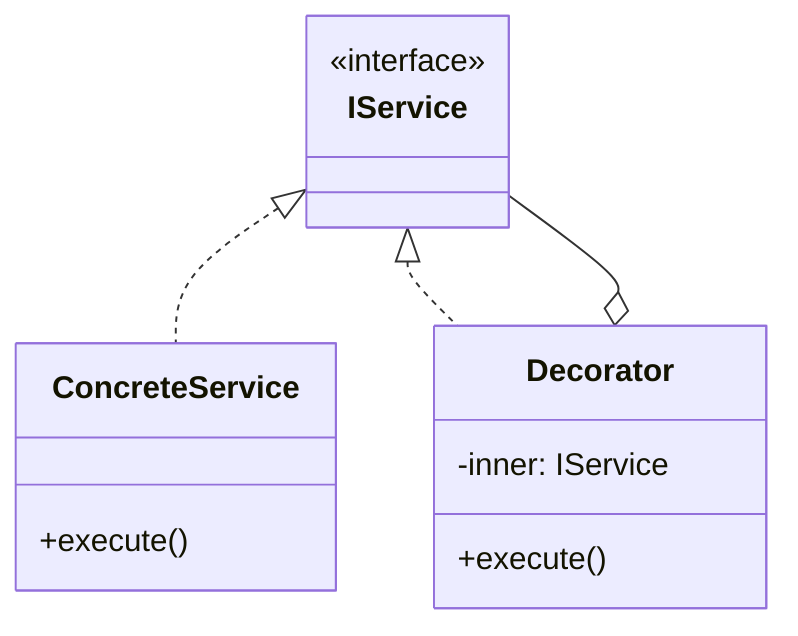

# Skill 12: Putting It All Together — The Team Application Framework

## WHY

Skills 01-11 define individual layers and their patterns. This capstone skill shows how they compose into a **shared framework** that a team of 2+ engineers can develop against without working in silos.

The framework is not a library to install — it's a set of **conventions, directory structure, dependency rules, and shared interfaces** that the team agrees on before writing the first line of business logic.

## The Complete Architecture

```
┌──────────────────────────────────────────────────────────────┐
│                     Application Entry Point                   │
│                     (config/composition-root.ts)              │
├──────────────────────────────────────────────────────────────┤
│                                                              │
│  ┌─────────────┐  ┌──────────────┐  ┌───────────────────┐   │
│  │ Application  │  │ Communication│  │   Cross-Cutting   │   │
│  │ Controllers  │  │  Event Bus   │  │   Decorators      │   │
│  │  (Skill 09)  │  │  (Skill 07)  │  │   (Skill 05)      │   │
│  └──────┬───────┘  └──────┬───────┘  └───────┬───────────┘   │
│         │                 │                   │               │
│  ┌──────▼─────────────────▼───────────────────▼───────────┐  │
│  │                  Domain Services                        │  │
│  │           Business Logic & State Machines               │  │
│  │                    (Skill 08)                           │  │
│  ├─────────────────────────────────────────────────────────┤  │
│  │                  Domain Interfaces                      │  │
│  │        IRepository, IService, IEventBus                 │  │
│  └──────────────────────┬──────────────────────────────────┘  │
│                         │                                     │
│  ┌──────────────────────▼──────────────────────────────────┐  │
│  │              Shared Utilities / Core                     │  │
│  │         Pure functions, validators, formatters           │  │
│  │                    (Skill 03)                           │  │
│  └─────────────────────────────────────────────────────────┘  │
│                                                              │
│  ┌─────────────────────────────────────────────────────────┐  │
│  │              Infrastructure Adapters                     │  │
│  │      MySQL, HTTP, FileSystem, SMTP implementations      │  │
│  │                    (Skill 04)                           │  │
│  └─────────────────────────────────────────────────────────┘  │
│                                                              │
│     Async/Resilience (Skill 10) ── cuts across all layers    │
│     Testing (Skill 11)          ── verifies each layer       │
└──────────────────────────────────────────────────────────────┘
```

## Directory Structure Convention

```
src/
  core/                          ← Skill 03
    validators.ts                  Pure validation functions
    formatters.ts                  Pure data formatters
    types.ts                       Shared type definitions
    index.ts                       Barrel export

  domain/                        ← Skill 08
    entities/
      order.ts                     Order entity with State pattern
      user.ts                      User entity
    services/
      order-service.ts             Domain service (business rules)
    repositories/
      i-order-repository.ts        Interface ONLY (no implementation)
      i-user-repository.ts         Interface ONLY
    events/
      domain-events.ts             Typed event definitions
    index.ts

  infrastructure/                ← Skill 04
    database/
      mysql-order-repository.ts    Implements IOrderRepository
      mysql-user-repository.ts     Implements IUserRepository
    http/
      axios-http-client.ts         Implements IHttpClient
    email/
      smtp-email-service.ts        Implements IEmailService
    index.ts

  application/                   ← Skill 09
    controllers/
      order-controller.ts          Orchestrates user → domain
      user-controller.ts
    index.ts

  crosscutting/                  ← Skill 05
    logging-decorator.ts           Wraps any service with logging
    caching-decorator.ts           Wraps any repository with cache
    auth-middleware.ts              Request authentication

  communication/                 ← Skill 07
    event-bus.ts                   Typed PubSub implementation
    events.ts                      Event name constants + types
    index.ts

  config/                        ← Skill 06
    container.ts                   DI container
    composition-root.ts            Wires everything together
    app-config.ts                  Environment configuration

  index.ts                         Application entry point
```

## Dependency Rules

```
             ┌──────────────┐
             │     core/    │  depends on: NOTHING
             └──────┬───────┘
                    │
             ┌──────▼───────┐
             │   domain/    │  depends on: core/
             └──────┬───────┘
                    │
        ┌───────────┼────────────┐
        │           │            │
 ┌──────▼──┐ ┌─────▼──────┐ ┌──▼──────────┐
 │ infra/  │ │application/│ │communication/│  depends on: domain/, core/
 └─────────┘ └────────────┘ └─────────────┘
                    │
             ┌──────▼───────┐
             │   config/    │  depends on: EVERYTHING (composition root)
             └──────────────┘
```

**The golden rule:** `config/composition-root.ts` is the **only file** that imports from `infrastructure/`. Everything else imports from `domain/` interfaces or `core/` utilities.

## Team Workflow

### Two-Engineer Scenario

**Engineer A:** Works on domain layer
- Defines `IOrderRepository` interface in `domain/repositories/`
- Implements `OrderService` with State pattern in `domain/services/`
- Writes domain unit tests (no mocks needed — pure logic)
- Does NOT touch `infrastructure/` or `application/`

**Engineer B:** Works on infrastructure layer
- Implements `MySQLOrderRepository` in `infrastructure/database/`
- Implements `SMTPEmailService` in `infrastructure/email/`
- Writes integration tests against test database
- Does NOT touch `domain/` or `application/`

**Both work in parallel.** They agree on the interface (`IOrderRepository`) at the start. DI wires their code together in `config/composition-root.ts`.

### Adding a New Feature: Checklist

1. **Define the interface** in `domain/` — what does the feature need?
2. **Implement domain logic** in `domain/services/` — pure business rules
3. **Implement adapter** in `infrastructure/` — external system integration
4. **Wire in composition root** — `config/composition-root.ts`
5. **Add controller** in `application/` — user interaction orchestration
6. **Add events** in `communication/events.ts` — if other features need to react
7. **Add tests** per layer — domain unit, infrastructure integration, controller unit

## Pattern Decision Matrix

Given a problem, find the right pattern and layer:

| Problem | Pattern | Layer | Skill |
|---------|---------|-------|-------|
| Need to swap database provider | Abstract Factory, Adapter | infrastructure/ | 02, 04 |
| Complex object configuration | Builder | Any layer | 02 |
| Shared instance (config, pool) | Container-managed Singleton | config/ | 02, 06 |
| Pure data transformation | Pipeline, Strategy | core/ | 03 |
| Third-party API wrapping | Adapter | infrastructure/ | 04 |
| Complex subsystem simplification | Facade | infrastructure/ | 04 |
| Logging/caching/auth | Decorator, Middleware | crosscutting/ | 05 |
| Wiring layers together | DI Container | config/ | 06 |
| Cross-layer event notification | PubSub | communication/ | 07 |
| UI component coordination | Mediator | application/ | 07 |
| User action with undo | Command + Memento | domain/, application/ | 07, 08 |
| Entity lifecycle management | State | domain/entities/ | 08 |
| Operations across domain objects | Visitor | domain/services/ | 08 |
| Standardized multi-step process | Template Method | domain/services/ | 08 |
| Controller/View separation | MVC/MVP/MVVM | application/ | 09 |
| Transient failure recovery | Retry, Circuit Breaker | infrastructure/ | 10 |
| Parallel operations | Fan-Out/Fan-In | Any async layer | 10 |

## Onboarding Checklist

When a new engineer joins the team:

1. Read [Skill 00](00-overview-architect-decision-flow.md) — understand the full architecture
2. Read [Skill 01](01-foundation-modules-and-namespaces.md) — understand module conventions
3. Read [Skill 06](06-dependency-injection-and-ioc-container.md) — understand how layers connect
4. Read the skill for their assigned layer (e.g., Skill 08 for domain work)
5. Review `config/composition-root.ts` — see how everything wires together
6. Write a small feature following the checklist above

## DSL Cautionary Note

`B05337_13/dsl.ts` demonstrates a DSL using `eval()`:

```typescript
// DANGEROUS: eval-based DSL from the book
var defined = eval(function_body);
```

**Never use `eval()` in production.** For domain-specific languages, use:
- Tagged template literals: `` sql`SELECT * FROM users WHERE id = ${id}` ``
- Parser libraries (e.g., PEG.js, nearley)
- TypeScript's type system as a compile-time DSL

## Summary

The framework is not code you install — it's **decisions you make together**:

1. **Module boundaries** define who owns what (Skill 01)
2. **Factory interfaces** control object creation (Skill 02)
3. **Pure utilities** are safe for everyone to use (Skill 03)
4. **Adapter interfaces** isolate external systems (Skill 04)
5. **Decorators** separate cross-cutting concerns (Skill 05)
6. **DI composition root** wires everything at one point (Skill 06)
7. **Typed events** decouple runtime communication (Skill 07)
8. **State machines** make domain logic explicit (Skill 08)
9. **MVC/MVP/MVVM** separates UI from logic (Skill 09)
10. **Resilience patterns** handle real-world failures (Skill 10)
11. **Layer-targeted tests** verify each piece independently (Skill 11)
12. **React component patterns** map classical patterns to modern UI (Skill 13)
13. **Rendering & performance patterns** optimize delivery to users (Skill 14)

The result: engineers work on different layers in parallel, develop against shared interfaces, and the DI container assembles the running system.

## References

Code examples come from two sources:

**Simon Timms** — `Data_Source/Simon Timms/`:
- `B05337_03/` — Creational patterns (Skill 02)
- `B05337_04/` — Structural patterns (Skills 04, 05)
- `B05337_05/` — Behavioral patterns (Skills 07, 08)
- `B05337_06/` — Functional patterns (Skill 03)
- `B05337_07/` — MVC/MVP/MVVM (Skill 09)
- `B05337_10/` — Messaging patterns (Skill 07)
- `B05337_12/` — Testing patterns (Skill 11)
- `B05337_13/` — AOP, DI, DSL (Skills 05, 06)
- `B05337_14/` — Modern JS/TS features

**Addy Osmani** — `Data_Source/Addy Osmani/learning-jsdp-main/`:
- `ch05/` — ES Modules, dynamic import (Skill 01)
- `ch07/` — Design patterns: Proxy, Flyweight, Mixin, Observer variants (Skills 01, 03, 04, 07)
- `ch08/` — MVC/MVP/MVVM modern frameworks (Skill 09)
- `ch09/` — Async patterns: Promise pipeline, memoization (Skill 10)
- `ch10/` — Module loading: AMD, CommonJS, UMD (Skill 01)
- `ch11/` — Namespacing patterns (Skill 01)
- `ch12/` — React component patterns (Skill 13)
- `ch13/` — Next.js rendering & performance patterns (Skill 14)


---

## AI Agent Documentation Protocol

When an AI Agent completes a development task using patterns from this skill, it **MUST** perform the following documentation steps:

### 1. Pattern Annotation Comments

Add a block comment at the top of each file where a pattern is applied:

```typescript
/**
 * @pattern Observer
 * @skill 07-inter-component-communication
 * @description TypedEventBus for cross-layer event notification
 * @see skills/07-inter-component-communication.md
 */
```

### 2. Mermaid Architecture Diagram

Generate a Mermaid class or sequence diagram showing how the implemented patterns interact:



### 3. Pattern Registry Update

If a `pattern-registry.md` exists in the project, append an entry:

```markdown
| Date | File(s) | Pattern | Skill | Rationale |
|------|---------|---------|-------|-----------|
| YYYY-MM-DD | src/services/user-service.ts | Decorator | 05 | Added logging without modifying business logic |
```

> These steps ensure every AI-generated code change is traceable to a design decision, making future modifications faster and cheaper for both humans and AI agents.
