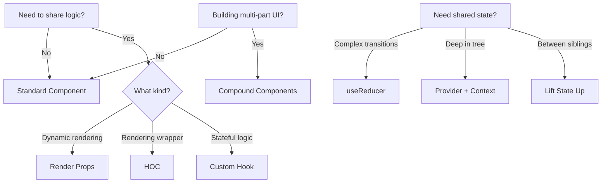
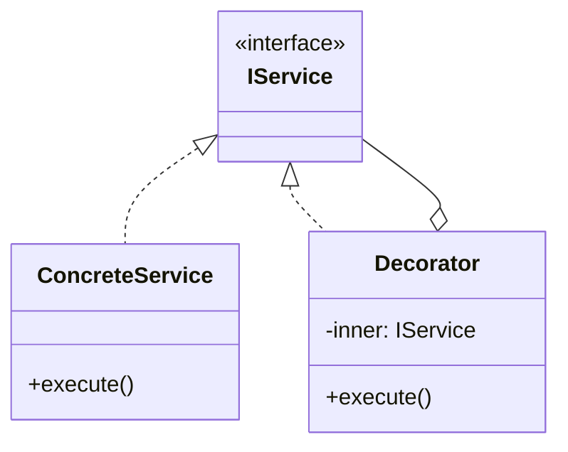

# Skill 13: React Component Patterns — Applying Design Patterns in Modern UI

## WHY

React is where most engineers first encounter design patterns — even if they don't realize it. Higher-Order Components are Decorators. Context Providers are Dependency Injection. useReducer is the State Pattern. Compound Components are the Composite Pattern.

Understanding these connections means you can reason about **why** a React pattern exists, not just **how** to use it. When the framework changes (and it will), the underlying design pattern knowledge transfers.

This skill bridges the classical patterns from Skills 01-12 to the React component model.

## WHICH Patterns

| React Pattern | Classical Pattern | Skill Reference | Use When |
|--------------|-------------------|-----------------|----------|
| **Higher-Order Component (HOC)** | Decorator | [Skill 05](05-cross-cutting-concerns-aop-and-decorators.md) | Adding cross-cutting behavior (auth, logging, theming) to components |
| **Custom Hooks** | Strategy / Decorator | [Skill 05](05-cross-cutting-concerns-aop-and-decorators.md) | Extracting reusable stateful logic |
| **Provider Pattern** | Dependency Injection | [Skill 06](06-dependency-injection-and-ioc-container.md) | Sharing dependencies without prop drilling |
| **Compound Components** | Composite | [Skill 04](04-io-and-infrastructure-adapters.md) | Building flexible multi-part UI components |
| **useReducer** | State Pattern | [Skill 08](08-state-management-and-business-logic.md) | Complex state transitions with explicit actions |
| **Render Props** | Strategy | [Skill 03](03-shared-utilities-and-functional-core.md) | Injecting rendering behavior |
| **Lifting State Up** | Mediator | [Skill 07](07-inter-component-communication.md) | Coordinating sibling components |
| **Conditional Rendering** | Strategy | [Skill 03](03-shared-utilities-and-functional-core.md) | Switching UI based on state |

## HOW

### Higher-Order Component (HOC) — Decorator for Components

A HOC wraps a component to add behavior — exactly like the GoF Decorator wraps an object:

```typescript
// Classical Decorator (Skill 05): ChainMail wraps BasicArmor
// React HOC: withAuth wraps any component

function withAuth<P extends object>(
  WrappedComponent: React.ComponentType<P>
): React.FC<P> {
  return function AuthenticatedComponent(props: P) {
    const { user, isLoading } = useAuth();

    if (isLoading) return <Spinner />;
    if (!user) return <Redirect to="/login" />;

    return <WrappedComponent {...props} />;
  };
}

// Usage — compose like Decorator stacking:
const ProtectedDashboard = withAuth(withTheme(Dashboard));
```

**Ref:** `Data_Source/Addy Osmani/learning-jsdp-main/ch12/` — React HOC examples

**Modern alternative:** Custom Hooks have largely replaced HOCs for logic reuse, but HOCs remain useful for rendering wrappers (layout, auth gates, error boundaries).

### Custom Hooks — Extracting Reusable Logic

Custom Hooks are the modern replacement for HOCs and Render Props. They extract stateful logic into reusable functions:

```typescript
// Custom Hook = Strategy pattern for data fetching
function useFetch<T>(url: string): { data: T | null; loading: boolean; error: Error | null } {
  const [data, setData] = useState<T | null>(null);
  const [loading, setLoading] = useState(true);
  const [error, setError] = useState<Error | null>(null);

  useEffect(() => {
    let cancelled = false;
    setLoading(true);

    fetch(url)
      .then(res => res.json())
      .then(json => { if (!cancelled) { setData(json); setLoading(false); } })
      .catch(err => { if (!cancelled) { setError(err); setLoading(false); } });

    return () => { cancelled = true; };
  }, [url]);

  return { data, loading, error };
}

// Usage — any component can use the same fetch logic:
function UserProfile({ userId }: { userId: string }) {
  const { data: user, loading, error } = useFetch<User>(`/api/users/${userId}`);
  if (loading) return <Spinner />;
  if (error) return <ErrorMessage error={error} />;
  return <ProfileCard user={user!} />;
}
```

### Provider Pattern — Dependency Injection for React

React Context + Provider is DI ([Skill 06](06-dependency-injection-and-ioc-container.md)) applied to the component tree:

```typescript
// 1. Define the interface (like domain/repositories/i-user-service.ts)
interface ThemeContextType {
  theme: 'light' | 'dark';
  toggleTheme: () => void;
}

// 2. Create the context (the "interface" consumers depend on)
const ThemeContext = createContext<ThemeContextType | undefined>(undefined);

// 3. Provider component (the "composition root" for this dependency)
function ThemeProvider({ children }: { children: React.ReactNode }) {
  const [theme, setTheme] = useState<'light' | 'dark'>('light');
  const toggleTheme = () => setTheme(t => t === 'light' ? 'dark' : 'light');

  return (
    <ThemeContext.Provider value={{ theme, toggleTheme }}>
      {children}
    </ThemeContext.Provider>
  );
}

// 4. Custom Hook to consume (no direct coupling to implementation)
function useTheme(): ThemeContextType {
  const context = useContext(ThemeContext);
  if (!context) throw new Error('useTheme must be used within ThemeProvider');
  return context;
}

// 5. Consumer component — depends on interface, not implementation
function Header() {
  const { theme, toggleTheme } = useTheme();
  return <header className={theme}><button onClick={toggleTheme}>Toggle</button></header>;
}
```

**Mapping to Skill 06:** `ThemeProvider` = composition root. `ThemeContext` = interface. `useTheme()` = constructor injection. Components never know how the theme is implemented.

### Compound Components — Composite for UI

Compound Components let users compose flexible UIs from related parts — the Composite pattern ([Skill 04](04-io-and-infrastructure-adapters.md)):

```typescript
// Parent manages state; children render parts
interface TabsContextType {
  activeTab: string;
  setActiveTab: (id: string) => void;
}

const TabsContext = createContext<TabsContextType | undefined>(undefined);

function Tabs({ children, defaultTab }: { children: React.ReactNode; defaultTab: string }) {
  const [activeTab, setActiveTab] = useState(defaultTab);
  return (
    <TabsContext.Provider value={{ activeTab, setActiveTab }}>
      <div className="tabs">{children}</div>
    </TabsContext.Provider>
  );
}

function TabList({ children }: { children: React.ReactNode }) {
  return <div role="tablist">{children}</div>;
}

function Tab({ id, children }: { id: string; children: React.ReactNode }) {
  const { activeTab, setActiveTab } = useContext(TabsContext)!;
  return (
    <button role="tab" aria-selected={activeTab === id} onClick={() => setActiveTab(id)}>
      {children}
    </button>
  );
}

function TabPanel({ id, children }: { id: string; children: React.ReactNode }) {
  const { activeTab } = useContext(TabsContext)!;
  return activeTab === id ? <div role="tabpanel">{children}</div> : null;
}

// Attach sub-components
Tabs.TabList = TabList;
Tabs.Tab = Tab;
Tabs.TabPanel = TabPanel;

// Usage — flexible composition:
<Tabs defaultTab="profile">
  <Tabs.TabList>
    <Tabs.Tab id="profile">Profile</Tabs.Tab>
    <Tabs.Tab id="settings">Settings</Tabs.Tab>
  </Tabs.TabList>
  <Tabs.TabPanel id="profile"><ProfileForm /></Tabs.TabPanel>
  <Tabs.TabPanel id="settings"><SettingsForm /></Tabs.TabPanel>
</Tabs>
```

### useReducer — The State Pattern in React

`useReducer` maps directly to the State Pattern ([Skill 08](08-state-management-and-business-logic.md)):

```typescript
// Compare: BankAccountManager (Skill 08) vs useReducer

type OrderState = 'draft' | 'submitted' | 'paid' | 'shipped' | 'delivered' | 'cancelled';

type OrderAction =
  | { type: 'SUBMIT' }
  | { type: 'PAY'; paymentId: string }
  | { type: 'SHIP'; trackingNumber: string }
  | { type: 'DELIVER' }
  | { type: 'CANCEL'; reason: string };

interface OrderStateData {
  status: OrderState;
  paymentId?: string;
  trackingNumber?: string;
  cancelReason?: string;
}

function orderReducer(state: OrderStateData, action: OrderAction): OrderStateData {
  switch (state.status) {
    case 'draft':
      if (action.type === 'SUBMIT') return { ...state, status: 'submitted' };
      if (action.type === 'CANCEL') return { ...state, status: 'cancelled', cancelReason: action.reason };
      throw new Error(`Invalid action ${action.type} for state ${state.status}`);

    case 'submitted':
      if (action.type === 'PAY') return { ...state, status: 'paid', paymentId: action.paymentId };
      if (action.type === 'CANCEL') return { ...state, status: 'cancelled', cancelReason: action.reason };
      throw new Error(`Invalid action ${action.type} for state ${state.status}`);

    case 'paid':
      if (action.type === 'SHIP') return { ...state, status: 'shipped', trackingNumber: action.trackingNumber };
      throw new Error(`Invalid action ${action.type} for state ${state.status}`);

    case 'shipped':
      if (action.type === 'DELIVER') return { ...state, status: 'delivered' };
      throw new Error(`Invalid action ${action.type} for state ${state.status}`);

    default:
      throw new Error(`No transitions from terminal state: ${state.status}`);
  }
}

// Usage in component:
function OrderManager() {
  const [order, dispatch] = useReducer(orderReducer, { status: 'draft' });

  return (
    <div>
      <p>Status: {order.status}</p>
      {order.status === 'draft' && (
        <button onClick={() => dispatch({ type: 'SUBMIT' })}>Submit Order</button>
      )}
      {order.status === 'submitted' && (
        <button onClick={() => dispatch({ type: 'PAY', paymentId: 'pay_123' })}>Pay</button>
      )}
    </div>
  );
}
```

**Key insight:** The reducer enforces valid state transitions — invalid actions throw errors. This is the same principle as `BankAccountManager.moveToState()` from Skill 08.

### Render Props — Injecting Rendering Strategy

```typescript
// Render Props = Strategy pattern for rendering
interface MouseTrackerProps {
  render: (position: { x: number; y: number }) => React.ReactNode;
}

function MouseTracker({ render }: MouseTrackerProps) {
  const [position, setPosition] = useState({ x: 0, y: 0 });

  useEffect(() => {
    const handler = (e: MouseEvent) => setPosition({ x: e.clientX, y: e.clientY });
    window.addEventListener('mousemove', handler);
    return () => window.removeEventListener('mousemove', handler);
  }, []);

  return <>{render(position)}</>;
}

// Different rendering strategies for the same data:
<MouseTracker render={({ x, y }) => <Tooltip x={x} y={y} />} />
<MouseTracker render={({ x, y }) => <Crosshair x={x} y={y} />} />
```

**Note:** Custom Hooks are now preferred over Render Props for most use cases. Render Props remain useful when the rendering itself needs to be dynamic.

### Lifting State Up — Mediator Between Siblings

When sibling components need to share state, lift it to the nearest common parent — the Mediator pattern ([Skill 07](07-inter-component-communication.md)):

```typescript
// Parent acts as Mediator
function TemperatureConverter() {
  const [celsius, setCelsius] = useState(0);

  return (
    <div>
      <CelsiusInput value={celsius} onChange={setCelsius} />
      <FahrenheitInput
        value={celsius * 9/5 + 32}
        onChange={(f) => setCelsius((f - 32) * 5/9)}
      />
    </div>
  );
}

// Children communicate through parent, never directly
function CelsiusInput({ value, onChange }: { value: number; onChange: (v: number) => void }) {
  return <input value={value} onChange={e => onChange(Number(e.target.value))} />;
}
```

### Conditional Rendering — Strategy for UI Variants

```typescript
// Map states to components — replaces if/else chains
const StatusComponents: Record<OrderState, React.FC<{ order: OrderStateData }>> = {
  draft: ({ order }) => <DraftView order={order} />,
  submitted: ({ order }) => <PendingPaymentView order={order} />,
  paid: ({ order }) => <ProcessingView order={order} />,
  shipped: ({ order }) => <TrackingView order={order} />,
  delivered: ({ order }) => <CompletedView order={order} />,
  cancelled: ({ order }) => <CancelledView order={order} />,
};

function OrderStatus({ order }: { order: OrderStateData }) {
  const Component = StatusComponents[order.status];
  return <Component order={order} />;
}
```

## Pattern Selection Guide



## TEAM Convention

1. **Custom Hooks first.** Prefer hooks over HOCs and Render Props for logic reuse. Use HOCs only for rendering wrappers (auth gates, error boundaries, layout).
2. **Provider per domain concern.** `AuthProvider`, `ThemeProvider`, `CartProvider` — one context per bounded context, not one god-context.
3. **useReducer for 3+ state transitions.** If a component has more than 2-3 `setState` calls that depend on each other, switch to `useReducer` with explicit actions.
4. **Compound Components for library-quality UI.** If building a reusable Tabs, Accordion, or Dropdown, use the compound pattern.
5. **Never pass dispatch directly to children.** Wrap in named callback functions (`onSubmit`, `onCancel`) so children don't know about the state management implementation.
6. **Map states to components.** Use a `Record<State, Component>` for conditional rendering instead of if/else chains.

## References

- `Data_Source/Addy Osmani/learning-jsdp-main/ch12/` — React Component Patterns (HOC, Hooks, Provider, Mediator examples)
- `Data_Source/Addy Osmani/learning-jsdp-main/ch12/react-loading-patterns/` — React loading pattern examples
- `Data_Source/Addy Osmani/learning-jsdp-main/ch12/react-mediator/` — React Mediator pattern
- [Skill 04](04-io-and-infrastructure-adapters.md) — Composite pattern (→ Compound Components)
- [Skill 05](05-cross-cutting-concerns-aop-and-decorators.md) — Decorator pattern (→ HOC, Custom Hooks)
- [Skill 06](06-dependency-injection-and-ioc-container.md) — DI pattern (→ Provider + Context)
- [Skill 07](07-inter-component-communication.md) — Mediator pattern (→ Lifting State Up)
- [Skill 08](08-state-management-and-business-logic.md) — State pattern (→ useReducer)

## Next

With React component patterns mapped to classical design patterns, [Skill 14](14-rendering-and-performance-patterns.md) covers rendering strategies and performance patterns for modern web applications.


---

## AI Agent Documentation Protocol

When an AI Agent completes a development task using patterns from this skill, it **MUST** perform the following documentation steps:

### 1. Pattern Annotation Comments

Add a block comment at the top of each file where a pattern is applied:

```typescript
/**
 * @pattern Observer
 * @skill 07-inter-component-communication
 * @description TypedEventBus for cross-layer event notification
 * @see skills/07-inter-component-communication.md
 */
```

### 2. Mermaid Architecture Diagram

Generate a Mermaid class or sequence diagram showing how the implemented patterns interact:



### 3. Pattern Registry Update

If a `pattern-registry.md` exists in the project, append an entry:

```markdown
| Date | File(s) | Pattern | Skill | Rationale |
|------|---------|---------|-------|-----------|
| YYYY-MM-DD | src/services/user-service.ts | Decorator | 05 | Added logging without modifying business logic |
```

> These steps ensure every AI-generated code change is traceable to a design decision, making future modifications faster and cheaper for both humans and AI agents.
