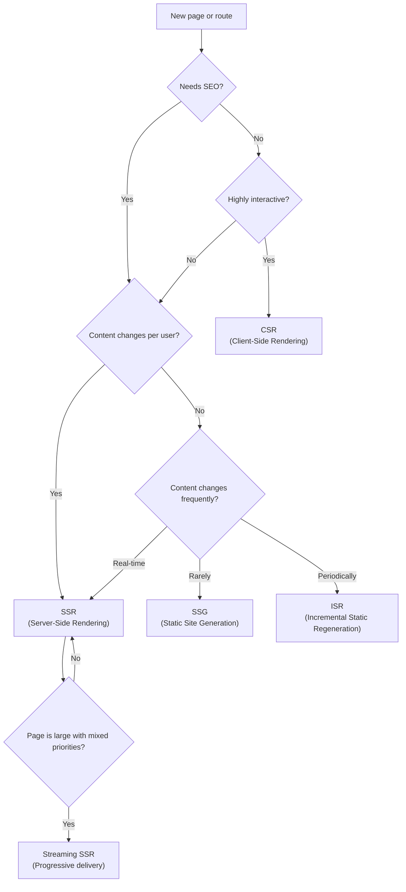
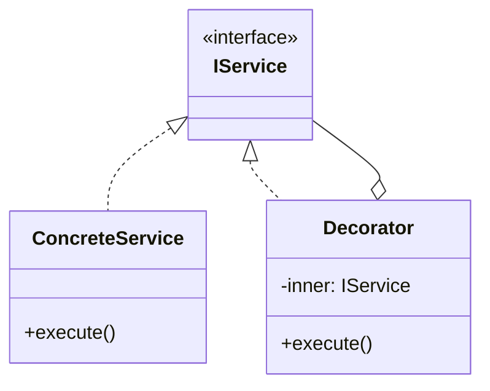

# Skill 14: Rendering and Performance Patterns — Delivering the Right Content at the Right Time

## WHY

The best-designed component architecture (Skills 01-13) is worthless if the application takes 8 seconds to load. Rendering patterns determine **when and where** code runs — on the server, at build time, or lazily on the client. Performance patterns determine **how much** code runs — splitting bundles, deferring imports, and hydrating progressively.

These patterns operate at the **delivery layer** — between your application code and the user's browser. They don't change your business logic; they change how and when it reaches the user.

## WHICH Patterns

### Rendering Strategies

| Strategy | Where It Runs | When HTML Is Generated | Best For |
|----------|--------------|----------------------|----------|
| **CSR** (Client-Side Rendering) | Browser | At runtime, in the browser | Highly interactive apps, dashboards |
| **SSR** (Server-Side Rendering) | Server | Per request, on the server | SEO-critical pages, personalized content |
| **SSG** (Static Site Generation) | Build server | At build time | Blogs, docs, marketing pages |
| **ISR** (Incremental Static Regeneration) | Build + Server | At build time + revalidation | E-commerce catalogs, news sites |
| **Streaming SSR** | Server | Progressively, during response | Large pages with mixed priority content |

### Performance Patterns

| Pattern | Solves | Implementation |
|---------|--------|---------------|
| **Dynamic Import** | Loading code only when needed | `import()` expression |
| **Route-Based Splitting** | Loading only the current page's code | `React.lazy()` + Suspense |
| **Import on Interaction** | Deferring heavy libraries until user engages | Click/hover triggers `import()` |
| **Import on Visibility** | Loading below-fold content when scrolled into view | Intersection Observer + `import()` |
| **Prefetch / Preload** | Speeding up anticipated navigation | `<link rel="prefetch">` or router prefetch |
| **Progressive Hydration** | Making critical UI interactive first | Selective hydration with Suspense |
| **Bundle Analysis** | Identifying bloated dependencies | webpack-bundle-analyzer, source-map-explorer |

## HOW

### Rendering Strategy Decision Tree



### Client-Side Rendering (CSR)

The browser downloads a minimal HTML shell, then JavaScript builds the entire page:

```typescript
// index.html — minimal shell
<div id="root"></div>
<script src="/bundle.js"></script>

// App.tsx — everything renders in the browser
function App() {
  const [data, setData] = useState(null);
  useEffect(() => {
    fetch('/api/dashboard').then(r => r.json()).then(setData);
  }, []);
  return data ? <Dashboard data={data} /> : <Spinner />;
}
```

**Trade-offs:**
- Fast subsequent navigation (SPA)
- Poor initial load (blank screen until JS downloads + executes)
- No SEO without additional tooling

### Server-Side Rendering (SSR)

The server generates full HTML per request. The browser shows content immediately, then JavaScript "hydrates" it to make it interactive:

```typescript
// Next.js SSR — runs on the server per request
export async function getServerSideProps(context) {
  const user = await getUser(context.req.cookies.session);
  const orders = await getOrders(user.id);
  return { props: { user, orders } };
}

export default function OrdersPage({ user, orders }) {
  return (
    <Layout user={user}>
      <OrderList orders={orders} />
    </Layout>
  );
}
```

**Ref:** `Data_Source/Addy Osmani/learning-jsdp-main/ch13/nextjs-rendering-patterns/` — Next.js SSR/SSG/ISR examples

### Static Site Generation (SSG)

HTML is generated at build time. Every user gets the same pre-rendered page:

```typescript
// Next.js SSG — runs at build time
export async function getStaticProps() {
  const posts = await getBlogPosts();
  return { props: { posts } };
}

export async function getStaticPaths() {
  const slugs = await getAllPostSlugs();
  return {
    paths: slugs.map(slug => ({ params: { slug } })),
    fallback: false,
  };
}
```

**Best for:** Content that doesn't change per user — docs, blogs, marketing pages.

### Incremental Static Regeneration (ISR)

Combines SSG's speed with SSR's freshness. Pages are statically generated but revalidated after a time interval:

```typescript
// Next.js ISR — static + revalidation
export async function getStaticProps() {
  const products = await getProducts();
  return {
    props: { products },
    revalidate: 60,  // regenerate at most every 60 seconds
  };
}
```

### Dynamic Import — Load Code on Demand

The `import()` expression enables code splitting at the module level. This connects to [Skill 01](01-foundation-modules-and-namespaces.md) — modules are the unit of splitting:

```typescript
// Static import — always loaded
import { heavyChart } from './analytics';

// Dynamic import — loaded only when needed
const loadChart = () => import('./analytics').then(m => m.heavyChart);

// React.lazy — dynamic import for components
const AnalyticsChart = React.lazy(() => import('./AnalyticsChart'));

function Dashboard() {
  const [showChart, setShowChart] = useState(false);
  return (
    <div>
      <button onClick={() => setShowChart(true)}>Show Analytics</button>
      {showChart && (
        <Suspense fallback={<Spinner />}>
          <AnalyticsChart />
        </Suspense>
      )}
    </div>
  );
}
```

**Ref:** `Data_Source/Addy Osmani/learning-jsdp-main/ch05/` — ES Module and dynamic import examples

### Route-Based Code Splitting

Split the application by route so each page loads only its own code:

```typescript
import { lazy, Suspense } from 'react';
import { Routes, Route } from 'react-router-dom';

// Each route is a separate chunk
const Home = lazy(() => import('./pages/Home'));
const Dashboard = lazy(() => import('./pages/Dashboard'));
const Settings = lazy(() => import('./pages/Settings'));
const AdminPanel = lazy(() => import('./pages/AdminPanel'));

function App() {
  return (
    <Suspense fallback={<PageLoader />}>
      <Routes>
        <Route path="/" element={<Home />} />
        <Route path="/dashboard" element={<Dashboard />} />
        <Route path="/settings" element={<Settings />} />
        <Route path="/admin" element={<AdminPanel />} />
      </Routes>
    </Suspense>
  );
}
```

### Import on Interaction

Defer loading heavy libraries until the user actually interacts:

```typescript
function ChatWidget() {
  const [ChatModule, setChatModule] = useState<typeof import('./chat') | null>(null);

  const handleOpen = async () => {
    // Load the chat library only when user clicks "Open Chat"
    const mod = await import('./chat');
    setChatModule(mod);
  };

  if (ChatModule) return <ChatModule.ChatWindow />;

  return <button onClick={handleOpen}>Open Chat</button>;
}
```

### Import on Visibility

Load below-the-fold content when the user scrolls to it:

```typescript
function LazySection({ importFn }: { importFn: () => Promise<{ default: React.ComponentType }> }) {
  const ref = useRef<HTMLDivElement>(null);
  const [Component, setComponent] = useState<React.ComponentType | null>(null);

  useEffect(() => {
    const observer = new IntersectionObserver(
      ([entry]) => {
        if (entry.isIntersecting) {
          importFn().then(mod => setComponent(() => mod.default));
          observer.disconnect();
        }
      },
      { rootMargin: '200px' }  // start loading 200px before visible
    );

    if (ref.current) observer.observe(ref.current);
    return () => observer.disconnect();
  }, [importFn]);

  return (
    <div ref={ref}>
      {Component ? <Component /> : <Placeholder />}
    </div>
  );
}

// Usage:
<LazySection importFn={() => import('./HeavyFooterContent')} />
```

### Prefetch and Preload

Anticipate what the user will need next:

```typescript
// Prefetch — low priority, for future navigation
<link rel="prefetch" href="/pages/dashboard.js" />

// Preload — high priority, for current page
<link rel="preload" href="/critical-font.woff2" as="font" crossOrigin="" />

// Router-level prefetch (Next.js)
import Link from 'next/link';
<Link href="/dashboard" prefetch={true}>Dashboard</Link>

// Manual prefetch on hover:
function NavLink({ href, children }) {
  const prefetch = () => {
    import(/* webpackPrefetch: true */ `./pages${href}`);
  };
  return <a href={href} onMouseEnter={prefetch}>{children}</a>;
}
```

### Progressive Hydration

Make critical UI interactive first, defer non-critical sections:

```typescript
// React 18 Streaming SSR with selective hydration
import { Suspense } from 'react';

function ProductPage({ product }) {
  return (
    <div>
      {/* Critical — hydrates immediately */}
      <ProductHeader product={product} />
      <AddToCartButton product={product} />

      {/* Non-critical — hydrates when ready */}
      <Suspense fallback={<ReviewsSkeleton />}>
        <ProductReviews productId={product.id} />
      </Suspense>

      <Suspense fallback={<RecommendationsSkeleton />}>
        <Recommendations category={product.category} />
      </Suspense>
    </div>
  );
}
```

**Ref:** `Data_Source/Addy Osmani/next-page-rendering-main/` — Next.js rendering patterns reference implementation

## Performance Budget Checklist

| Metric | Target | How to Measure |
|--------|--------|---------------|
| First Contentful Paint (FCP) | < 1.8s | Lighthouse, Web Vitals |
| Largest Contentful Paint (LCP) | < 2.5s | Lighthouse, Web Vitals |
| Time to Interactive (TTI) | < 3.8s | Lighthouse |
| Cumulative Layout Shift (CLS) | < 0.1 | Web Vitals |
| JS Bundle Size (initial) | < 200KB gzipped | webpack-bundle-analyzer |

## TEAM Convention

1. **Default to SSG.** If the page content doesn't change per user or per request, generate it at build time.
2. **Route-based splitting is mandatory.** Every route should be a separate chunk via `React.lazy()`.
3. **Import on interaction for heavy libraries.** Chat widgets, rich text editors, charting libraries — don't load them until the user needs them.
4. **Set a performance budget.** Initial JS bundle < 200KB gzipped. Enforce with CI checks.
5. **Measure with real user metrics.** Use Core Web Vitals (LCP, FID, CLS), not just Lighthouse scores.
6. **Prefetch likely navigation.** Use `<Link prefetch>` or hover-triggered `import()` for anticipated user paths.
7. **Streaming SSR for large pages.** If a page has 5+ sections with different data sources, use Suspense boundaries for streaming.

## References

- `Data_Source/Addy Osmani/learning-jsdp-main/ch05/` — ES Modules, dynamic import
- `Data_Source/Addy Osmani/learning-jsdp-main/ch10/` — Module loading patterns (AMD, CommonJS, UMD)
- `Data_Source/Addy Osmani/learning-jsdp-main/ch12/react-loading-patterns/` — React loading strategies
- `Data_Source/Addy Osmani/learning-jsdp-main/ch13/nextjs-rendering-patterns/` — Next.js SSR/SSG/ISR
- `Data_Source/Addy Osmani/learning-jsdp-main/ch13/quiz-app-performance/` — Performance optimization examples
- `Data_Source/Addy Osmani/next-page-rendering-main/` — Rendering patterns reference project
- [Skill 01](01-foundation-modules-and-namespaces.md) — Module system (the unit of code splitting)
- [Skill 13](13-react-component-patterns.md) — React component patterns (what gets loaded)


---

## AI Agent Documentation Protocol

When an AI Agent completes a development task using patterns from this skill, it **MUST** perform the following documentation steps:

### 1. Pattern Annotation Comments

Add a block comment at the top of each file where a pattern is applied:

```typescript
/**
 * @pattern Observer
 * @skill 07-inter-component-communication
 * @description TypedEventBus for cross-layer event notification
 * @see skills/07-inter-component-communication.md
 */
```

### 2. Mermaid Architecture Diagram

Generate a Mermaid class or sequence diagram showing how the implemented patterns interact:



### 3. Pattern Registry Update

If a `pattern-registry.md` exists in the project, append an entry:

```markdown
| Date | File(s) | Pattern | Skill | Rationale |
|------|---------|---------|-------|-----------|
| YYYY-MM-DD | src/services/user-service.ts | Decorator | 05 | Added logging without modifying business logic |
```

> These steps ensure every AI-generated code change is traceable to a design decision, making future modifications faster and cheaper for both humans and AI agents.
